# 11. 出库操作

> 本章定位：把出库从 SO 创建、波次组织、库存分配、实物拣货、系统确认、复核到发货扣减库存的作业链拆开，并补齐手工波次、快捷复核、播种、配送、集拼、装车和外围单据。
>
> 来源：`../01-按章节拆分的md文件（1119页版本）/11-出库操作.md`；原 PDF 第 674—867 页。

## 11.1. 学习重点

1. SO 是出库作业的操作依据；订单、分配和发货是系统流程中的关键节点，实物拣货必须发生。
2. 波次、系统拣货确认、出库复核、配送单、集拼箱、装车和出库放行是可按业务采用的附加环节，不应默认画成所有订单都必须经过。
3. 分配的结果是把库存锁定给订单；发货确认才会扣减库存并更新单据。
4. 出库现场的关键分支是：是否合并波次、是否部分分配、是否记录系统拣货确认、是否复核装箱、是否满足发货控制、异常后怎样释放或重做。

## 11.1—11.3. 出库共同主链与可选环节

### 用途

先看出库的主链，再进入后续图中的按钮级操作。这里区分“现场必须发生”和“系统可以跳过”。

### 原文依据

- 第 11 章开篇说明，原 PDF 第 674 页。
- 11.3 发货操作，原 PDF 第 720—730 页：订单、分配、发货是系统流程中的必须步骤；实物拣取必须，系统拣货确认可跳过。
- 11.6 出库复核，原 PDF 第 743—790 页：复核位于实物拣货后、发运前，且不是必需环节。

### 关键说明

1. SO、分配、发货是系统主链；实物拣货必须完成，但是否在 WMS 中执行拣货确认可按业务安排。
2. 波次和复核不是所有订单的必经步骤；发货前是否还要求拣货、复核、装车等，由系统参数和作业流程控制。
3. 下面的图分别展开 SO 创建、波次、分配、拣货、复核、播种、发货和异常处理，不在本图重复画所有按钮。

### 事实边界

原文没有给出所有出库模式的统一状态机。图中只表达明确的主链与可选环节，不把配送单、集拼箱、装车等附加功能硬插入每个订单的流程。

## 11.1. SO 创建、明细与释放控制

### 用途

说明发运订单怎样创建、怎样维护明细，以及“订单释放/冻结/未释放”如何影响后续出库。

### 原文依据

- 11.1.1 发运订单创建，原 PDF 第 674—701 页。
- 支持人工录入、文档导入、库存余量生成和接口传递等创建方式。
- 表头【新增】、【保存】；明细【新增】、【保存】。
- 表头右键包括订单释放、订单冻结、订单未释放、拆分订单、触发补货任务、创建波次计划等。

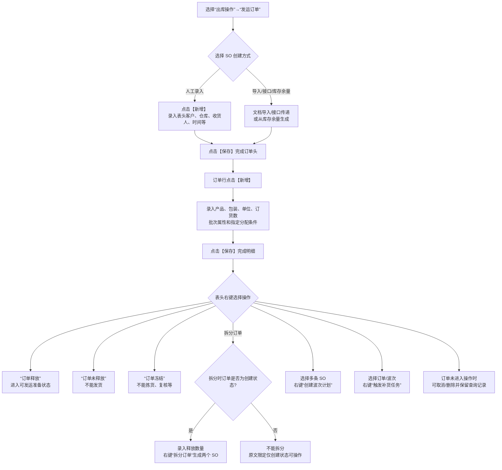

### 操作步骤

1. 进入“出库操作”→“发运订单”，点击【新增】，录入客户、仓库、收货人、预期发货时间、参考编号等，点击【保存】。
2. 在订单行点击【新增】，录入产品、包装、单位、订货数量、批次属性和指定分配条件，点击【保存】。
3. 需要审核后才能继续时，表头右键选择“订单释放”；暂不允许作业时选择“订单未释放”或“订单冻结”。
4. 需要拆分时，在创建状态订单的明细中录入释放数量，表头右键选择“拆分订单”。
5. 多个 SO 需要合并时，选中订单后选择“创建波次计划”；订单驱动补货时选择“触发补货任务”。

### 关键说明

1. `RLS_CTL=Y` 时，SO 默认可释放；否则释放状态需要按业务操作。
2. 订单明细中的跟踪号如果被指定，原文说明将不再考虑预配规则、分配规则和库存周转规则。
3. 销售订单是原始指令查询和编组对象，不直接执行拣货、发货；实际作业仍以发运订单为依据。

### 事实边界

原文支持多种 SO 创建方式，但没有给出接口字段映射和所有导入异常。图中只列出创建入口，不补充外部系统的处理规则。

## 11.2. 波次创建、任务下发与关闭

### 用途

把波次从订单筛选到作业下发的页面操作拆开，特别补充打印、播种、面单关联、装车和关闭条件。

### 原文依据

- 11.2 波次计划，原 PDF 第 702—719 页。
- 通过 SO 查询后选择多条订单，右键“创建波次计划”；也可以通过波次规则和定时器后台创建。
- 波次表头右键包括任务下发、打印、面单/发票关联、生成装车单、关闭波次、触发补货任务等。
- 已下达任务的波次不能删除；波次有订单未发运时不能关闭。

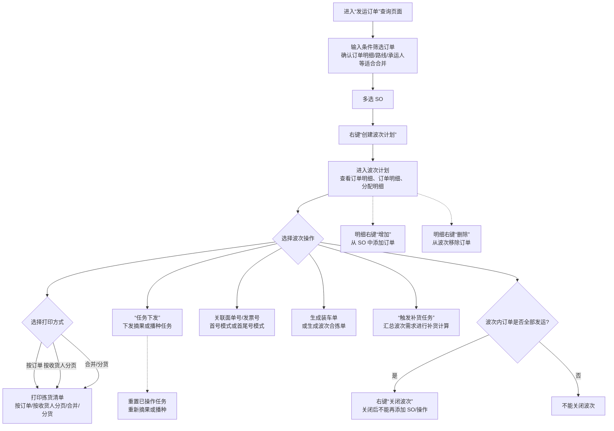

### 操作步骤

1. 进入“出库操作”→“发运订单”，输入条件查询并多选适合合并的 SO，右键选择“创建波次计划”。
2. 在波次计划中查看明细、订单明细和分配明细；需要纸面作业时，从表头右键“单据打印”选择对应拣货清单。
3. 需要下发作业时，从表头右键“任务下发”，选择摘果或播种相关任务；已操作任务可以按原文提供的功能重置。
4. 提前打印面单或发票时，使用“关联面单号”或“关联发票号”；面单可以按首号或首尾号模式关联。
5. 需要装车、波次合拣或补货时，使用对应表头右键功能。
6. 波次内订单全部发运后，才可以右键“关闭波次”。

### 关键说明

1. 波次适合订单明细相同或相似、拣货路径存在优化空间的订单；不是所有订单都适合合并。
2. 波次任务可以是摘果或播种；播种是集中拣货后的分货环节，具体操作见 11.8。
3. 波次任务下发后不能删除波次；明细增加或删除订单的可用范围受单据状态影响，原文没有给出完整状态表。

### 事实边界

波次规则、定时器和人工创建都能产生波次，但原文没有给出三者在所有状态下的优先级。图中将后台创建作为入口说明，不推导调度优先级。

## 11.3.2. 分配：查找、锁定、取消与人工改配

### 用途

把分配操作的页面路径和三种取消范围画出来，再补上系统找不到库存时的人工改配路径。

### 原文依据

- 11.3.2 分配，原 PDF 第 720—730 页。
- 进入“出库操作”→“发运订单”，查询并选择 SO，表头右键“分配-按订单”。
- 也支持订单行分配、批量分配，以及按订单、按订单行、按分配明细取消分配。
- 人工改配通过删除原分配明细、点击【新增】、库存快速检索选择库存并保存。

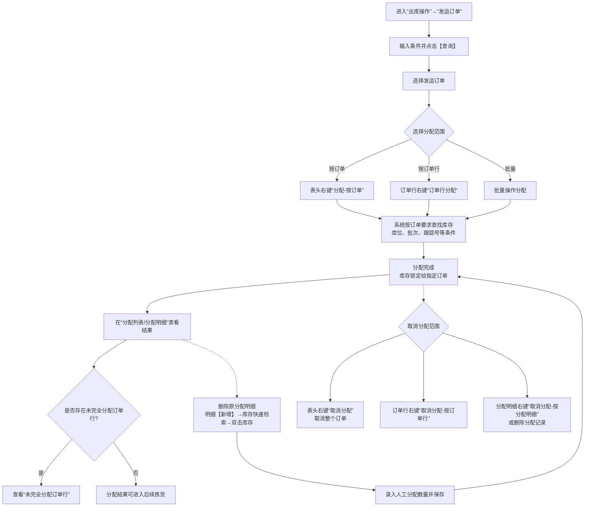

### 操作步骤

1. 进入“发运订单”，输入条件点击【查询】，选择 SO。
2. 表头右键选择“分配-按订单”；也可以在订单行右键分配或使用批量操作。
3. 在分配列表、分配明细查看结果；没有完全满足时查看“未完全分配订单行”。
4. 需要取消时，按范围选择表头“取消分配”、订单行“取消分配-按订单行”，或分配明细“取消分配-按分配明细”。
5. 系统分配无法适配现场实物时，删除原分配明细，点击【新增】，通过库存快速检索选择库存，录入数量并保存。

### 关键说明

1. 分配完成的核心结果是库存被锁定给指定订单；已分配库存不能再次分配或变更库位。
2. 订单行分配总数量通常不能超过订货数量。
3. 纸面作业时，分配后可以通过表头右键“打印拣货任务清单”。

### 事实边界

原文没有在本节规定未完全分配后的统一业务处理，也没有规定人工改配是否需要额外审批。图中只保留查询入口和改配操作。

## 11.3.3. 系统拣货确认：信息录入与反拣

### 用途

说明实物拣货后，系统拣货确认具体要维护什么信息、怎样批量复制和确认，以及如何取消拣货或生成反拣任务。

### 原文依据

- 11.3.3 拣货，原 PDF 第 720—730 页。
- 在分配明细中维护拣货时间、拣货人员、目标库位、目标跟踪号，保存后选择分配明细。
- 右键“复制拣货信息到以下各行”“拣货-按分配明细”“取消拣货”“反拣”“打印拣货标签”。

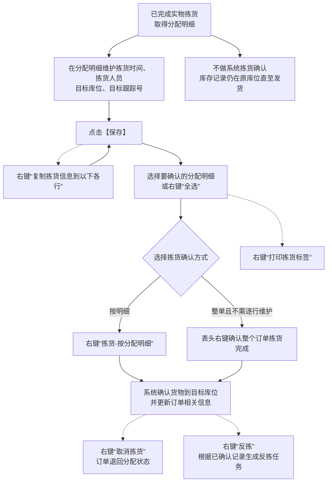

### 操作步骤

1. 在“发运订单”的分配明细页签录入拣货时间、拣货人员、目标库位和目标跟踪号，点击【保存】。
2. 信息相同的后续明细，可以使用“复制拣货信息到以下各行”。
3. 选择分配明细或使用“全选”，右键“拣货-按分配明细”确认；如果不需要记录不同拣货人员，也可以在表头确认整单拣货完成。
4. 使用纸面或 RF 作业时，可以右键“打印拣货标签”。

### 关键说明

1. 系统拣货确认不是现场实物拣货本身；原文明确实物拣取必须，而系统确认可以跳过。
2. 做系统拣货确认后，库存可以被确认到目标库位；跳过时，库存记录仍在原存储库位直到发货。
3. 发现系统确认错误时可以“取消拣货”；需要把已拣货货物返回原位时可以使用“反拣”。

### 事实边界

原文没有说明所有 RF/语音设备的拣货确认界面，因此本图只画 WMS 界面中的分配明细操作。

## 11.6. 出库复核与装箱：扫描、确认和异常

### 用途

这是出库现场最细的一张图：从获取订单/周转箱/波次信息开始，到新箱号、SKU 数量校验、装箱缓存、装箱完成和复核异常。

### 原文依据

- 11.6.1—11.6.3 出库复核，原 PDF 第 743—790 页。
- 入口：“出库操作”→“出库复核”；复核类型由 `CHK_TYP` 控制，也可在操作选项中临时切换。
- 主要按钮：新箱号、换箱、装箱完成、装箱缓存、操作选项、附加信息、包装材料、异常处理等。
- 复核可以按订单、拣货容器或波次获取分配信息；数量超出分配时系统校验并提示。

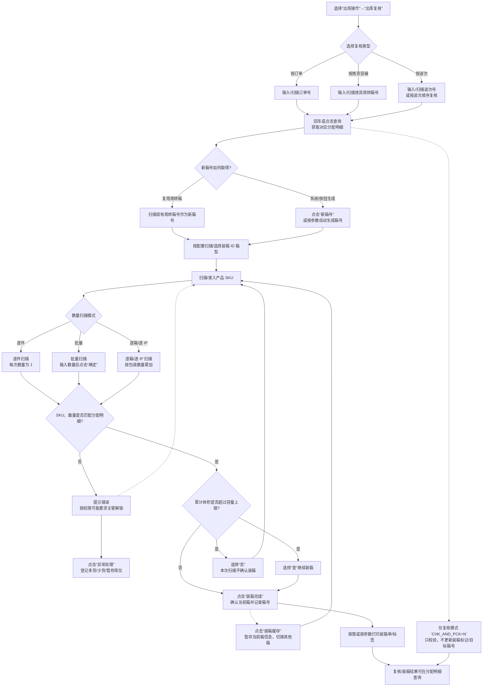

### 操作步骤

1. 进入“出库操作”→“出库复核”，根据复核类型输入或扫描订单号、拣货容器号或波次号，回车或点击查询。
2. 通过“新箱号”按钮生成出库箱号，或者扫描现场已有周转箱号；启用箱型管理时继续录入装箱 ID。
3. 在产品代码字段扫描/录入 SKU。批量模式输入数量并点击“确定”，逐件、逐箱、逐 IP 模式按操作选项累计。
4. 扫描信息匹配后，点击“装箱完成”；需要同时处理多个箱时，先用“装箱缓存”，切换箱号后再分别完成。
5. 需要记录箱体体积、重量时点击“附加信息”；需要记录包材时点击“包装材料”。
6. 发现多货、少货或放错周转箱时，点击“异常处理”登记；复核完成后按需要打印装箱单或装箱标签。

### 关键说明

1. 复核可以只校验，也可以同时装箱；仅复核模式 `CHK_AND_PCK=N` 不更新装箱标记和目标箱号。
2. 扫描到不在分配明细中的 SKU，或数量超过应出数量，会进入错误提示；是否需要高级用户解锁由 `CHK_ERR_LCK` 控制。
3. `PKG_CUB_HNT` 开启时，累计体积超限会弹窗；选择“否”时，刚扫描产品不做装箱确认。
4. 多人复核、订单排序复核、双条码、BOM 扫描、图片复核等属于操作选项或行业模式，不应默认套用到普通复核。

### 事实边界

原文列出大量行业复核参数，但没有在本章给出所有参数之间的组合优先级。图中只画复核入口、数量匹配、容量提示和异常登记等明确关系。

## 11.9. 波次播种：任务前置、扫描分货与动态播种

### 用途

说明集中拣货之后怎样按波次把产品分到订单/播种位，以及固定播种位、动态播种、尾箱和重置任务的分支。

### 原文依据

- 11.9 波次播种，原 PDF 第 809—817 页。
- 使用前需要将波次结构和分货要求下达至播种任务表；可由后台或波次计划右键任务下发。
- 入口：“出库操作”→“波次播种”；扫描波次号、播种货架号、产品条码。
- 右键/按钮包括“播种完成”“尾箱作业”“满箱”“重置任务”；动态播种由 `PTL_SEQ_LOC` 控制。

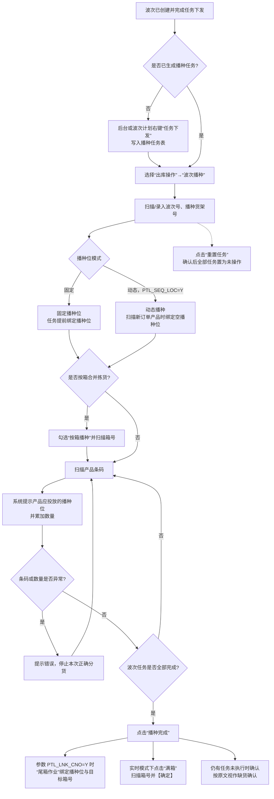

### 操作步骤

1. 先在波次计划中下发任务，确保播种任务已经写入后台任务表。
2. 进入“出库操作”→“波次播种”，扫描/录入波次号和播种货架号；按箱合并拣货时勾选“按箱播种”并扫描箱号。
3. 扫描产品条码，按系统提示把产品投放到播种位；条码或数量异常时按错误提示处理。
4. 全部任务完成后点击“播种完成”；如果有未执行任务，确认后原文视作缺货确认。
5. `PTL_LNK_CNO=Y` 时使用“尾箱作业”绑定尾箱；实时模式下可使用“满箱”按钮扫描目标箱号。
6. 需要重新开始时使用“重置任务”，确认后该波次播种任务恢复为未操作。

### 关键说明

1. 固定模式提前分配播种位；动态模式在扫描新订单产品时临时绑定空播种位，用户步骤与固定模式基本相同。
2. 播种是集中拣货后的分货，不等同于分配或实物拣货本身。

### 事实边界

图中未加入电子标签、RF、纸单三种设备的细部交互，因为原文只说明它们都可以承载播种作业，具体设备操作另有说明。

## 11.3.4. 发货控制、按订单/按明细发货与特殊触发

### 用途

说明发货确认在哪里点击、可以按什么粒度发货，以及拣货/复核/装车和取消标记如何阻断发货。

### 原文依据

- 11.3.4 发货，原 PDF 第 720—730 页。
- 标准入口：“出库操作”→“发运订单”，表头右键“发货-按订单”，明细右键“按拣货明细发运”。
- 也支持 RF、定时器、装车单和波次触发；发货前可以配置拣货、复核、装车控制。
- 接口取消标记会阻止发货；已取消明细之外的剩余明细可正常发货。

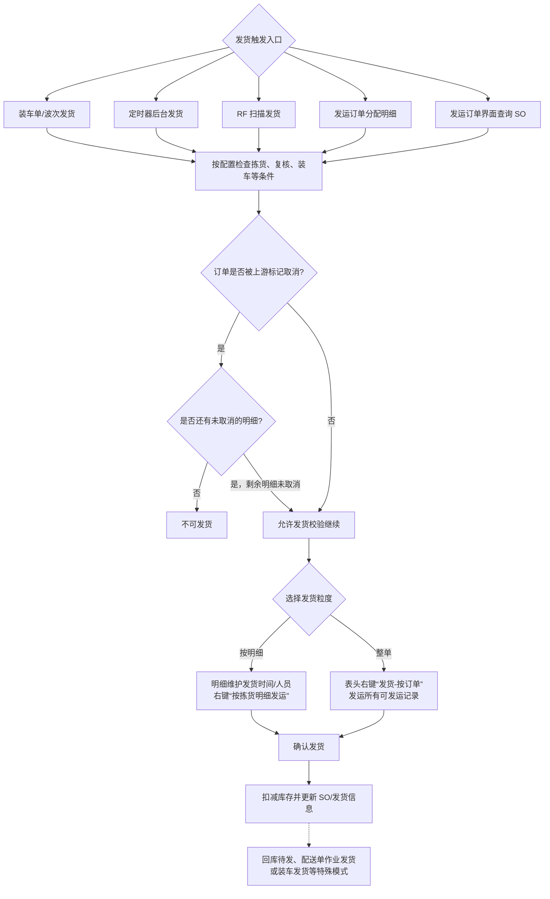

### 操作步骤

1. 在“发运订单”中输入条件查询 SO；整单发货时表头右键选择“发货-按订单”。
2. 逐条发货时，在分配明细维护发货时间和发货人员，保存后右键“按拣货明细发运”。
3. 也可以按现场设备或流程通过 RF、定时器、装车单或波次触发发货。
4. 系统按参数校验拣货、复核、装车等条件；校验通过后确认发货。

### 关键说明

1. 发货确认是系统流程中的必需节点，完成后扣减库存并更新订单。
2. “允许发运”可以由发运规则标记，再由定时器自动发货；原文没有在本节展开规则计算过程。
3. “回库待发”“配送单作业发货”“装车发货”是特殊触发方式，库存和单据结果需要结合对应作业模块理解。

### 事实边界

发货前具体需要哪些控制由参数和现场流程决定。图中列出原文明确的控制类型，但不把“拣货已确认、复核已完成、装车已完成”设成所有订单的固定前置条件。

## 11.4、11.16. 取消发货与出库异常处理

### 用途

把发货后的回退、复核异常和缺货/损坏处理放在一起，说明系统提供的是不同层级的修正动作，而不是一个笼统的“撤销”。

### 原文依据

- 11.4 取消发货，原 PDF 第 731 页：查询订单、选择记录、右键“取消发货”、确认；状态回到发货前。
- 11.16 出库异常处理，原 PDF 第 855—856 页：查询异常记录，右键重新下发拣货、取消分配、取消拣货任务、生成反拣任务、生成盘点任务、关闭异常。
- `SHP_CCL_CHK` 控制已关闭订单是否可以取消发货。

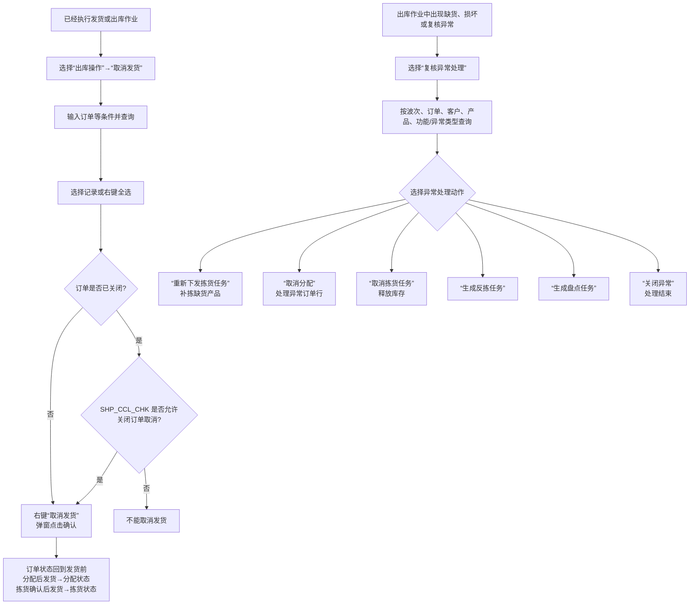

### 操作步骤

1. 取消发货：进入“出库操作”→“取消发货”，输入查询条件并查询，选中记录后右键“取消发货”，在确认框中确认。
2. 已关闭订单能否取消发货由 `SHP_CCL_CHK` 控制；不允许时停在阻断分支。
3. 处理缺货、损坏或复核异常：进入“出库操作”→“复核异常处理”，按条件查询，选中记录后右键选择处理动作。
4. 补拣选择“重新下发拣货任务”；释放错误分配选择“取消分配”；已有未完成拣货任务时可“取消拣货任务”；已完成拣货需要回架时可“生成反拣任务”；库存异常可“生成盘点任务”。

### 关键说明

1. 取消发货会使订单状态回到发货前，但原文没有在本节逐项列出所有订单状态的回退组合。
2. 出库异常处理允许专职人员后续处理并关闭异常，以免异常记录阻塞其他正常作业。

### 事实边界

原文没有规定每种异常动作的后续责任人、时限或自动触发条件。图中只保留系统提供的处理入口和直接结果。

## 11.5. 手工波次模板

### 用途

说明自动波次无法满足临时筛选需求时，如何通过订单查询结果人工控制波次规模；同时保留销售订单编组这一切换入口。

### 原文依据

- 11.5 手工波次模板，原 PDF 第 732—742 页。
- 原文明确：支持按发运订单创建波次，也支持按销售订单创建销售订单组；查询结果可以导入、导出或添加到前一次结果中，只处理未存在于其他波次/编组的订单。

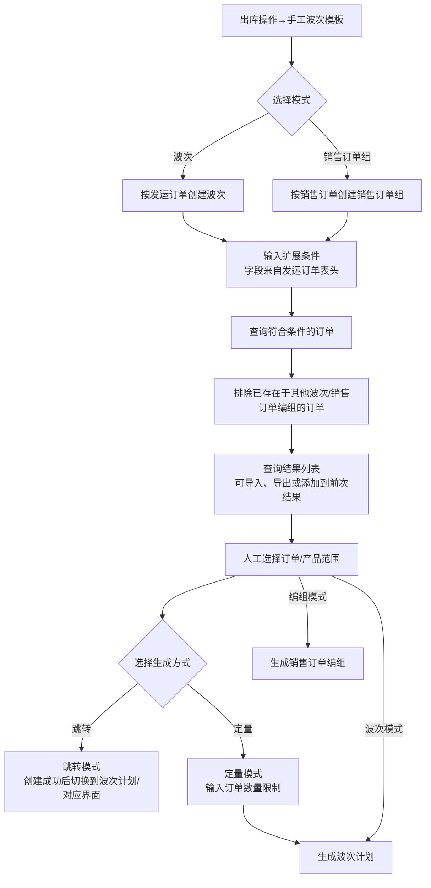

### 关键说明

1. 手工波次模板的价值在于人工筛选和控制订单量，不是重新定义波次计划规则。
2. 查询结果支持“添加到列表”，可以把二次查询结果并入前一次结果后再人工选择。
3. 定量模式限制的是创建波次计划时的订单数量；原文没有说明按产品重复率的具体计算字段，因此图中只保留人工筛选这一事实。

### 事实边界（手工波次模板）

- 本图明确表达：手工查询、排除已入波次/编组订单、人工选择和生成波次或销售订单编组的页面关系。
- 原文未说明：定量模式的完整计算规则、查询 SQL 的权限边界、重复提交和创建失败后的回滚。
- 不应据此推导：手工波次模板会替代波次规则、订单分配或库存锁定。

## 11.7—11.8. 单品复核与 N+X 复核

### 原文依据

- 对应手册小节：11.7 单品复核、11.8 N+X 复核。
- 原 PDF 页码：791—808。
- 原文明确内容：单品复核按单 SKU 订单扫描匹配；N+X 复核扫描低重合 SKU 后带出高重合 SKU；两种模式还涉及货主确认、装箱 ID/箱号、打印、重量和配送单跳转。

### 用途

把两种快捷复核方式放在同一张对比图里：单品复核面向单 SKU 订单，N+X 复核面向多品订单中的高重合 SKU 组合。

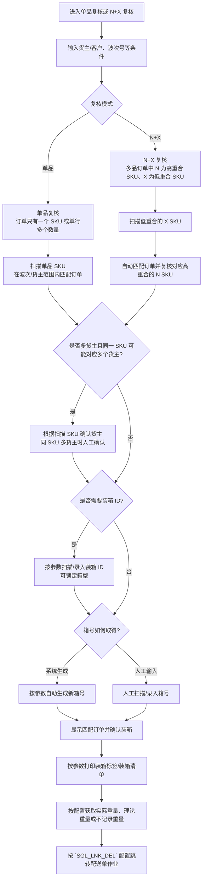

### 关键说明

1. 单品复核的订单前提是一个订单只有一个 SKU（单行多数量也属于单品订单）；正确扫描 SKU 后，可以匹配订购该产品的订单。
2. N+X 复核只需要扫描低重合的 X SKU，系统自动匹配订单并带出高重合的 N SKU，达到一次扫描复核两行订单明细的效果。
3. 两种模式都保留了货主确认、装箱 ID、箱号、打印、重量获取、异常处理和跳转配送单等现场控制；赠品管理是原文在单品复核中单独说明的功能，不扩展到 N+X。

### 事实边界（单品复核与 N+X 复核）

- 本图明确表达：单品复核与 N+X 复核的扫描入口、订单匹配、货主确认、装箱和输出动作。
- 原文未说明：N、X 重合率的计算公式、多候选订单排序以及复核数量写回库存/任务的精确时点。
- 不应据此推导：两种复核模式覆盖所有订单，或确认装箱就等于完成发货。

## 11.10. 图形化波次播种

### 原文依据

- 对应手册小节：11.10 图形化波次播种。
- 原 PDF 页码：818—831。
- 原文明确内容：图形化播种依赖工作站、播种墙和波次计划设置，支持标准/简单模式、固定/动态播种位、按箱播种、尾箱、满箱、残损登记、打印和重置。

### 用途

在普通波次播种基础上，补充工作站、播种墙、图形化交互、简单模式和播种异常处理。

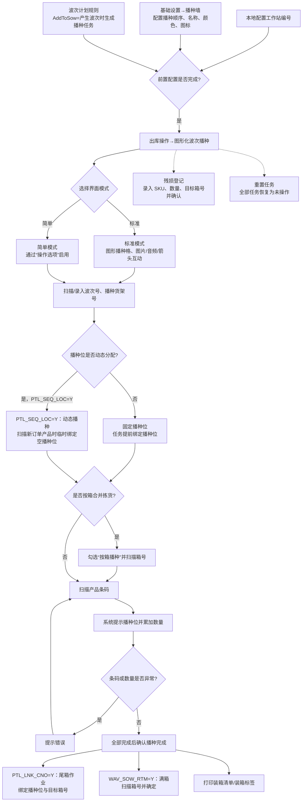

### 关键说明

1. 图形化播种使用前，工作站、播种墙和波次计划规则是三类前置设置；没有本地工作站编号时，原文明确会提示不能作业。
2. 标准模式用图形化播种格配合图片、音频和方向提示；简单模式仍保留波次、播种货架、按箱和产品扫描等核心步骤，只改变界面形式。
3. 动态播种由 `PTL_SEQ_LOC` 控制，任务下达时不绑定具体播种位，而是在扫描新订单产品时按次序绑定空播种位。
4. 播种完成后仍可能有尾箱、满箱、装箱清单/标签、残损登记和重置任务等操作；它们不是每次都必须执行。

### 事实边界

- 本图明确表达：工作站、播种墙、波次规则、播种模式、扫描、播种位绑定和异常处理入口。
- 原文未说明：播种数量与库存事务的精确记账时点、动态播种位并发占用和重置后的任务恢复细节。
- 不应据此推导：播种完成必然等于复核完成或发货完成。

## 11.11. 订单分配计划

### 原文依据

- 对应手册小节：11.11 订单分配计划。
- 原 PDF 页码：832—835。
- 原文明确内容：订单分配计划包含计划头、计划明细和订单选择 SQL，可用标准/扩展条件生成查询条件，并按执行顺序、批量数和执行周期抓取订单行进入分配流程。

### 用途

说明订单分配计划 3.0 解决的不是普通 SKU 级规则，而是“同 SKU 不同订单使用不同分配方式”以及“多个库区按顺序尝试”的筛选需求。

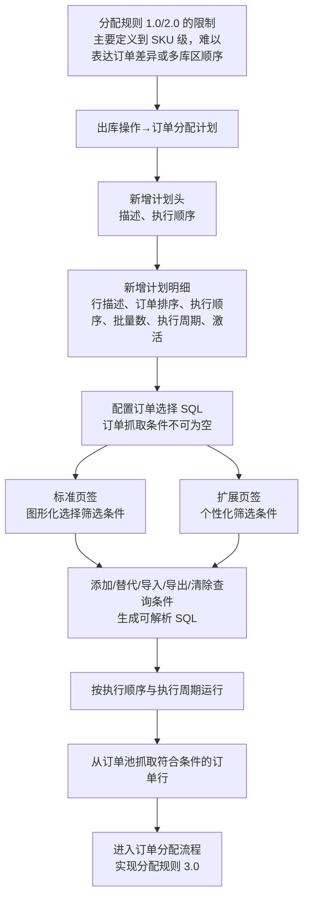

### 关键说明

1. 计划头维护计划描述和执行顺序；明细再定义订单排序字段、执行顺序、订单批量数、执行周期和订单选择 SQL。
2. 订单选择 SQL 用于多维度筛选订单行；标准条件不够时，使用扩展页签补充个性化条件。
3. “添加”以覆盖形式更新原 SQL，“替代”以追加形式更新原 SQL；原文同时提供筛选条件导入、导出和清除。
4. 计划编号、定时器任务编号、上次分配时间等由系统生成或记录，图中不把它们误画成用户输入条件。

### 事实边界

- 本图明确表达：计划头、明细、筛选条件、SQL、执行顺序/周期与订单分配之间的页面关系。
- 原文未说明：SQL 的实际执行权限、失败重试、订单行去重和与库存分配事务的精确时点。
- 不应据此推导：订单分配计划一定替代所有普通分配规则，或计划执行后必然生成完整拣货任务。

## 11.12—11.15. 配送、集拼、集货与装车的后段衔接

### 用途

把复核完成后可能出现的多个物流容器和作业岗位分开：配送单负责称重/面单，集拼箱负责大容器关联，集货位负责按规则集中，装车单负责车辆装载跟踪。

### 配送单作业

### 原文依据

- 对应手册小节：11.12 配送单作业。
- 原 PDF 页码：836—842。
- 原文明确内容：配送单作业以箱号为入口，展示订单/收货人信息，可维护箱型、重量和包材，打印标签/面单并按参数记录配送标签或自动发运。

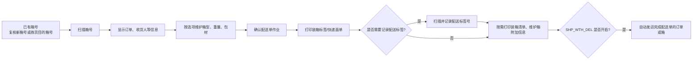

### 事实边界（配送单作业）

- 本图明确表达：以箱号进入配送单作业、维护箱与包材信息、打印标签/面单，以及按参数记录配送标签或触发自动发运。
- 原文未说明：配送单确认与库存事务的精确记账时点、承运商选择规则和外部运输接口。
- 不应据此推导：配送单作业本身必然完成发货，或所有出库订单都必须经过配送单。

### 集拼箱、集货位与装车单

### 原文依据

- 对应手册小节：11.13 集拼箱、11.14 集货位、11.15 装车单。
- 原 PDF 页码：843—854。
- 原文明确内容：集拼箱通过 DROPID 关联出库箱/配送标签；集货位可按配置计算；装车单可以选择或扫描明细，执行装载确认、装车完成、确认发货、关闭和重置。

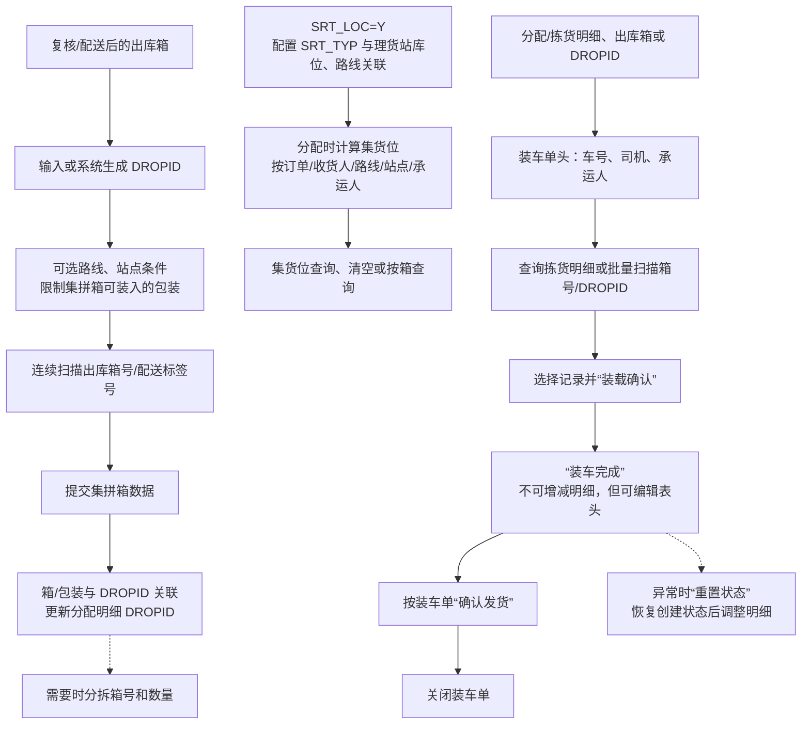

### 关键说明

1. 集拼箱可以限制路线/站点，也可以不限制；提交后系统把出库箱与 `DROPID` 关联，特殊情况下可分拆出库箱。
2. 集货位启用由 `SRT_LOC` 控制，分配方法 `SRT_TYP` 可按订单、收货人、路线、站点或承运人；体积超限时系统寻找下一个集货位。
3. 装车单不是出库必经环节；可以从分配明细查询选择，也可以扫描箱号或 `DROPID`。装车完成后不能增减明细，必要时通过“重置状态”回退。

### 事实边界（集拼箱、集货位与装车单）

- 本图明确表达：箱号/配送单、DROPID、集货位配置和装车单之间的后段衔接，以及装车单可见动作。
- 原文未说明：集货位候选排序、装车确认是否产生库存事务、运输接口契约和重置后的可回退状态集合。
- 不应据此推导：配送、集拼、集货和装车一定全部启用或按图中顺序执行。

## 11.17—11.21. 销售订单、发票与包裹管理

### 原文依据

- 对应手册小节：11.17 销售订单、11.18 销售订单编组、11.20 发票管理、11.21 包裹管理。
- 原 PDF 页码：857—865。
- 原文明确内容：销售订单可编组并生成/取消波次；发票可关联订单明细并进行作废、重开、红冲、取消、复制；包裹管理承接集拼箱信息并维护承运人和面单号。

### 用途

补充出库作业外围的原始订单组织、发票维护和承运人后置选择，避免把它们误画成直接拣货节点。

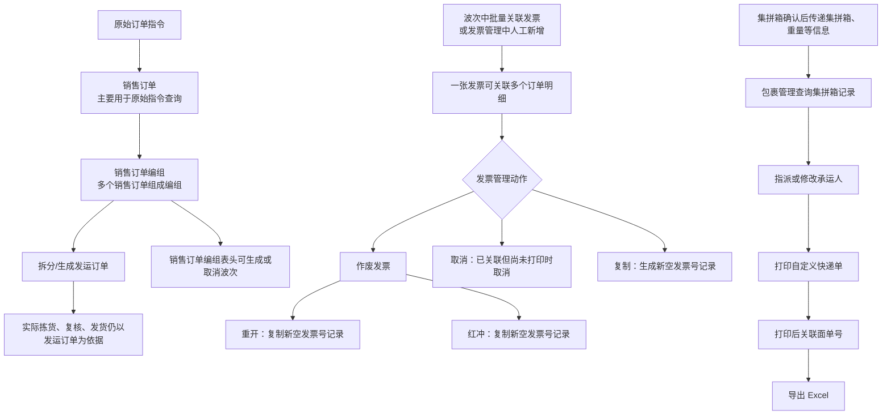

### 关键说明

1. 销售订单是原始指令查询和编组对象，销售订单编组可以生成或取消波次；系统不直接根据销售订单执行拣货、发货。
2. 发票管理既承接波次批量关联，也支持人工新增；金额原文允许负数和小数。作废、重开、红冲、取消、复制是不同动作，不应统称为“修改发票”。
3. 包裹管理需要配合集拼箱使用：集拼箱确认后，先指派承运人，再打印自定义快递单，打印成功后关联面单号；承运人也可以后续修改。

### 事实边界（销售订单、发票与包裹管理）

- 本图明确表达：销售订单/编组、发运订单、发票、集拼箱和包裹管理的可见连接。
- 原文未说明：发票与库存事务的关系、承运人选择算法、各模块的启用顺序和外部运输同步。
- 不应据此推导：销售订单编组、发票处理或打印面单本身会直接完成库存发货。

## 11.3.1—11.3.4. 发货操作的可选节点与状态控制

> 用途：补齐新版手册对预配、分配、拣货、发货四个节点的定义，以及一步分配、终止/恢复分配和组箱计算等关键分支。
>
> 原文依据：`../01-按章节拆分的md文件（1119页版本）/11-出库操作.md`；原 PDF 第 720—729 页。

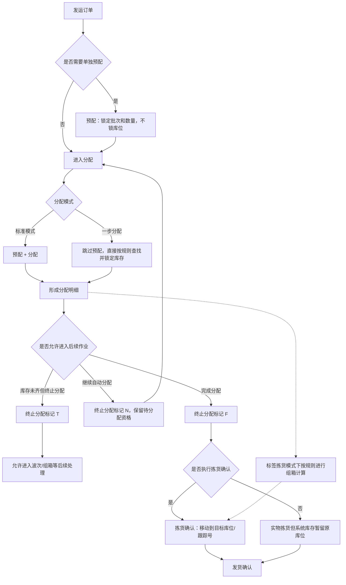

### 关键说明

1. 预配只查找并保留符合要求的批次和数量，不涉及库位；标准分配通常在后台执行“预配+分配”，一步分配则跳过预配。
2. 终止分配标记 T 用于把尚未完全分配但需要继续作业的订单视同完成分配；N 允许继续分配，F 表示分配完成。
3. 拣货确认不是所有场景都必须在系统中执行；发货确认是手册明确的必不可少节点。

### 事实边界

原文没有给出所有订单类型的状态枚举、分配失败重试规则和组箱算法细节；图中不把“终止分配”解释为订单已发货。

## 11.19—11.23. 发货后的回单、包裹与快递交接

> 用途：补齐发货后段新增支撑功能：回单、发票、包裹、快递交接单和出库序列号查询。
>
> 原文依据：`../01-按章节拆分的md文件（1119页版本）/11-出库操作.md`；原 PDF 第 861—867 页。

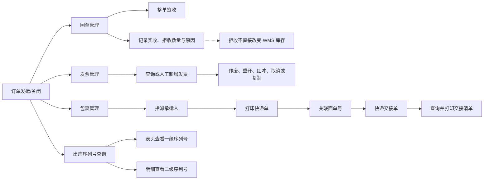

### 关键说明

1. 回单可以记录签收和拒收，但原文明确说拒收数据不直接影响 WMS 库存，退货回仓后还需执行退货收货确认。
2. 包裹管理需要配合集拼箱：集拼箱确认后，先指派承运人，再打印快递单，打印成功后关联面单号。
3. 快递交接单在 WMS 中主要提供查询、查看和清单打印，交接扫描主要通过 RF 功能完成。

### 事实边界

原文没有说明承运人选择算法、回单与 ERP 的回传时序或交接完成后的订单关闭规则；图中不补充这些系统间关系。
