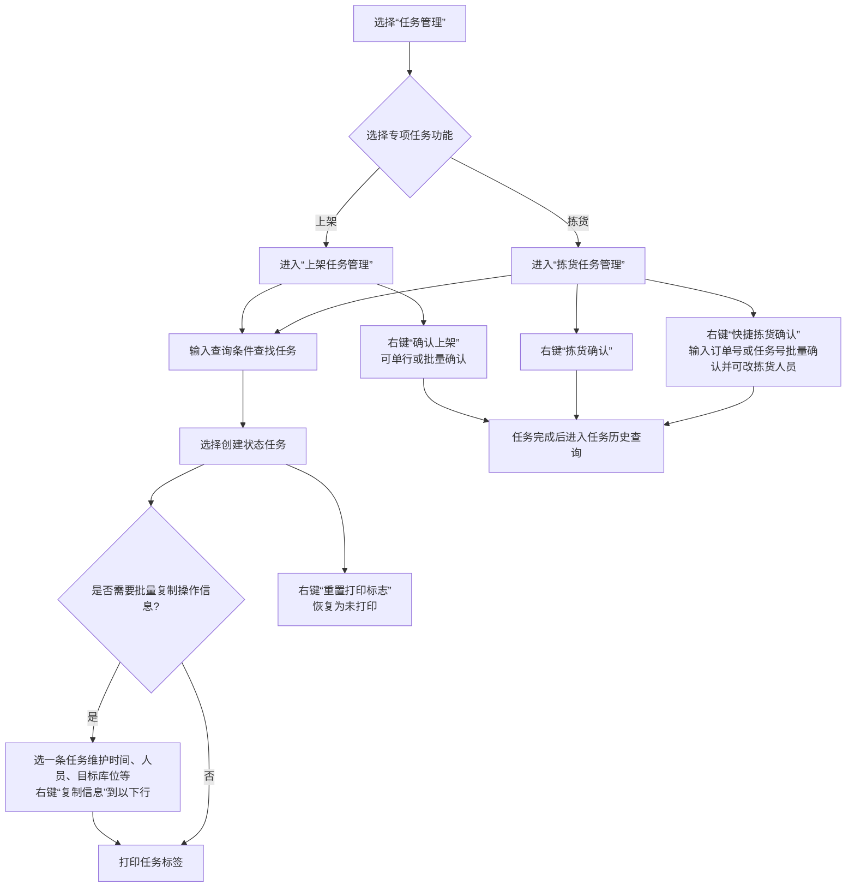
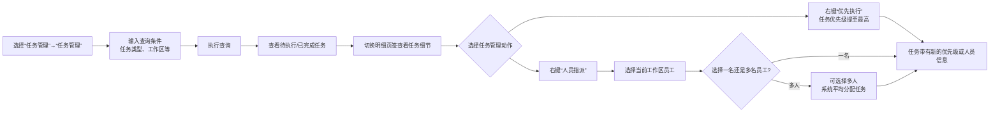
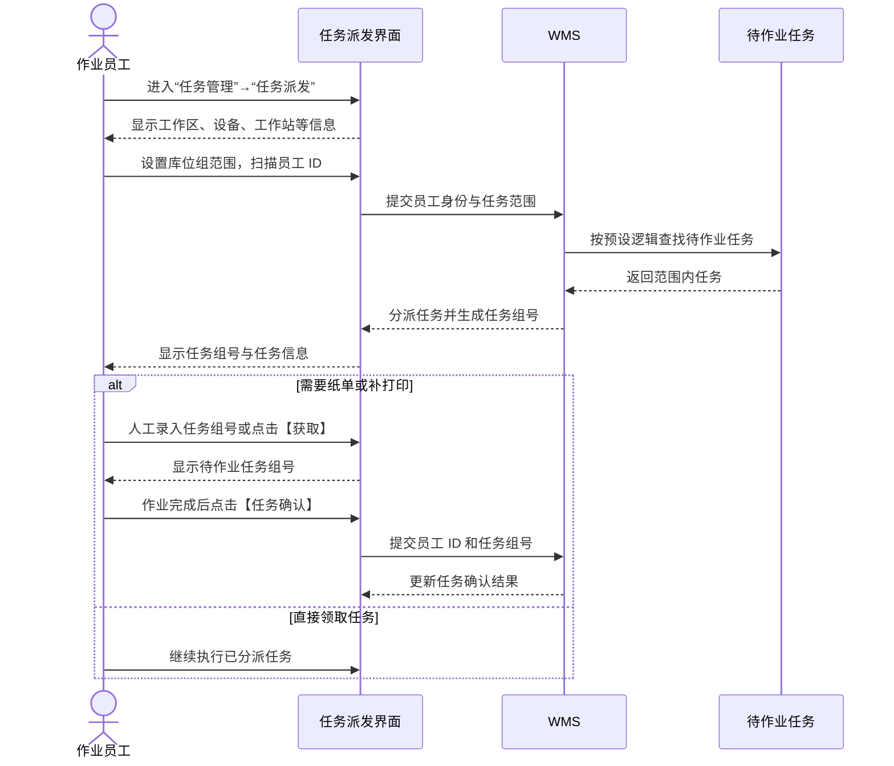
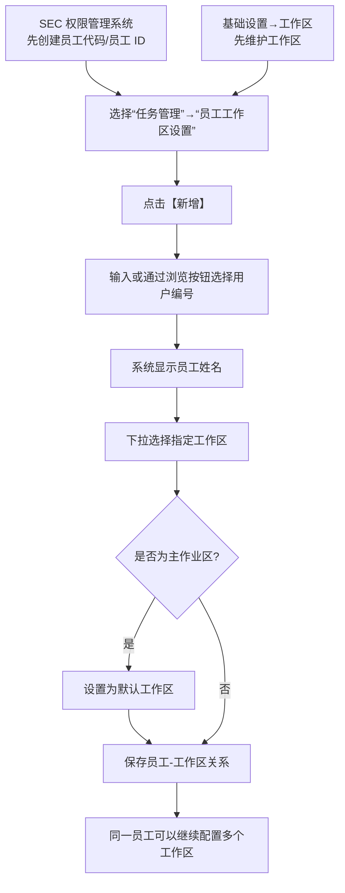
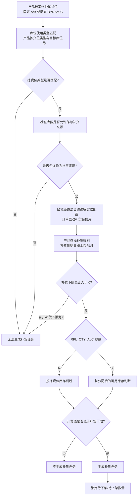
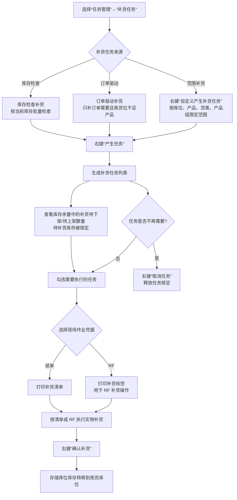
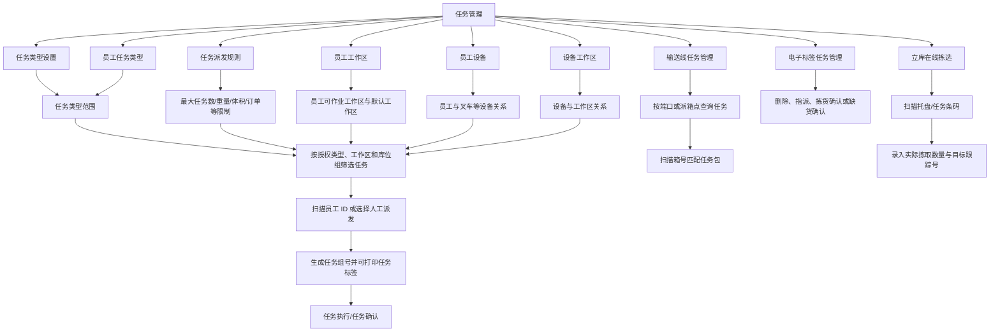

# 12. 任务管理

> 本章定位：把上架、拣货、补货等任务的查询、打印、指派、派发、执行、确认和取消拆成可操作的页面流程。
>
> 来源：`../01-按章节拆分的md文件（1119页版本）/12-任务管理.md`；原 PDF 第 868—894 页。

## 12.1. 学习重点

1. 任务是 WMS 把业务单据转成仓库现场动作的载体；本章明确覆盖上架、拣货和补货任务。
2. 任务管理不只是查看列表，还包括打印、优先执行、人员指派、任务组号、现场完成确认和历史追溯。
3. 任务派发有“范围 + 员工 ID + 系统分派”的模式，也支持人工录入/获取任务组号后再处理纸单确认。
4. 补货任务的重点是拣货位设置、来源库区、补货规则、补货下限和 `RPL_QTY_ALC`；任务生成后会锁定待下架/待上架数量。

## 12.2—12.3. 上架任务与拣货任务的专项操作

### 用途

把两个专项任务页面的共同操作和差异画出来：上架任务确认上架，拣货任务确认拣货，拣货任务另有快捷批量确认。

### 原文依据

- 12.2 上架任务管理、12.3 拣货任务管理，原 PDF 第 869—871 页。
- 共同入口：进入对应专项功能，输入查询条件查找任务；创建状态任务可以打印标签或确认完成。
- 上架右键包括“复制信息”“确认上架”“重置打印标志”；拣货右键包括“复制信息”“拣货确认”“快捷拣货确认”“重置打印标志”。

### 操作步骤

1. 进入“任务管理”→“上架任务管理”或“拣货任务管理”，输入查询条件。
2. 选择创建状态任务，需要纸面操作时打印标签；字段相同的多行可先维护一条，再右键“复制信息”。
3. 上架任务选择“确认上架”；拣货任务选择“拣货确认”，或使用“快捷拣货确认”按订单号/任务号批量确认。
4. 打印标记错误时，可使用“重置打印标志”重新进入未打印状态。

### 关键说明

1. “复制信息”是批量录入辅助，不等于确认任务完成。
2. 上架确认和拣货确认是两个不同动作，不能因为任务都在任务管理模块中就合并成一个状态。
3. 原文允许单行或多行批量上架确认；拣货任务另提供快捷批量确认，并可同时修改拣货人员。

### 事实边界

原文没有为上架任务、拣货任务给出统一的状态名称和完整状态迁移表。图中只画专项页面和原文明确的菜单动作。

## 12.1. 统一任务管理：查询、优先级与人员指派

### 用途

说明“任务管理”总入口与专项任务入口的区别，以及任务为什么可以被优先执行或分派给工作区人员。

### 原文依据

- 12.1 任务管理，原 PDF 第 868 页。
- 任务管理可以查询已完成和尚未执行的不同类型任务，并通过明细页签查看细节。
- 右键“优先执行”会把任务优先级提至最高；“人员指派”可以选择当前工作区员工，也可以多人平均分配。

### 操作步骤

1. 进入“任务管理”→“任务管理”，输入查询条件并查询。
2. 通过明细页签查看具体任务。
3. 需要插队处理时，对任务右键选择“优先执行”。
4. 需要指定人员时，右键“人员指派”，在二级窗口选择员工；未指定工作区时，原文说明会显示当前仓库全部工作区对应人员。

### 关键说明

1. 任务优先执行改变的是任务队列优先级，不代表任务已经完成。
2. 人员指派可以选择多人，系统平均分配任务；原文没有说明平均分配的具体计算口径。

### 事实边界

原文没有说明优先级与工作区、任务类型之间的排序算法，也没有规定人员指派后是否立即生成任务组号。图中不补充这些内部规则。

## 12.6. 任务派发：范围、员工 ID 与任务组号

### 用途

把“任务派发”页面真正的操作顺序画出来，说明员工不是直接看到所有任务，而是先限定范围，再由系统根据预设逻辑分派。

### 原文依据

- 12.6 任务派发，原 PDF 第 879—881 页。
- 模式一：设置工作区、库位组等范围，扫描员工 ID，系统根据范围内任务量分派。
- 模式二：扫描员工卡号/ID，系统查找并分派任务。
- 成功后生成任务组号；支持人工录入或【获取】任务组号，纸单作业完成后通过【任务确认】提交员工 ID 和任务组号。

### 操作步骤

1. 进入“任务管理”→“任务派发”。
2. 模式一设置工作区、库位组 1、库位组 2 等范围，扫描员工 ID；系统按范围任务量分派。
3. 模式二直接扫描员工卡号/ID，系统查找并分派任务。
4. 派发成功后系统生成任务组号；需要补打印时可以人工录入任务组号，或点击【获取】按范围取得待作业任务组号。
5. 纸单作业完成后点击【任务确认】，扫描员工 ID、录入任务组号并确认；需要输出标签时点击【打印】。

### 关键说明

1. 工作区默认值来自客户端配置；界面可以勾选“不指定工作区”，但不能修改客户端默认工作区。
2. 设备来自员工设备设置，工作站来自客户端文件；原文将它们作为派发范围/作业环境信息展示。
3. 勾选“关联容器号”后，可以扫描容器号与任务关联，例如拣货到同一个目标容器。

### 事实边界

原文没有说明任务队列的具体排序算法、一次派发任务数量和任务组号生成规则。时序图只表达角色交接和系统响应。

## 12.10. 员工工作区设置：任务范围的基础资料

### 用途

说明任务派发中的员工和工作区从哪里来，以及怎样建立员工—工作区关系。

### 原文依据

- 12.10 员工工作区设置，原 PDF 第 885 页。
- 员工代码需要先在 SEC 权限管理系统创建；工作区在基础设置的工作区功能中维护。
- 在“员工工作区设置”中点击【新增】，选择用户编号和工作区，可设置默认工作区并保存；同一员工可设置多个工作区。

### 操作步骤

1. 先在 SEC 创建员工代码，并在基础设置中维护工作区。
2. 进入“任务管理”→“员工工作区设置”，点击【新增】。
3. 输入或通过浏览按钮选择用户编号，系统显示姓名。
4. 下拉选择工作区；如果是主作业区，可以设置为默认工作区。
5. 保存，建立员工与工作区关系；同一员工可以重复配置多个工作区。

### 关键说明

员工工作区设置是任务派发可按工作区查找人员的基础资料，不等于已经把某个具体任务分派给员工。

### 事实边界

原文没有说明一个员工多个工作区在派发时的优先级，也没有说明默认工作区与“不指定工作区”的内部处理关系。

## 12.4.1. 补货设置与任务计算

### 用途

把补货任务为什么生成或不生成拆成前置资料和计算分支，重点保留 `RPL_QTY_ALC` 的实际差异。

### 原文依据

- 12.4.1 补货设置，原 PDF 第 872—876 页。
- 需要维护产品拣货位、库位使用类型、库区补货来源、区域设置、补货规则和上架规则。
- 拣货位类型与库位类型不匹配，或补货下限为 0，会导致无法生成补货任务。
- `RPL_QTY_ALC=N` 按拣货位库存判断；`Y` 按分配后的可用库存余量判断。

### 操作步骤

1. 在产品档案维护固定或动态拣货位；确认目标库位的使用类型匹配。
2. 在库区设置中确认来源库区允许用于补货；订单驱动补货还要检查区域是否遵循拣货位设置。
3. 为产品选择补货规则，并确认补货规则关联正确的上架规则。
4. 根据现场逻辑设置 `RPL_QTY_ALC`，再由系统按库存或分配后可用量计算是否低于补货下限。
5. 达到补货条件后生成任务，系统锁定来源待下架和目标待上架数量。

### 关键说明

1. 动态拣货位有库存时，系统可以指向现有拣货位合并；没有库存时，再根据补货规则查找新库位。
2. 补货下限为 0、拣货位类型与库位类型不匹配，原文明确会导致无法生成任务。
3. 原文示例：拣货位库存 100、已分配 95、下限 20；`N` 时不生成，`Y` 时可用余量 5 小于 20，生成任务。

### 事实边界

订单驱动补货还需要在分配规则中允许自动产生任务。本图只画补货计算共同骨架，不把库存检查补货和订单驱动补货的触发时点画成同一条固定路径。

## 12.4.2. 补货任务生成、执行、确认与取消

### 用途

把补货功能的实际按钮操作串起来，明确“产生任务”后库存被锁定，实物完成后才通过“确认补货”完成转移。

### 原文依据

- 12.4.2 补货操作，原 PDF 第 872—876 页。
- 库存检查补货：任务管理→补货任务，右键“产生任务”；选择任务后打印补货清单/标签；实物完成后右键“确认补货”。
- 已生成但不再需要的任务，右键“取消任务”释放任务。
- 订单驱动补货生成的任务进入同一补货任务列表，后续操作相同。

### 操作步骤

1. 进入“任务管理”→“补货任务”。库存检查补货使用右键“产生任务”；需要限定范围时使用“自定义产生补货任务”。
2. 订单驱动补货由订单分配过程触发，生成后同样显示在补货任务列表中。
3. 选择任务并打印补货清单，或打印补货标签供 RF 操作。
4. 实物补货完成后，在对应任务上右键选择“确认补货”。
5. 如果任务生成后已不需要补货，例如库存已经被移动，右键选择“取消任务”释放锁定。

### 关键说明

1. “产生任务”是系统计算和锁定，不代表实物已经补货完成；“确认补货”才执行存储库位到拣货库位的库存转移。
2. 订单驱动补货和库存检查补货的触发方式不同，但生成后的任务列表和后续确认操作相同。
3. 补货任务的待下架、待上架数量可以在库存余量的按批次/库位/跟踪号查询中查看。

### 事实边界

原文没有展开 RF 补货的扫描交互，因此图中只标出打印标签和 RF 作业入口，不补充 RF 页面字段和扫描顺序。

## 12.5—12.14. 任务派发与人员/设备约束

> 用途：补齐输送线派箱、任务派发、任务类型、员工约束、电子标签任务和立库在线拣选的关系。
>
> 原文依据：`../01-按章节拆分的md文件（1119页版本）/12-任务管理.md`；原 PDF 第 878—894 页。

### 关键说明

1. 任务派发不是只扫描员工 ID；系统还会读取授权任务类型、工作区、库位组、设备及派发规则，生成任务组号。
2. 员工任务类型、员工工作区、员工设备和设备工作区是任务调度的约束资料，原文允许一个员工关联多个任务类型、工作区或设备。
3. 电子标签任务支持人工指派、拣货确认和缺货确认；立库在线拣选支持逐个任务确认或批量获取任务打印标签两种模式。

### 事实边界

原文没有说明派发规则冲突时的算法、任务组号的唯一性规则、设备接口报文和缺货后的统一库存补偿；图中不补充这些实现细节。
