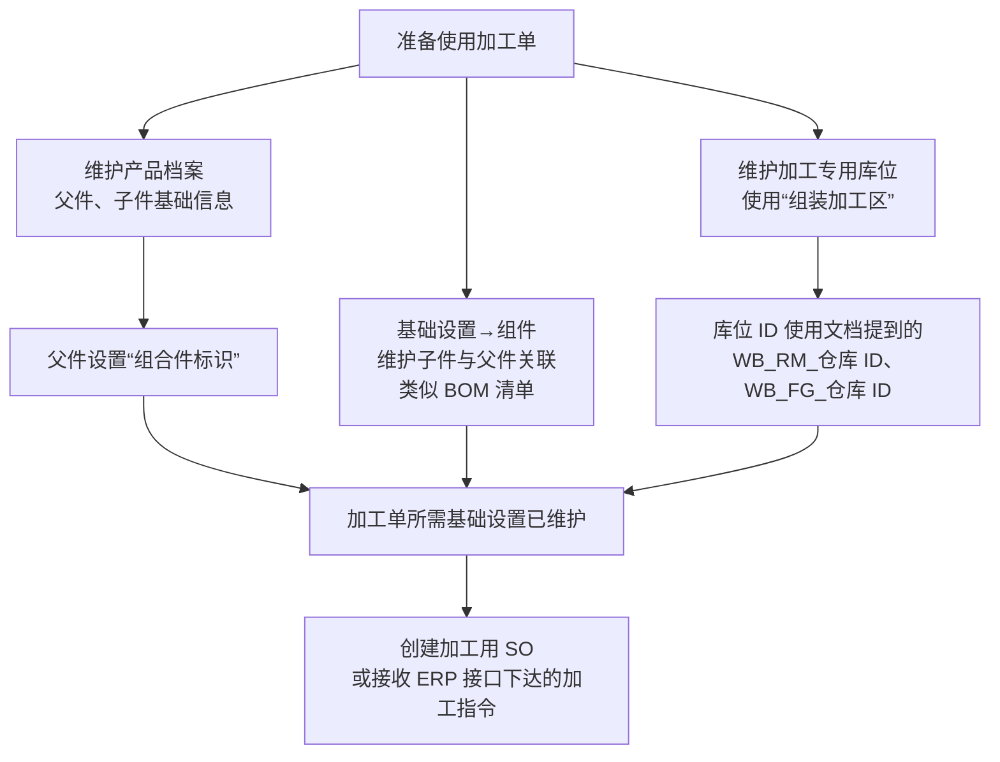
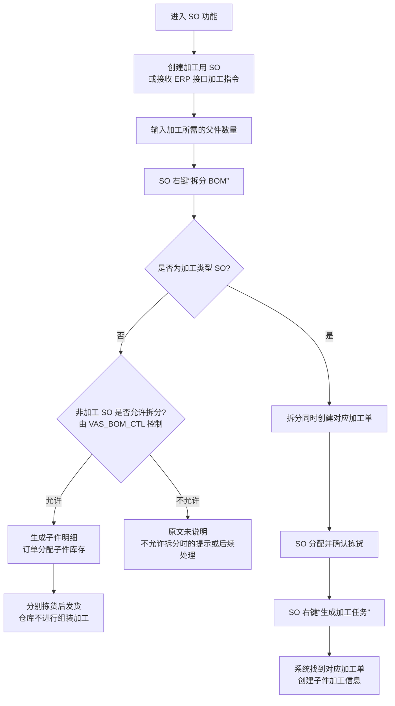
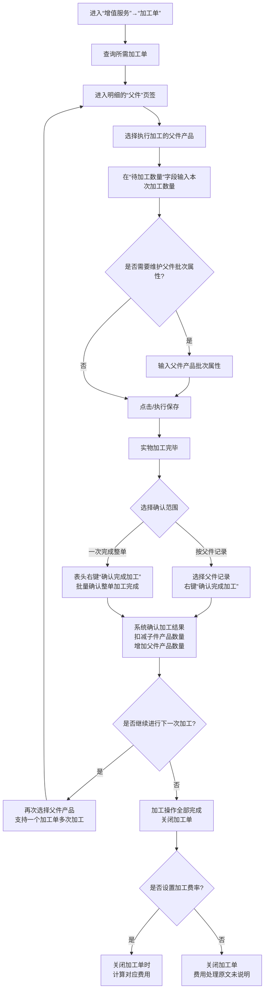
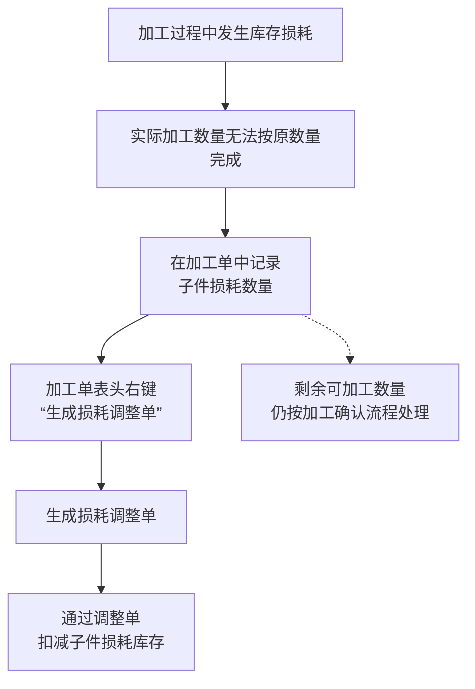
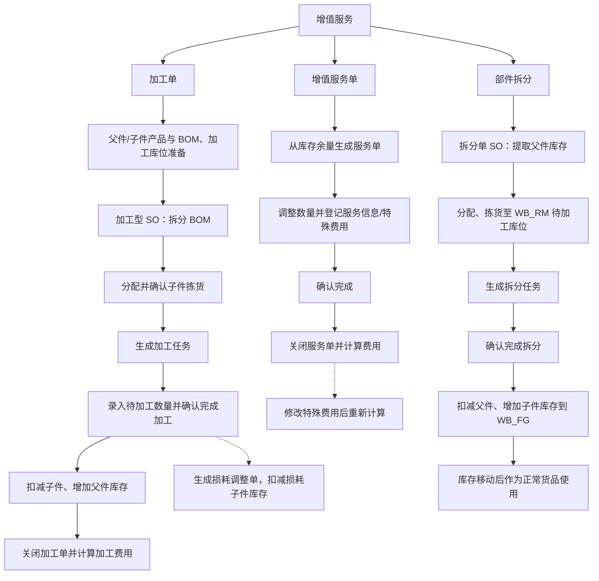

# 13. 增值服务

> 本章定位：把加工型增值服务从 BOM 拆分、子件分配、加工任务生成，一直拆到加工确认、父子件库存变化、加工单关闭和损耗调整。
>
> 来源：`../01-按章节拆分的md文件（1119页版本）/13-增值服务.md`；原 PDF 第 895—904 页。

## 13.1. 学习重点

1. 本章概述列出加工单、拆分单和增值服务单，但原文重点展开的是“加工单”以及 SO 的“拆分 BOM”操作。
2. 增值服务中的两类加工不能混为一谈：原产品基础上的加工，重点是记录加工工作量并区分已加工/未加工；组合加工则会把多个子件加工组合成父件，产品和数量都会发生变化。
3. 加工单不是单独凭空开始的。原文要求先维护产品档案、组件关系和组装加工区库位，再通过加工用 SO 分配子件库存。
4. 最关键的库存结果是：确认完成加工后，系统扣减子件产品数量，增加父件产品数量；损耗则通过损耗调整单扣减子件损耗库存。
5. 本章没有展开“拆分单”和“增值服务单”的具体页面操作，以下图表不对这两类功能补充未出现的流程。

## 13.1.1. 加工前的基础设置

### 用途

先把加工单依赖的基础资料画出来，避免把“生成加工任务”误解成只要有一个 SO 就能直接执行。

### 原文依据

- 13.1 加工单—相关设置，原 PDF 第 895—896 页。
- 产品档案：维护父件、子件基础信息，父件需要设置“组合件标识”。
- 组件：维护子件与父件的关联，类似 BOM 清单。
- 库位：需要有使用“组装加工区”的加工专用库位；原文提到库位 ID `WB_RM_仓库 ID`、`WB_FG_仓库 ID`，作为待加工库位与已加工暂存库位。

### 编号说明

1. **1—3：产品与组件关系。** 父件、子件需要先存在于产品档案中，父件还要设置“组合件标识”；组件功能维护两者的关联关系。
2. **4—5：加工库位。** 原文要求有组装加工区专用库位，并列出 `WB_RM_仓库 ID`、`WB_FG_仓库 ID` 两类库位 ID。
3. **6：加工单入口。** 加工用 SO 可以人工创建，也可以接收 ERP 接口下达的加工指令。

### 事实边界 / 原文未说明

- 原文没有给出父件、子件、组件和加工库位的完整字段清单，也没有说明保存这些基础资料时的校验顺序。
- 原文只说明这些库位用于待加工库位和已加工暂存库位，没有进一步说明每个库位 ID 与具体阶段的唯一对应关系。
- 图中“基础设置已维护”表示加工功能的前置资料关系，不代表系统会在创建 SO 时逐项自动校验这些配置。

## 13.1.2. SO 拆分 BOM：普通 SO 与加工型 SO

### 用途

这是本章最容易混淆的分支：同样是右键“拆分 BOM”，普通 SO 可以只是把父件拆成子件分别出库；加工类型 SO 则会同时创建加工单，进入后续加工管理。

### 原文依据

- 13.1 加工单—加工单操作—创建加工用的 SO，原 PDF 第 895—899 页。
- SO 输入加工所需父件数量后，通过右键功能“拆分 BOM”拆成子件记录，并分配子件库存。
- 所有 SO 都可以根据 BOM 把父件明细拆为子件明细；参数 `VAS_BOM_CTL` 控制非加工类型 SO 能否使用“拆分 BOM”。
- 只有加工类型 SO 在拆分的同时创建对应加工单。

### 编号说明

1. **1—4：SO 操作入口。** 先创建 SO，输入父件数量，再在 SO 上右键选择“拆分 BOM”。
2. **5—7：普通 SO 分支。** 普通 SO 也可以拆分 BOM，但是否允许使用该功能受 `VAS_BOM_CTL` 控制；允许时，系统生成子件明细并分配子件库存，随后分别拣货发货。
3. **8—10：加工型 SO 分支。** 加工类型 SO 拆分 BOM 时会创建加工单；SO 分配并确认拣货后，右键“生成加工任务”，系统找到对应加工单并创建子件加工信息。
4. **普通 SO 示例。** 原文给出的典型场景是：A 产品 100 件按 BOM 拆出赠品 B 产品 100 件，A、B 分别拣货后发货，再由超市销售人员捆扎销售。

### 关键逻辑

- “拆分 BOM”与“实际组装加工”不是同一个动作。普通 SO 可以只做 BOM 拆分和子件出库，不进入加工确认。
- “SO 分配并确认拣货”是生成加工任务前的原文前置动作；图中没有把创建加工任务直接连到 SO 创建。
- `VAS_BOM_CTL` 只在原文中被说明为控制非加工类型 SO 是否可以使用“拆分 BOM”；它不是加工单的通用状态字段。

### 事实边界 / 原文未说明

- 原文没有说明 `VAS_BOM_CTL` 取值、配置位置和不允许拆分时的具体系统提示。
- 原文没有给出“加工类型 SO”的全部判定字段，也没有说明 SO 分配失败、拣货确认失败时的处理分支。
- “系统找到对应加工单”的匹配字段和匹配失败结果，原文未说明。

## 13.1.3. 加工确认与父子件库存变化

### 用途

展开加工单页面中的实际操作：查询加工单、填写本次加工数量、可选录入父件批次属性、按明细或整单确认，并明确确认动作带来的库存变化。

### 原文依据

- 13.1 加工单—加工确认，原 PDF 第 897—899 页。
- 在增值服务的加工单功能中查询加工单，在父件页签选择父件产品，输入待加工数量并保存。
- 可按需要输入父件批次属性；一个加工单支持多次加工。
- 实物加工完成后，明细右键“确认完成加工”；也可以通过表头右键“确认完成加工”批量确认整单。
- 确认加工扣减子件产品数量，增加父件产品数量；加工完成后可关闭加工单；配置加工费率时，关闭加工单会计算对应费用。

### 编号说明

1. **1—5：加工数量录入。** 进入加工单后，在父件页签选择父件，填写本次待加工数量并保存。
2. **6—7：批次属性是可选录入。** 原文说“可根据需要”输入父件产品批次属性，并未规定所有加工都必须录入。
3. **8—10：完成加工确认。** 实物加工完毕后，可以对父件记录右键确认，也可以通过表头右键批量确认整单。
4. **11：库存变化。** 确认完成加工后，系统扣减子件产品数量，增加父件产品数量。这是本章最重要的库存结果。
5. **12—13：多次加工。** 一个加工单支持多次加工；如果还要继续加工，可以再次回到父件页签录入数量。
6. **14—16：关闭和费用。** 所有加工操作完成后可关闭加工单；如果设置加工费率，关闭时计算对应费用。

### 关键逻辑

- “保存待加工数量”不等于“确认完成加工”。库存的父子件变化发生在“确认完成加工”之后。
- 明细右键和表头右键的区别是确认范围：前者针对选择的父件记录，后者用于一次性确认整单。
- 加工单支持分次加工，因此一次加工确认的数量不应被理解为整单父件数量。

### 事实边界 / 原文未说明

- 原文没有说明待加工数量的最大值、最小值和超量输入时的提示。
- 原文没有说明父件批次属性与子件批次属性之间如何传递，也没有说明确认加工时批次属性的校验规则。
- 原文没有给出加工单完整状态机，也没有说明关闭后是否允许重新打开或修改。
- 原文只明确“配置加工费率时关闭加工单会计算费用”，没有说明未配置费率时系统是否提示或记录其他费用结果。

## 13.1.4. 加工损耗与损耗调整单

### 用途

把“实物加工数量不足”与正常加工确认分开。损耗不是直接在加工确认中被默默扣除，而是先在加工单记录子件损耗，再生成损耗调整单扣减库存。

### 原文依据

- 13.1 加工单—损耗管理，原 PDF 第 899—904 页。
- 加工损耗导致无法按数量完成加工时，在加工单中记录子件损耗数量。
- 通过表头右键“生成损耗调整单”，通过调整单扣减子件损耗库存。

### 编号说明

1. **1—3：损耗登记。** 先确认加工过程中发生了损耗，再在加工单中记录子件损耗数量。
2. **4—6：库存扣减。** 表头右键“生成损耗调整单”，再通过调整单扣减子件损耗库存。
3. **虚线关系：** 原文说明损耗处理与正常加工确认并存，但没有给出两者的先后顺序，因此不把“剩余可加工数量”画成确定的下一步。

### 事实边界 / 原文未说明

- 原文没有说明损耗调整单是否还需要审核、执行或关闭，也没有给出这些按钮的操作步骤。
- 原文没有说明损耗数量的录入字段位置、是否需要原因代码以及是否限制损耗比例。
- 原文没有明确损耗记录与最终父件加工确认数量之间的系统计算公式。

## 本章操作要点

| 操作节点 | 页面/入口 | 关键操作 | 直接业务结果 |
|---|---|---|---|
| 建立加工来源 | SO | 输入父件数量；右键“拆分 BOM” | 生成子件明细并分配子件库存；加工型 SO 同时创建加工单 |
| 生成加工任务 | SO | 分配并确认拣货；右键“生成加工任务” | 找到对应加工单，创建子件加工信息 |
| 录入加工数量 | 增值服务→加工单 | 父件页签输入“待加工数量”并保存 | 记录本次计划/待确认的加工数量 |
| 确认加工 | 加工单明细或表头右键 | “确认完成加工” | 扣减子件数量，增加父件数量 |
| 关闭加工单 | 加工单 | 加工操作全部完成后关闭 | 若设置加工费率，关闭时计算对应费用 |
| 处理损耗 | 加工单表头右键 | “生成损耗调整单” | 通过调整单扣减子件损耗库存 |

### 本章总体事实边界

本章详细描述的是“加工单”路径。它没有完整展开增值服务单、拆分单、ERP 接口报文、加工单状态迁移、加工费率配置和损耗调整单的后续审核流程；这些内容不在图中自行补齐。

## 13.1—13.3. 加工、增值服务单与部件拆分

> 用途：补齐新版手册中加工型、库存内增值服务和反向部件拆分的三条路径，突出父子件库存变化和服务费用节点。
>
> 原文依据：`../01-按章节拆分的md文件（1119页版本）/13-增值服务.md`；原 PDF 第 895—904 页。

### 关键说明

1. 加工单的核心结果是子件减少、父件增加；部件拆分相反，是父件减少、子件增加。
2. 不改变产品性状的库存内服务可以通过增值服务单记录服务数量、服务类型和费用；服务完成后关闭单据。
3. 加工损耗不是自动从加工确认中推导的统一数量公式，而是通过损耗记录和损耗调整单处理。

### 事实边界

原文没有展开增值服务单和拆分单的全部状态枚举、审批过程或费用计算公式；图中不补充这些未说明的后续环节。
