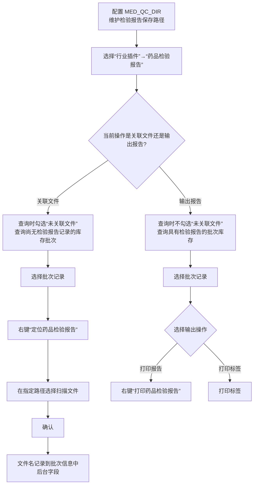
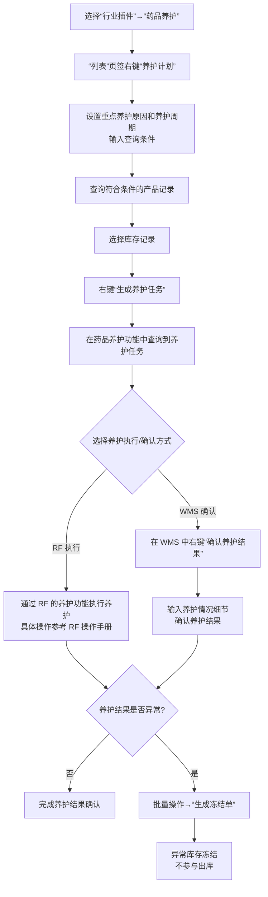
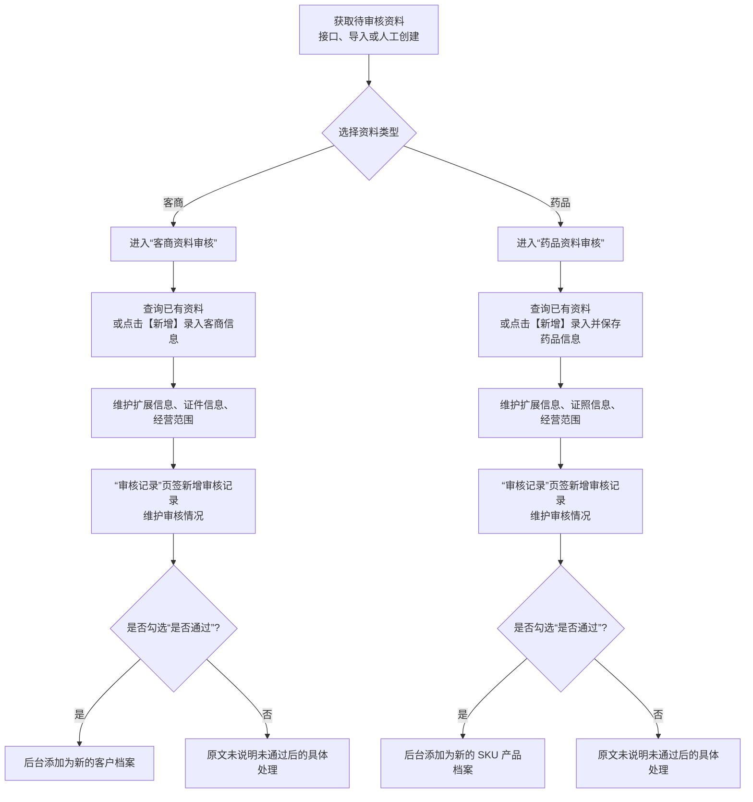

# 14. 行业插件

> 本章定位：整理医药行业场景下的检验报告、药品养护、客商资料审核和药品资料审核。它们不是通用 WMS 的必经流程，是否启用取决于行业场景。
>
> 来源：`../01-按章节拆分的md文件/14-行业插件.md`；原 PDF 第 444—451 页。

## 14.1. 学习重点

1. 药品检验报告把“批次库存”和“报告文件”关联起来，入库时定位并关联文件，输出时再查询并打印。
2. 药品养护先生成养护任务，再通过 RF 或 WMS 确认结果；养护异常时可以生成冻结单，使异常库存不参与出库。
3. 客商资料和药品资料不是录入后立即成为正式档案，原文明确要求审核通过后，分别添加为客户档案和 SKU 产品档案。
4. 本章只展开原文明确的行业功能，不把医药 GSP 之外的校验、审批层级或冻结解除流程自行补齐。

## 14.2. 药品检验报告：批次文件关联与输出

### 用途

说明药品检验报告在“关联文件”和“打印输出”之间的两段式操作，以及查询条件“未关联文件”的作用。

### 原文依据

- 14.1 药品检验报告，原 PDF 第 444—445 页。
- 使用前需要配置 `MED_QC_DIR`，维护扫描文件上传后的保存路径。
- 新入库批次可勾选“未关联文件”查询；选择记录后右键“定位药品检验报告”，选择扫描文件并确认。
- 输出时不勾选“未关联文件”，查询具有检验报告的批次库存，右键“打印药品检验报告”或打印标签。

### 编号说明

1. **1—2：前置配置和入口。** 先配置 `MED_QC_DIR`，再进入行业插件中的药品检验报告功能。
2. **3—8：关联文件。** 勾选“未关联文件”找出没有报告的批次，右键定位文件，选择扫描文件并确认。
3. **9—12：输出报告。** 查询时取消“未关联文件”条件，定位已有报告的批次，右键打印报告或打印标签。

### 关键说明

- 原文描述的是“按批号提供”检验报告，因此图中以批次库存作为文件关联和输出对象。
- “定位药品检验报告”是文件选择入口；确认后系统把文件名记录到批次信息中。
- 关联文件和打印输出是两种不同的查询口径，不能把“未关联文件”理解成打印过滤条件。

### 事实边界 / 原文未说明

- 原文没有说明文件上传失败、文件格式限制、同一批次多份报告或报告替换规则。
- 原文没有说明打印报告/标签时的模板配置和打印失败处理。

## 14.3. 药品养护：任务生成、结果确认与异常冻结

### 用途

呈现药品养护的手动作业链，并保留两条结果确认路径：通过 RF 执行，或在 WMS 中直接确认养护结果。

### 原文依据

- 14.2 药品养护，原 PDF 第 445—447 页。
- 养护任务可以由定时器后台生成，也可以手动生成；本章介绍手动作业。
- 通过“养护计划”设置重点养护原因、养护周期，查询产品后右键“生成养护任务”。
- 已生成任务可以通过 RF 的养护功能执行；也可以在 WMS 中右键“确认养护结果”，输入养护情况细节。
- 对养护异常药品，批量操作中的“生成冻结单”会将异常库存冻结，不参与出库。

### 编号说明

1. **1—6：生成养护任务。** 进入药品养护，打开“养护计划”，设置原因/周期，查询并选择产品，再右键生成任务。
2. **7—9：执行和确认。** 生成任务后，可以通过 RF 执行，也可以在 WMS 中右键确认养护结果并录入细节。
3. **10—12：异常处理。** 原文要求养护异常药品冻结；用户通过批量操作“生成冻结单”，异常库存不参与出库。

### 关键说明

- “生成养护任务”与“确认养护结果”是两个不同动作；前者产生任务，后者记录养护结果。
- 原文提供手动生成和定时器后台生成两种方式，本图按本章介绍的手动作业展开。
- 冻结是养护异常处理的明确结果；原文没有把冻结解除画入本章。

### 事实边界 / 原文未说明

- 原文没有说明养护异常由哪个字段、哪个人员或哪种结果值判断。
- RF 端的具体扫描和确认步骤属于另一本 RF 操作手册，本章没有展开。
- 原文没有说明冻结单的审核、执行、释放和关闭操作，因此图中不继续推导。

## 14.4. 客商资料与药品资料审核

### 用途

把两个 GSP 资料审核流程放在同一张对比图中，突出审核通过后的档案落点不同。

### 原文依据

- 14.3 客商资料审核，原 PDF 第 447—449 页。
- 14.4 药品资料审核，原 PDF 第 449—451 页。
- 客商资料可通过接口、导入或人工创建；审核通过后添加为客户档案。
- 药品资料可通过接口、导入或人工创建；审核通过后添加为 SKU 产品档案。

### 编号说明

1. **1—2：资料来源和分流。** 客商或药品资料可以来自接口、导入或人工创建。
2. **3—7：客商路径。** 维护扩展、证件和经营范围，新增审核记录；审核通过后成为客户档案。
3. **8—12：药品路径。** 维护扩展、证照和经营范围，新增审核记录；审核通过后成为 SKU 产品档案。

### 事实边界 / 原文未说明

- 原文没有说明审核角色、审核次数、退回修改、重新提交和未通过资料的状态名称。
- 图中“是否勾选通过”来自原文审核记录中的“是否通过选择框”，不代表系统只有这一种审核判定机制。

