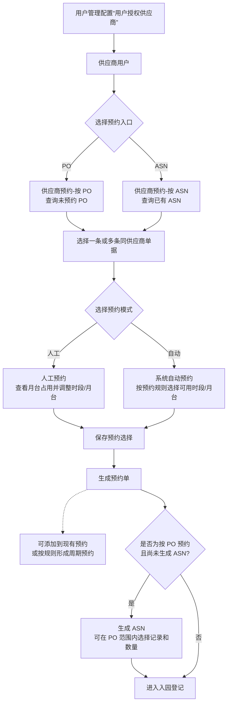
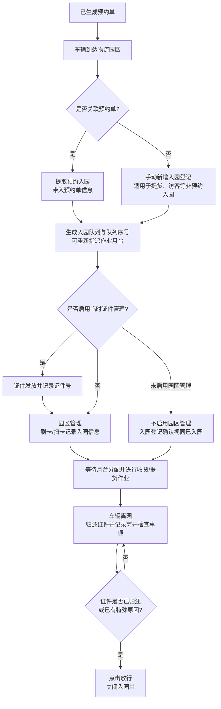

# 15. 预约

> 本章定位：呈现供应商送货预约、预约单、入园登记和园区管理之间的主链；不把月台排班、门禁设备和个性化队列算法扩展成手册未说明的统一规则。
>
> 来源：`../01-按章节拆分的md文件（1119页版本）/15-预约.md`；原 PDF 第 953—968 页。

## 15.1—15.2. 供应商预约与预约单

### 用途

说明供应商可以基于 PO 或 ASN 发起预约，系统根据人工或自动预约模式生成预约单；预约单还可以继续生成 ASN 或进入入园登记。

### 原文依据

- 15.1.1 供应商预约-按 PO、15.1.2 供应商预约-按 ASN，原 PDF 第 953—957 页。
- 15.2 预约单，原 PDF 第 957—960 页：预约成功后生成预约单，可查看、调整优先级、关闭、取消、进入园登记；按 PO 预约的预约单在尚未生成 ASN 时可以生成 ASN。
- 供应商预约用户需要在用户管理中配置“用户授权供应商”，只能查询被授权供应商的对应到货单据。

### 关键说明

1. PO 和 ASN 是两条预约入口；按 PO 预约时，可以选择多张同供应商单据共同送货。
2. 人工预约通过图形化月台占用情况调整时段和月台；自动预约则由系统根据预设预约规则限制可预约的时段和月台。
3. 预约单不是收货单。它既是后续入园登记的依据，也可以在按 PO 且尚未生成 ASN 的条件下生成 ASN。

### 事实边界

原文没有给出人工预约与自动预约冲突时的统一处理优先级，也没有说明预约单关闭、取消后对 PO/ASN 状态的完整影响。图中不补充这些状态规则。

## 15.3—15.4. 入园登记与园区管理

### 用途

呈现从预约单到车辆入园、月台安排、证件发放、离园检查和入园单关闭的现场管理链。

### 原文依据

- 15.3 入园登记，原 PDF 第 960—965 页：预约单是入园登记前提，也支持手动新增非预约入园记录。
- 15.4 园区管理，原 PDF 第 966—968 页；原文说明预约、收货链路为“PO → 供应商预约 → 生成 ASN → 入园登记 → 园区管理 → 收货”或“ASN → 供应商预约 → 入园登记 → 园区管理 → 收货”。

### 关键说明

1. 预约单可以带入入园登记；没有预约单时，也可以手动新增非预约入园记录。
2. 园区管理可以通过设备刷卡或功能界面扫卡记录入园信息；部分场景可以不启用园区管理。
3. 点击“放行”前，系统会校验证件是否已归还，或者是否已填写特殊原因；满足条件后关闭入园单。

### 事实边界

原文没有给出月台分配算法、队列排序的固定公式和收货完成与入园单关闭之间的统一状态机。图中只保留文档明确的现场管理动作。
