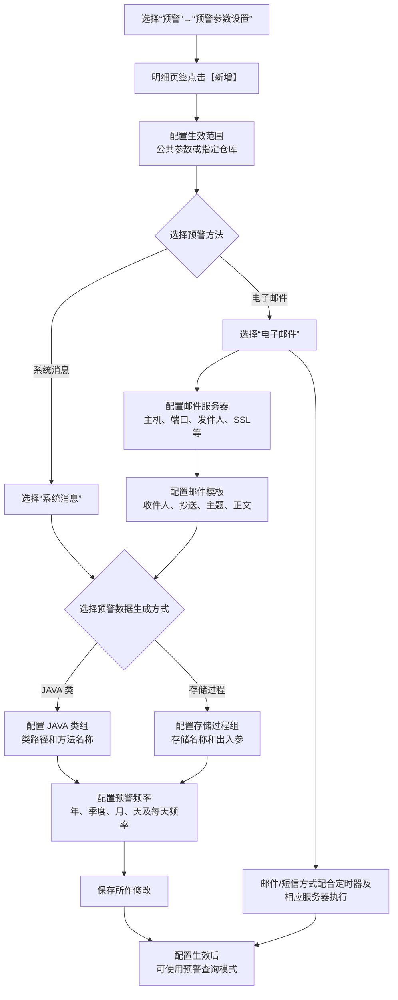
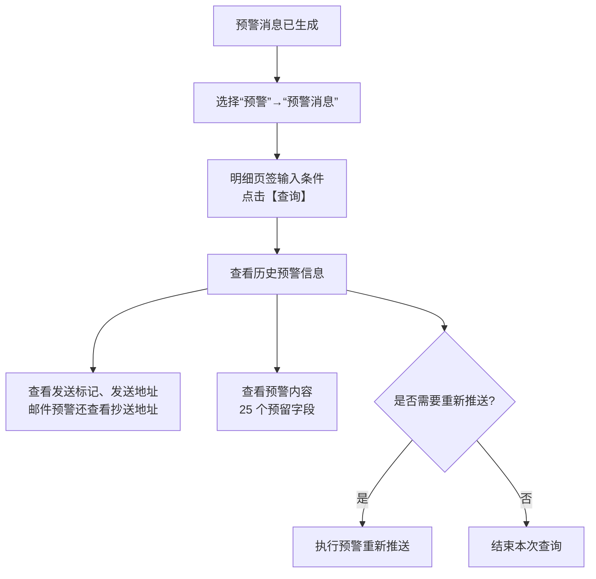
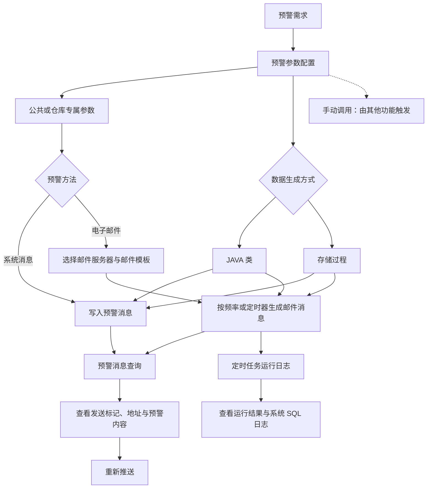

# 16. 预警

> 本章定位：整理预警参数、消息/邮件方式、模板与服务器配置，以及预警消息查询和重新推送。预警是异常关注和通知机制，不是库存或订单的主状态流转。
>
> 来源：`../01-按章节拆分的md文件（1119页版本）/16-预警.md`；原 PDF 第 969—986 页。

## 16.1. 学习重点

1. 预警参数可以配置为多仓共用的公共参数，也可以配置为针对某个仓库的专属参数。
2. 预警方式包括“电子邮件”和“系统消息”；邮件方式还要关联邮件服务器和邮件模板。
3. 预警数据生成方式支持 JAVA 类和存储过程；预警频率控制年、季度、月、天以及每天执行频率。
4. 预警生成后，可以在“预警消息”中查询历史信息和重新推送；原文没有把预警异常自动变成冻结、拦截或订单状态变更。

## 16.2. 预警参数配置与消息发送路径

### 用途

把预警配置中的公共/仓库范围、消息/邮件分支、生成方式和定时执行关系放在一张图中。

### 原文依据

- 16.1 预警参数配置，原 PDF 第 969—973 页。
- 16.3 邮件模板配置，原 PDF 第 976—976 页。
- 16.2 邮件服务器配置，原 PDF 第 974—975 页。
- 预警查询模式配置生效后可直接使用；邮件、短信模式需要配合定时器及相应服务器使用。

### 编号说明

1. **1—3：基础参数。** 进入预警参数设置，新增记录并配置公共或指定仓库的生效范围。
2. **4—7：预警方式。** 系统消息和电子邮件是两条方式；电子邮件需要额外关联邮件服务器和模板。
3. **8—10：数据生成。** 预警数据可以通过 JAVA 类或存储过程生成，再配置预警频率和每天执行频率。
4. **11—13：生效和执行。** 保存后可使用预警查询模式；邮件/短信方式还需要相应的定时器及服务器配合。

### 关键说明

- 多仓场景中，同一预警需求可以有公共参数和仓库专属参数；通过“仓库”查询条件查看对该仓库有效的参数。
- 预警格式 PDF/Excel 的设置主要在 Email 发送时生效，界面查询时忽略该设置。
- 消息排序用于多个预警同时执行时的次序；原文没有把它定义成业务优先级或订单优先级。

### 事实边界 / 原文未说明

- 原文没有说明公共参数与仓库专属参数同时存在时的覆盖或冲突规则。
- 原文没有说明 JAVA 类、存储过程执行失败后的重试和异常通知路径。
- 原文提到短信方式需要短信服务器，但本章没有提供短信服务器的配置步骤，图中不补充。

## 16.3. 预警消息查询与重新推送

### 用途

呈现预警生成后的查询入口、发送结果查看和重新推送动作。

### 原文依据

- 16.4 预警消息，原 PDF 第 977—978 页。
- 预警消息生成后，进入“预警”→“预警消息”，在明细页签点击“查询”。
- 模块显示预警日期、发送标记、发送地址、邮件抄送地址和预警内容，并支持历史信息查阅和重新推送。

### 编号说明

1. **1—3：查询入口。** 预警生成后进入预警消息模块，输入条件并点击【查询】。
2. **4—5：查看结果。** 可以查看发送标记、发送地址、邮件抄送地址和预警内容。
3. **6—7：补充操作。** 原文说明支持重新推送；图中不增加重新推送的审批或重试规则。

### 事实边界 / 原文未说明

- 原文没有说明重新推送是否只对发送失败消息开放，也没有说明重复推送的次数限制。
- 原文没有说明预警内容 25 个字段的具体业务含义和生成规则。

## 16.1—16.5. 标准预警与自定义预警配置链

> 用途：补齐预警参数、邮件服务器、邮件模板、定时器/手动调用、消息查看和日志追溯之间的关系。
>
> 原文依据：`../01-按章节拆分的md文件（1119页版本）/16-预警.md`；原 PDF 第 969—986 页。

### 关键说明

1. 预警参数可以配置公共记录或仓库专属记录；系统消息和电子邮件是手册明确的两种预警方法。
2. 邮件方式需要先配置邮件服务器和邮件模板；频率可以按年、季度、月、天配置，部分预警还支持手动调用。
3. 自定义预警示例的执行结果可以从预警消息查看，并通过定时任务运行日志进一步排查推送结果和 SQL。

### 事实边界

原文没有说明短信预警在本版本中的完整配置页面、预警重复发送去重机制或邮件失败后的自动补偿；图中不把邮件推送画成必然成功。
