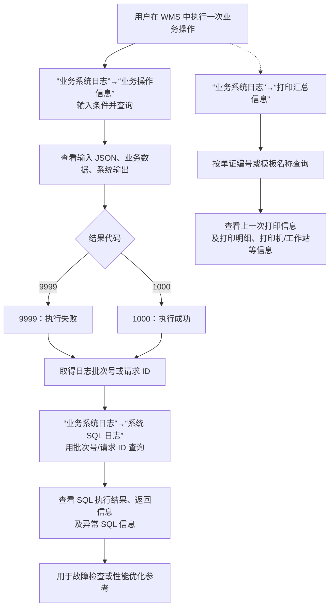

# 17. 业务系统日志

> 本章定位：整理业务操作日志、系统 SQL 日志、登录日志和打印汇总日志之间的追溯关系。它服务于故障排查、审计和打印责任定位，不是 WMS 业务作业流程。
>
> 来源：`../01-按章节拆分的md文件/17-业务系统日志.md`；原 PDF 第 477—489 页。

## 17.1. 学习重点

1. 业务操作信息以 JSON 维度记录系统交互；系统 SQL 日志以数据库 SQL 执行维度记录交互结果。
2. 两类日志可以通过“日志批次号”或“请求 ID”互相追溯：业务操作信息可以定位 SQL 日志，SQL 日志也可以反查业务操作信息。
3. 业务操作结果代码中，原文明确列出 `1000` 代表执行成功、`9999` 代表执行失败。
4. 用户登录、登录失败和打印汇总是独立的查询模块，不应直接当成库存、订单或任务状态。

## 17.2. 业务操作、SQL 与打印日志追溯

### 用途

把产品经理在现场排查问题时最常用的日志路径画出来：先看业务请求和结果，再用批次号/请求 ID 深入 SQL；打印问题则进入打印汇总信息。

### 原文依据

- 17.1 业务操作信息、17.2 系统 SQL 日志，原 PDF 第 477—484 页。
- 17.5 打印汇总信息，原 PDF 第 486—489 页。
- 业务操作信息和系统 SQL 日志可通过“日志批次号”或“请求 ID”关联。
- 打印汇总信息可按单证编号或模板名称查询上一次打印和打印明细。

### 编号说明

1. **1—4：业务操作日志。** 进入业务操作信息，查询并查看输入 JSON、业务数据和系统输出。
2. **5—8：SQL 追踪。** 不论结果成功或失败，都可以使用日志批次号或请求 ID 到系统 SQL 日志中定位详细 SQL；失败结果可以进一步查看异常 SQL 信息。
3. **9—11：打印追踪。** 打印问题进入打印汇总信息，按单证编号或模板名称查询累计信息和打印明细。

### 关键说明

- 日志追踪链是“业务请求 → JSON 记录 → SQL 记录”，不是“业务操作 → 自动修改库存”的业务流程图。
- 打印汇总信息记录打印标记、次数、人员、时间、工作站和打印机等信息，适合排查多打、漏打等问题。

### 事实边界 / 原文未说明

- 原文没有说明日志保留周期、归档策略和日志删除权限。
- 原文没有规定执行失败后的业务补偿动作；日志模块只提供查询和排查依据。
- 用户登录成功、登录失败和打印日志的具体字段很多，本图只保留它们在排查中的入口和用途。

