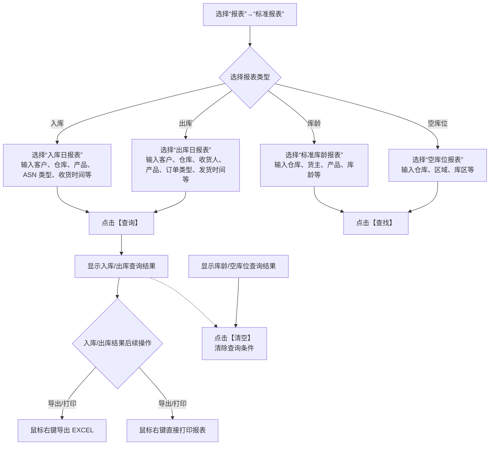

# 18. 报表

> 本章定位：整理标准报表的查询、结果查看、Excel 导出和打印操作。报表只呈现业务活动结果，不直接改变库存、订单或任务。
>
> 来源：`../01-按章节拆分的md文件/18-报表.md`；原 PDF 第 489—493 页。

## 18.1. 学习重点

1. 标准报表用于查询产品在系统中的活动，并以表单形式打印供客户查询和审查。
2. 本章列出的报表包括入库日报表、出库日报表、库存报表、进出存合并报表、作业汇总、发货装车清单、零库存、库龄和入库序列号等。
3. 原文详细展示了入库日报表、出库日报表、标准库龄报表和空库位报表的查询操作。
4. 报表查询、导出和打印是结果消费动作，不应被画成入库、出库或库存变化节点。

## 18.2. 标准报表查询与输出

### 用途

用一张简单流程图覆盖本章明确展示的四类报表操作，并突出不同报表的查询条件不同。

### 原文依据

- 18.1 标准表报，原 PDF 第 489—493 页。
- 入库日报表：按客户、仓库、产品、ASN 类型、货类、收货时间、批次属性等查询。
- 出库日报表：按客户、仓库、收货人、产品、订单类型、货类、发货时间、批次属性等查询。
- 标准库龄报表：按仓库、货主、产品、库龄等查询。
- 空库位报表：查询未被占用的空库位，可按仓库、所属区域、库区等条件查询。

### 编号说明

1. **1—2：入口和报表分流。** 进入标准报表后，按需要选择入库、出库、库龄或空库位报表。
2. **3—6：输入查询条件。** 每类报表有不同的查询维度；图中只保留原文列出的主要条件。
3. **7—9：消费查询结果。** 入库日报和出库日报结果支持右键导出 EXCEL 或直接打印；“清空”用于清除查询条件。

### 事实边界 / 原文未说明

- 原文没有说明报表查询是否实时读取业务表，也没有说明各报表的统计口径和跨仓汇总规则。
- 原文没有把所有列字段和计算公式展开，因此本图不推导报表数值如何计算。
