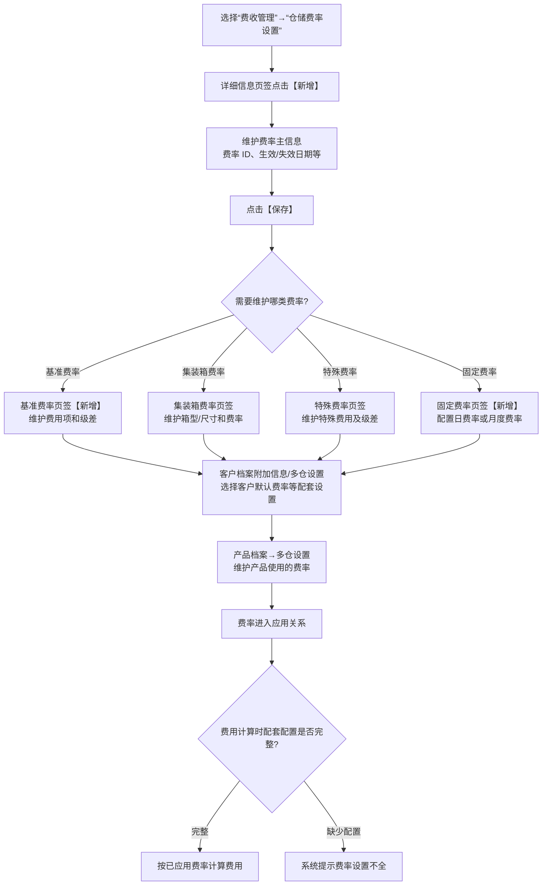
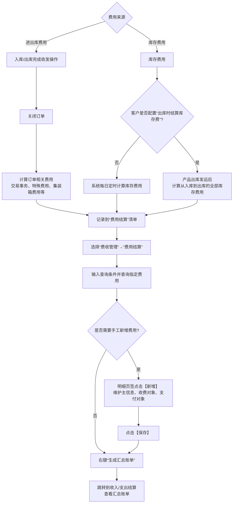
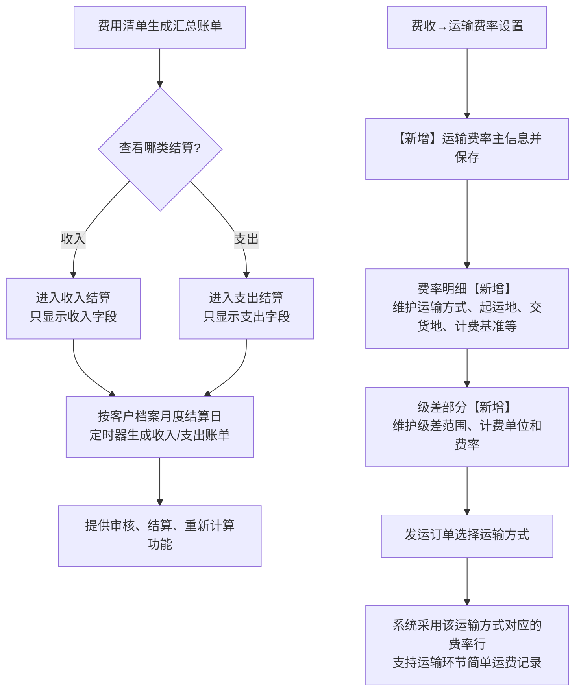

# 18. 费收

> 本章定位：整理费率配置、费率应用、订单/库存费用计算、费用清单、收入/支出结算和运输费率。它是 WMS 的商业结算层，不是收货、拣货、发货的现场主流程。
>
> 来源：`../01-按章节拆分的md文件（1119页版本）/18-费收.md`；原 PDF 第 994—1016 页。

## 18.1. 学习重点

1. 费率不是只在“仓储费率设置”里维护完就会生效，还要在客户和产品中选择应用；原文明确说明真正生效的是产品档案中选择的费率。
2. 进出库费用通常在完成收/发操作并关闭订单时计算；库存费用则由系统每日定时计算，客户也可以配置为出库时结算库存费。
3. 费用清单既承接系统自动计算结果，也允许人工新增费用记录；费用记录同时有收费对象和支付对象两侧信息。
4. 收入结算、支出结算和汇总账单属于费用管理结果，不应与库存事务或订单作业状态混为一谈。

## 18.2. 仓储费率配置与应用

### 用途

把仓储费率从配置到真正生效的关系画清楚，并保留基础费率、集装箱费率、特殊费率、固定费率等配置分支。

### 原文依据

- 18.2 仓储费率设置，原 PDF 第 995—1004 页。
- 在“费收管理”→“仓储费率设置”中新增主信息并保存，再维护基准、集装箱、特殊和固定费率等明细。
- 客户档案可维护默认费率；产品档案“多仓设置”可以维护产品实际使用的费率。
- 缺少相关配置时，费用计算会提示费率设置不全。

### 编号说明

1. **1—4：创建费率主信息。** 在仓储费率设置中新增主记录，维护生效/失效日期等信息并保存。
2. **5—8：维护费率明细。** 根据业务选择基准、集装箱、特殊或固定费率；原文还说明基准/特殊费率可以配置级差。
3. **9—10：应用费率。** 客户档案可以提供默认设置，产品档案多仓设置维护实际使用费率。
4. **11—13：计算前检查。** 缺少相关配置时，系统在费用计算时提示费率设置不全。

### 关键说明

- 客户档案费率是新增产品时的默认使用费率；原文明确真正生效的是产品档案中选择的费率。
- 固定费率支持日费率、月度费率；基准/特殊费率可以按级差设置，计费单位还可以实现进位计费。
- 集装箱费用依据进出库单据中记录的箱型和数量计算；特殊费用可依据单据特殊费用页签记录的工作量计算。

### 事实边界 / 原文未说明

- 原文没有给出不同费率类型同时配置时的冲突处理和统一优先级。
- 图中“费率类型”是配置分支，不表示每个客户都必须维护四种费率。
- 原文没有说明费率设置不全时是否阻断订单关闭，只有“系统会提示费率设置不全”的描述。

## 18.3. 订单/库存费用计算与费用结算

### 用途

说明费用何时产生、进入哪个清单，以及用户怎样查询、手工新增和生成汇总账单。

### 原文依据

- 18.2 费率应用，原 PDF 第 995—1004 页。
- 18.3 费用清单，原 PDF 第 1005—1010 页。
- 完成进、出库收发操作并关闭订单时，系统计算订单相关费用并记录到费用结算清单。
- 库存费用每日定时计算；费用结算界面支持查询、手工新增和保存费用记录。
- 费用清单右键“生成汇总账单”后跳转到收支结算部分。

### 编号说明

1. **1—4：订单费用。** 入库或出库完成收发操作后，关闭订单，系统计算订单相关费用。
2. **5—8：库存费用。** 默认由系统每日定时计算；若客户配置“出库时结算库存费”，则在出库发运后计算从入库到出库的全部库存费用。
3. **9—12：费用清单操作。** 用户进入费用结算查询自动生成的费用，也可以在明细中点击【新增】手工添加费用记录并保存。
4. **13—14：汇总账单。** 对费用记录右键“生成汇总账单”，系统跳转到收入/支出结算部分查看账单。

### 关键说明

- 费用结算记录可以同时维护收费对象和支付对象，分别对应仓储应收和仓库操作成本支出。
- “关闭订单时计算”与“每日定时计算”是不同触发点，不能合并成一个统一的费用计算时点。
- 费用清单支持手工新增，但原文没有说明手工费用是否必须关联订单或产品；图中不增加该限制。

### 事实边界 / 原文未说明

- 原文没有说明关闭订单后费用计算失败时订单是否仍可关闭。
- 原文没有给出每日库存费用定时器的具体执行时间、重复计算规则和失败重试规则。
- 原文没有说明“生成汇总账单”后的账单状态迁移，只说明可跳转到收支结算查看。

## 18.4—18.5. 收入/支出结算与运输费率

### 用途

把收入、支出结算与运输费率设置作为费收模块的两个结果/扩展方向，避免把运输费用误解成完整运输跟踪。

### 原文依据

- 18.4 收入/支出结算，原 PDF 第 1011—1012 页。
- 收入结算只显示收入字段；支出结算只显示支出字段。
- 根据客户档案维护的月度结算日，由定时器生成月度收入账单和支出账单，并提供审核、结算、重新计算功能。
- 18.5 运输费率设置，原 PDF 第 1013—1016 页。
- 运输费率支持承运人、运输方式、装运地/交货地、计费基准和级差等配置；发运订单选择运输方式时，系统采用对应费率行。

### 编号说明

1. **1—5：结算结果。** 汇总账单可以进入收入结算或支出结算；定时器也可以按月度结算日生成两类账单。
2. **6—10：运输费率。** 新增运输费率主信息、费率明细和级差；发运订单选择运输方式后，系统采用对应费率行。

### 事实边界 / 原文未说明

- 原文没有说明审核、结算、重新计算三个动作的先后顺序和各自状态结果。
- 运输费率章节明确“不做详细运输跟踪管理”时提供简单运费记录，因此本图不画运输轨迹、承运状态或配送节点。
