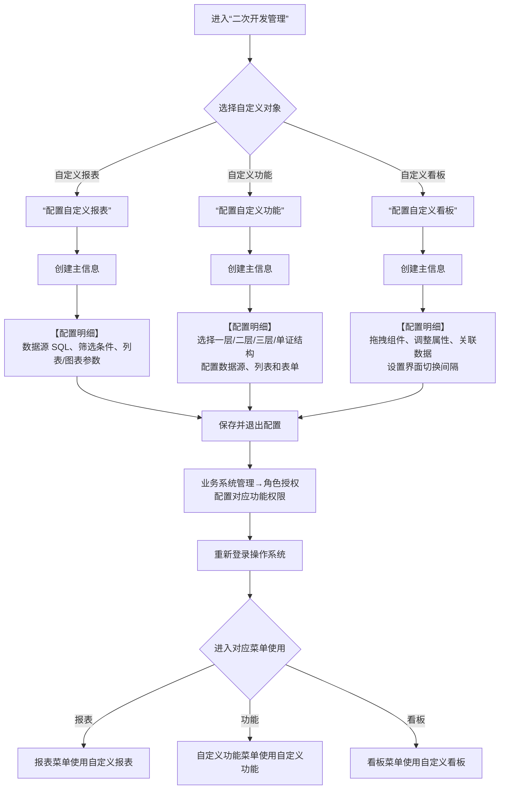
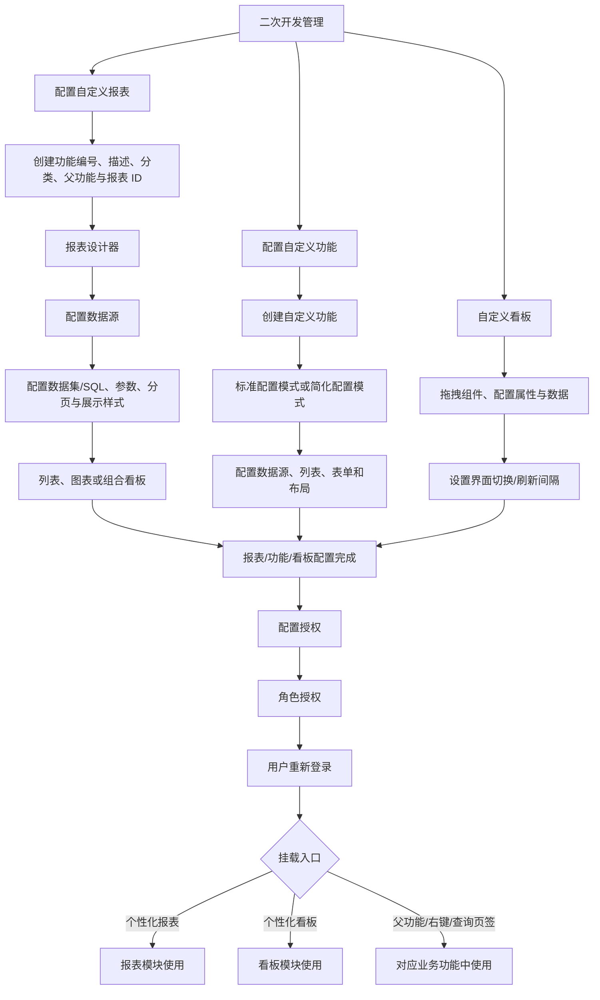

# 20. 二次开发管理

> 本章定位：整理自定义报表、自定义功能和自定义看板的创建、配置、授权、重新登录和使用生命周期。它是系统扩展配置，不是 WMS 核心仓库作业流程。
>
> 来源：`../01-按章节拆分的md文件（1119页版本）/20-二次开发管理.md`；原 PDF 第 1038—1108 页。

## 20.1. 学习重点

1. 自定义报表用于扩展标准报表，可配置 SQL 数据源、筛选条件、列表/图表展示和汇总方式。
2. 自定义功能用于扩展标准表单，支持一层、二层、三层和单证结构模板，并配置列表和表单布局。
3. 自定义看板通过组件拖拽、属性配置和数据关联展示作业数据，原文举例包括订单量、集货数和输送线集货口待作业数。
4. 三类自定义内容配置完成后都需要角色授权；原文明确要求重新登录后，才能在对应菜单中使用。

## 20.1—20.2. 自定义内容的创建、发布与使用

### 用途

用一张生命周期图覆盖三类二次开发对象，并把“配置完成后还要授权和重新登录”作为明确的发布前置条件。

### 原文依据

- 20.1 配置自定义报表，原 PDF 第 1038—1078 页。
- 20.2 配置自定义功能，原 PDF 第 1079—1108 页。
- 三类功能都包含创建、配置明细、保存、角色授权、重新登录和对应菜单使用步骤。

### 编号说明

1. **1—4：自定义报表。** 创建主信息后，通过【配置明细】维护 SQL、筛选和展示参数。
2. **5—7：自定义功能。** 创建主信息后选择结构模板，再配置数据源、列表和表单布局。
3. **8—10：自定义看板。** 创建主信息后拖拽组件、调整属性、关联数据，并设置界面切换间隔。
4. **11—13：发布使用。** 三类对象配置完成后保存退出，进入角色授权，重新登录，再从对应菜单使用。

### 关键说明

- 自定义报表的数据源配置包含 SQL；原文提供“测试语句”和“格式化 SQL”操作，但没有把 SQL 设计规则转换成 WMS 业务流程。
- 看板的界面切换间隔控制数据刷新周期，原文举例配置 20 表示每 20 秒刷新一次。
- “配置完成”与“可使用”之间有角色授权和重新登录两个明确步骤。

### 事实边界 / 原文未说明

- 原文没有说明自定义内容发布后的版本管理、回滚、审批和生产发布流程。
- 原文没有说明 SQL 执行失败、数据源不可用或组件数据为空时的系统处理。
- 图中“进入对应菜单”仅表示原文列出的使用入口，不代表授权后所有用户都可使用。

## 20.1—20.2. 自定义报表、功能与看板的配置生命周期

> 用途：补齐新版二次开发管理中“注册对象→配置数据与界面→授权→使用”的详细配置关系，并保留报表/看板的不同挂载入口。
>
> 原文依据：`../01-按章节拆分的md文件（1119页版本）/20-二次开发管理.md`；原 PDF 第 1038—1108 页。

### 关键说明

1. 自定义报表先在“配置自定义报表”注册，再通过报表设计器配置数据源、数据集和样式；也可以从其他环境导入配置。
2. 自定义功能支持标准配置模式和简化配置模式；自定义看板还可以设置组件属性和界面切换间隔。
3. 配置完成不等于所有用户可见，手册明确要求经过角色授权并重新登录后，从相应菜单或挂载功能使用。

### 事实边界

原文没有说明自定义内容的版本管理、审批、回滚、生产发布和 SQL 安全策略；图中不把“保存配置”推导成自动发布。
