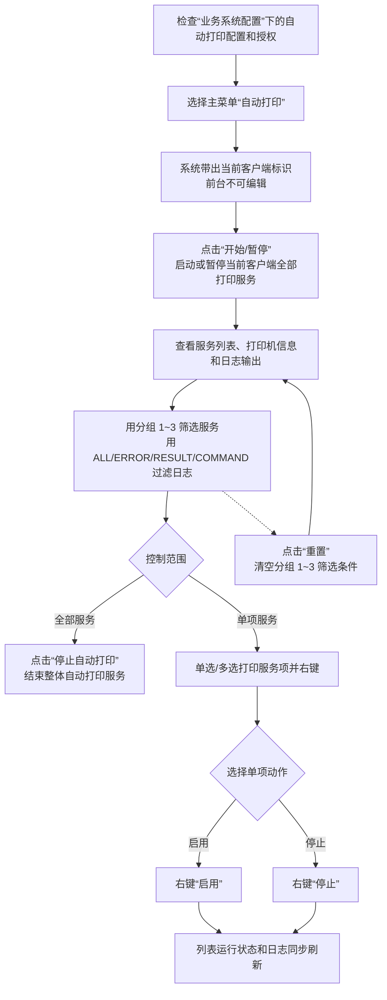

# 21. 自动打印

> 本章定位：整理自动打印如何衔接接口订单、波次、库存分配和拣货任务清单，以及自动打印服务和单项打印服务的启停操作。
>
> 来源：`../01-按章节拆分的md文件（1119页版本）/21-自动打印.md`；原 PDF 第 1109—1111 页。

## 21.1. 学习重点

1. 自动打印服务的价值是减少人工打印、通知和单据传递，让完成库存分配的订单自动输出拣货任务清单。
2. 自动打印依赖业务系统配置和授权；进入自动打印界面后，用户可以查看当前客户端标识下的服务、打印机信息和日志。
3. “开始/暂停”控制当前客户端标识下配置的所有打印服务；单项服务可以通过右键“启用”或“停止”单独控制。
4. 本章描述的是打印服务与业务作业的衔接，不等于拣货确认或发货确认；这些业务动作仍由第 11、12 章说明。

## 21.2. 自动打印与拣货作业衔接

### 用途

还原原文给出的订单接口示例，说明自动打印位于波次、分配之后，输出的是拣货任务清单。

### 原文依据

- 21 自动打印概述，原 PDF 第 1109 页。
- 原文示例：订单通过接口下达，定时器按波次规则运算生成波次订单，分配库存后，由自动打印配置在指定打印机输出拣货任务清单。

### 编号说明

1. **1—4：打印前置。** 原文示例中的订单先由接口下达，再由定时器按波次规则生成波次订单并完成库存分配。
2. **5—6：自动输出。** 完成分配的订单通过自动打印配置，在指定打印机输出拣货任务清单。
3. **7—8：现场衔接。** 拣货员工根据打印单据作业；后续确认、复核和发货不在本章自动打印流程中展开。

### 事实边界 / 原文未说明

- 这是原文给出的“例如”场景，不代表所有订单都必须通过接口、定时器和波次进入自动打印。
- 原文没有说明打印服务如何选择具体订单、如何处理分配失败订单或打印失败后的补打规则。

## 21.3. 自动打印服务与单项服务控制

### 用途

把自动打印客户端界面中的整体启停、单项启停、分组筛选和日志查看拆开，明确它们是服务运维动作。

### 原文依据

- 21.1 启用自动打印，原 PDF 第 1109 页。
- 21.2 暂停自动打印，原 PDF 第 1110 页。
- 21.3 单项打印服务启用/停止，原 PDF 第 1111 页。
- 开始/暂停控制当前客户端标识下所有打印服务；停止自动打印结束整体服务；单项服务右键提供“启用”“停止”。

### 编号说明

1. **1—4：启动服务。** 先检查配置和授权，进入自动打印界面，点击“开始/暂停”启动或暂停当前客户端的所有打印服务。
2. **5—6：观察运行情况。** 可以查看服务列表、打印机类型展示区和日志输出区，并按分组或日志类型筛选。
3. **7—10：控制服务。** 可以整体点击“停止自动打印”，也可以对单个/多个打印服务右键选择“启用”或“停止”。
4. **11：操作结果。** 单项服务的运行状态和日志输出区会同步刷新。

### 事实边界 / 原文未说明

- 原文没有说明开始、暂停和停止操作对已经发出的打印指令是否有回滚或补偿。
- 原文没有说明打印服务异常时是否自动重试，只说明可以在日志输出区查看信息。
- 图中的分组筛选是查看范围，不是对打印服务业务规则的重新配置。
