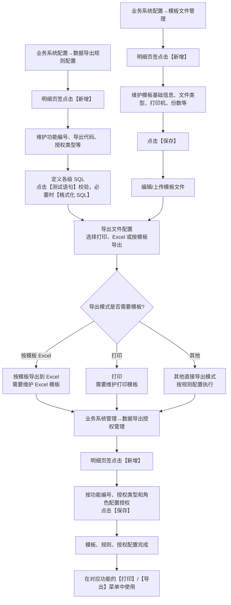

# 21. 自定义导出/打印配置实例

> 本章定位：整理自定义打印和数据导出的三层配置关系：模板文件、数据导出规则、数据导出授权。它是系统配置实例，不是入库、库存或出库业务流程。
>
> 来源：`../01-按章节拆分的md文件/21-自定义导出-打印配置实例.md`；原 PDF 第 512—523 页。

## 21.1. 学习重点

1. 自定义单据打印、标准 Excel 导出和按模板导出，都需要在模板文件管理、数据导出规则配置和数据导出授权之间建立关系。
2. 模板文件管理负责维护模板文件、打印机、打印份数、打印标记和打印汇总等配置。
3. 数据导出规则配置负责把功能编号、SQL、导出模式和模板文件关联起来；配置 SQL 时，系统会校验组织、仓库、货主等授权限制。
4. 数据导出授权按功能编号和授权类型授予角色；完成三部分配置后，才能在对应功能中使用自定义打印/导出。

## 21.2. 模板、规则、授权到执行

### 用途

用一张配置关系图说明“为什么配置了模板仍然不能直接导出”，以及用户在页面上需要经过哪些入口和按钮。

### 原文依据

- 21.1 模板文件管理配置，原 PDF 第 512—515 页。
- 21.2 数据导出规则配置，原 PDF 第 515—519 页。
- 21.3 数据导出授权，原 PDF 第 519—521 页。
- 原文总结：完成模板文件绘制、导出规则配置和导出授权后，才能实现自定义导出。

### 编号说明

1. **1—5：模板文件。** 在模板文件管理中新增记录、保存主信息，再编辑或上传模板。
2. **6—9：导出规则。** 新增规则，维护功能编号、导出代码和授权类型，定义 SQL 并测试，再配置导出模式。
3. **10—12：数据导出授权。** 在数据导出授权管理中新增记录，按功能编号、授权类型和角色保存授权。
4. **13—15：模式差异。** 按模板导出 Excel 需要 Excel 模板；打印需要打印模板；完成授权后才可在对应功能菜单执行。

### 关键说明

- SQL 执行时系统会校验是否包含组织、仓库、货主等授权条件；原文说明缺少时系统会根据业务表和用户授权自动增加查询条件。
- “常用导出/常用打印”决定规则是否直接出现在对应按钮下拉菜单；未勾选时通过“按规则导出/打印”选择。
- 模板配置中的打印标记、打印次数和打印汇总控制，会影响打印行为，但不改变入库、出库单据本身的业务状态。

### 事实边界 / 原文未说明

- 原文没有说明数据导出授权与角色标准功能授权之间的最终组合校验顺序。
- 原文没有说明 SQL 执行失败、模板渲染失败或打印失败时的具体回滚结果。
- 章节末尾只给出模板文件描述包含 `/` 可能导致再次编辑时报错的实例；不把它扩展成完整错误码或异常处理流程。

