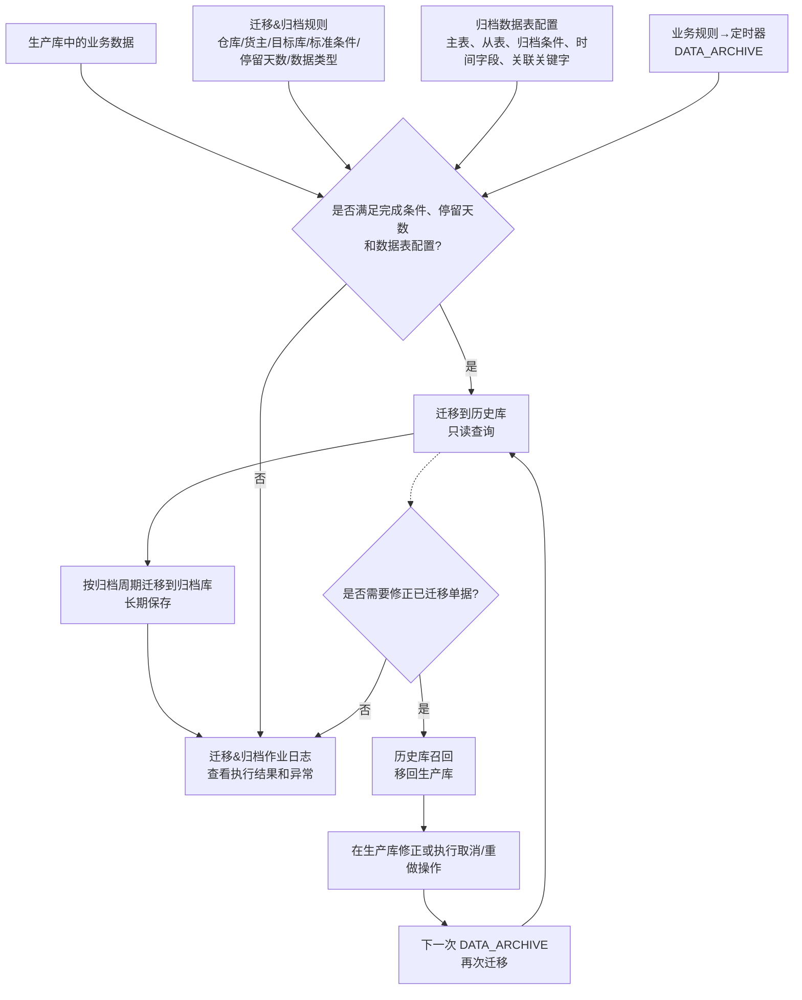
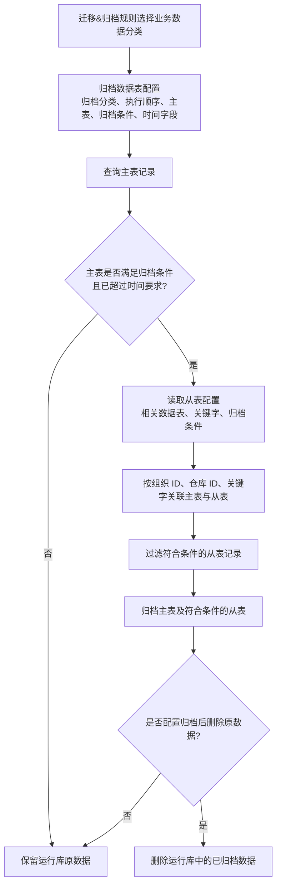

# 22. 迁移&归档

> 本章定位：呈现生产库、历史库、归档库之间的数据迁移与召回，以及迁移规则、数据表配置和作业日志的关系；不把数据库部署、删除策略和接口完成条件扩展成未说明的系统实现细节。
>
> 来源：`../01-按章节拆分的md文件（1119页版本）/22-迁移&归档.md`；原 PDF 第 1112—1119 页。

## 22.1—22.4. 迁移、归档、日志与历史库召回

### 用途

说明数据从生产库迁移到历史库，再按归档周期进入归档库的主链，以及特殊情况下从历史库召回生产库修正后再次迁移的闭环。

### 原文依据

- 22.1 迁移&归档规则，原 PDF 第 1112—1114 页：通过规则设置目标数据库、标准迁移条件、停留天数、批次处理记录数、数据类型和个性化处理逻辑。
- 22.2 归档数据表配置，原 PDF 第 1114—1118 页：按主表、从表、归档条件、时间字段和关键字配置标准或个性化表的归档处理。
- 22.3 迁移&归档作业日志、22.4 历史库召回，原 PDF 第 1118—1119 页。

### 关键说明

1. 系统采用生产库、历史库、归档库三级存储；已完成的业务数据先迁移到历史库，用于只读查询，再根据归档周期进入归档库。
2. `DATA_ARCHIVE` 定时器根据迁移&归档规则和归档数据表配置执行检查；规则可以按仓库、货主、目标数据库、完成条件、停留天数和数据类型细化。
3. 历史库召回用于特殊情况下的修正操作；修正后的单据在下一次归档定时器执行时还会再次迁移到历史库。

### 事实边界

原文没有给出所有业务单据的统一关闭状态，也没有给出迁移失败重试、跨服务器事务和归档后删除的统一默认值。图中不补充这些实现规则。

## 22.2. 归档数据表的主表、从表与执行顺序

### 用途

突出归档数据表配置的结构：先依据主表条件和时间字段判断，再根据主表关联查询从表并按从表条件过滤。

### 原文依据

- 22.2 归档数据表配置，原 PDF 第 1114—1118 页：主表用于判断是否可归档，从表通过当前组织 ID、仓库 ID、关键字 1 和关键字 2 与主表关联。

### 事实边界

原文明确了主表/从表的配置和关联方式，但没有为所有个性化表规定默认归档条件、默认删除策略或失败后的补偿动作。图中不将这些内容画成确定规则。
