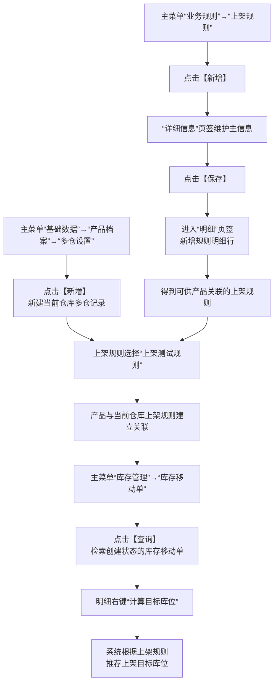
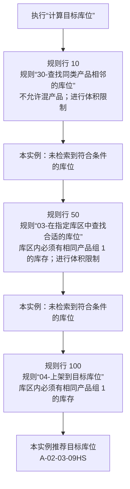
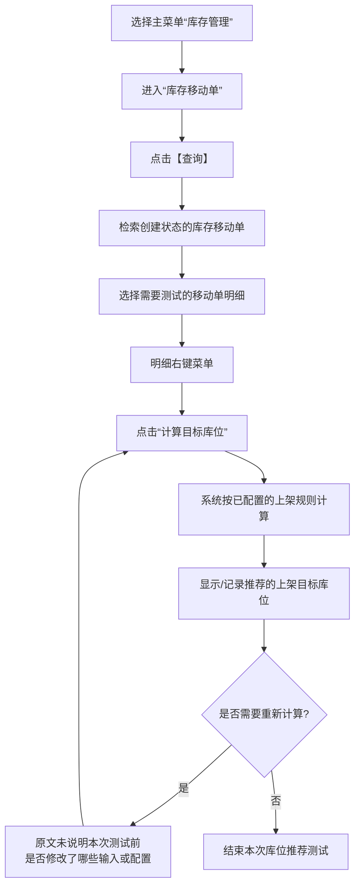

# 23. 上架库位计算实例

> 本章定位：用一个具体实例把上架规则配置、产品档案关联和库存移动单上的“计算目标库位”串起来，并还原规则行 10、50、100 的实际匹配结果。
>
> 来源：`../01-按章节拆分的md文件/23-上架库位计算实例.md`；原 PDF 第 535—541 页。

## 23.1. 学习重点

1. 上架库位推荐不是只在库存移动单页面点击一次按钮，它依赖三组配置：上架规则主信息与明细、产品档案的多仓设置、库存移动单中的计算操作。
2. 本实例以入库为范本，但原文说明上架规则还用于上架、补货、移库作业场景的库位推荐。
3. 规则明细中的行号 10、50、100 是本实例的实际配置示例；原文明确记录了前两条规则未找到符合条件的库位，最终由规则 100 推荐库位 `A-02-03-09HS`。
4. 第 8 章已经展开了通用的上架规则计算逻辑：按规则行号匹配条件、检查库位/空间限制、失败后继续下一行、全部失败返回空值。本章重点放在“怎样配置并测试一个具体规则实例”，不重复把通用算法伪装成新的事实。

## 23.2. 从配置到测试的完整操作链

### 用途

把三个页面之间的依赖关系画完整，回答产品经理最需要追踪的问题：规则在哪里建、产品在哪里关联、最后在哪里触发计算。

### 原文依据

- 23.1 上架规则—新增上架规则，原 PDF 第 535—538 页。
- 23.2 产品档案—上架规则配置，原 PDF 第 539 页。
- 23.3 计算库位测试—库存移动单测试，原 PDF 第 540—541 页。

### 编号说明

1. **1—5：创建上架规则。** 进入“业务规则”→“上架规则”，新增并保存主信息，再在“明细”页签维护规则明细。
2. **6—8：关联产品。** 进入“产品档案”的“多仓设置”，新增当前仓库记录，并选择“上架测试规则”。
3. **9—11：触发计算。** 进入“库存移动单”，查询创建状态的单据，在明细右键“计算目标库位”。
4. **12：计算结果。** 原文将该操作定义为根据上架规则推荐移库上架目标库位。

### 关键逻辑

- 上架规则是被配置和维护的对象，产品档案多仓设置是产品使用哪条规则的关联位置，库存移动单是触发本次推荐的操作页面。
- 本章的“规则配置完成”不等于已经计算出库位；必须在库存移动单中查询创建状态的单据并执行“计算目标库位”。
- 这个实例以“上架测试规则”为产品关联的规则名称，不能据此推断所有仓库都必须使用这个名称。

### 事实边界 / 原文未说明

- 原文没有说明保存上架规则主信息和明细时的完整必填校验，也没有说明规则是否需要额外审核或发布。
- 原文没有说明产品多仓记录与库存移动单之间通过哪些字段关联。
- 原文没有说明“创建状态”的库存移动单由哪个前置流程生成，本章只说明如何查询并计算。

## 23.3. 上架测试规则的明细实例

### 用途

还原本章给出的三条规则明细，并把“前面的规则没有找到库位，继续使用后面的规则”表现为实例路径。

### 原文依据

- 23.1.1 新增上架规则，原 PDF 第 536—538 页。
- 规则行 10：规则“30-查找同类产品相邻的库位”，库位约束为不允许混产品，并进行体积限制。
- 规则行 50：规则“03-在指定库区中查找合适的库位”，库位约束为库区内必须有相同产品组 1 的库存，并进行体积限制。
- 规则行 100：规则“04-上架到目标库位”，库位约束为库区内必须有相同产品组 1 的库存。

### 编号说明

1. **1：开始计算。** 触发点是库存移动单明细右键“计算目标库位”。
2. **2—3：规则行 10。** 先使用“查找同类产品相邻的库位”，并带有“不允许混产品”和体积限制。
3. **4—5：规则行 50。** 规则行 10 未找到符合条件的库位后，继续到指定库区查找，并要求库区内有相同产品组 1 的库存，同时进行体积限制。
4. **6—7：规则行 100。** 规则行 50 也未找到符合条件的库位后，使用“上架到目标库位”，本实例最终推荐 `A-02-03-09HS`。

### 关键逻辑

- 本图画的是原文给出的“重新计算目标库位后的实例路径”，不是对所有库存移动单运行结果的承诺。
- 规则行 10、50、100 的顺序来自原文展示的行号；本实例明确体现了前两条规则未命中后继续使用后续规则。
- 规则名称、库位约束和体积限制都是本实例配置内容，不应直接当成系统所有上架规则的固定配置。

### 事实边界 / 原文未说明

- 原文没有展示规则行 10、50 在其他库存、产品或库位条件下是否可能命中；图中只保留本实例明确写出的“未检索到符合条件的库位”。
- 原文没有说明规则行 100 的目标库位是固定配置、由规则代码计算，还是由其他配置得到；这里只记录本实例最终推荐结果。
- 原文没有在本章说明如果规则 100 也失败时的界面提示或后续人工操作。第 8 章的通用规则说明“全部失败返回空值”，但本实例没有展示该结果。

## 23.4. 库位计算测试的页面操作

### 用途

单独把测试动作拆出来，避免读者只看到规则关系，却不知道在系统中具体点击哪里、对哪一行执行操作。

### 原文依据

- 23.3 计算库位测试，原 PDF 第 540—541 页。
- 入口为“库存管理”→“库存移动单”→“上架库位推荐”。
- 操作步骤是查询创建状态的库存移动单，再在明细右键点击“计算目标库位”。

### 编号说明

1. **1—4：定位单据。** 进入库存移动单，点击【查询】，检索创建状态的库存移动单。
2. **5—7：执行动作。** 选择明细，右键点击“计算目标库位”。
3. **8—9：查看结果。** 系统根据上架规则计算并推荐目标库位；本章实例结果为 `A-02-03-09HS`。
4. **10—11：重新计算。** 原文使用了“重新计算目标库位”的表述，但没有进一步规定重复计算前必须修改什么，因此图中把再次计算前的具体条件标为“原文未说明”。

### 与第 8 章的关系

第 8 章的“上架规则计算流程”已经说明通用计算逻辑：产品配置为系统计算库位且收货库位为过渡库位时，系统按规则行号逐行匹配；条件、库位约束或空间限制不满足时继续下一行，全部失败返回空值。本章不重复绘制那张通用算法图，而是用实际配置和测试结果验证这条逻辑在一个实例中的表现。

### 事实边界 / 原文未说明

- 本章没有说明“库存移动单”创建、审核、执行和关闭的完整操作链；图中只处理库位推荐测试。
- 本章没有说明推荐结果显示在哪个具体字段，也没有说明点击计算后是否自动保存、是否自动生成后续任务。
- 本章实例只展示了一个推荐库位，不能据此推导系统在多候选库位时的排序、并列处理或人工改库位规则。

## 23.5. 本章操作要点

| 阶段 | 页面入口 | 关键操作 | 原文明确结果 |
|---|---|---|---|
| 配置规则 | 业务规则→上架规则 | 【新增】→保存主信息→明细页签维护规则行 | 形成上架规则配置 |
| 关联产品 | 基础数据→产品档案→多仓设置 | 【新增】当前仓库记录，选择“上架测试规则” | 产品关联上架规则 |
| 查询测试单 | 库存管理→库存移动单 | 点击【查询】，检索创建状态单据 | 找到待计算的库存移动单 |
| 计算库位 | 库存移动单明细右键 | “计算目标库位” | 根据上架规则推荐目标库位 |
| 实例结果 | 同上 | 重新计算后查看规则路径 | 规则 10、50 未命中，规则 100 推荐 `A-02-03-09HS` |

### 本章总体事实边界

本章是一个上架库位计算实例，不是完整的上架作业手册。它没有展开收货、上架任务确认、库存移动单后续执行、规则审核发布和多候选库位排序；这些内容继续以第 8—12 章的原文为准。
