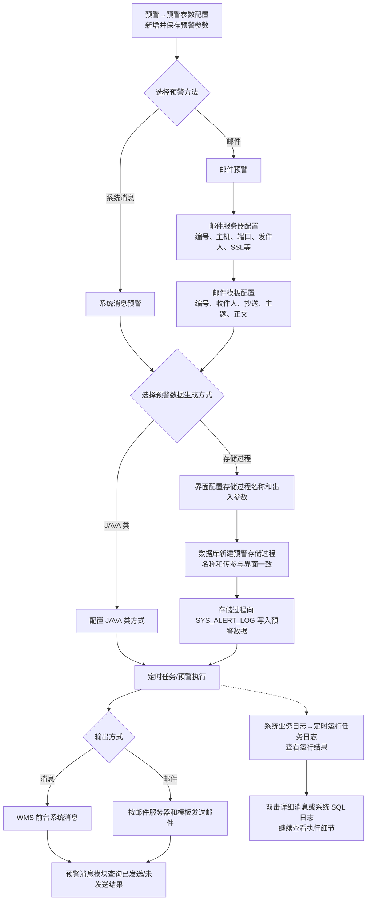
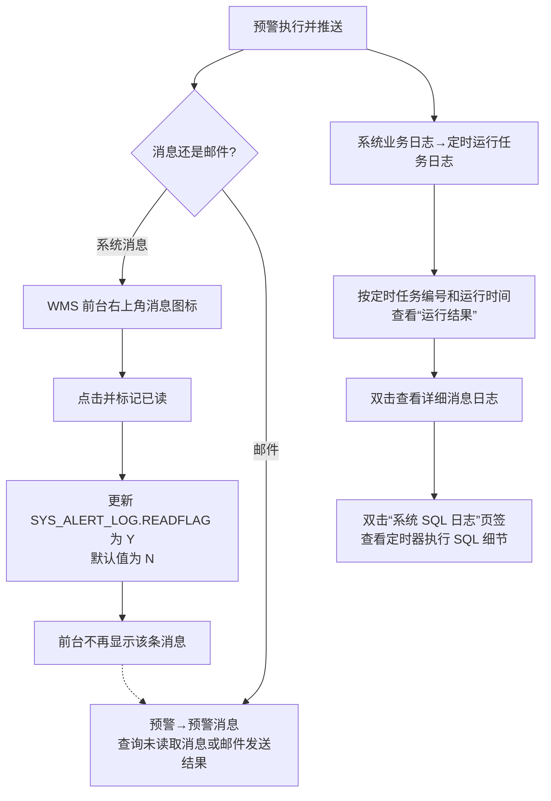

# 补充：16.5 自定义预警配置实例

> 本章定位：把第 16 章的预警机制进一步落到存储过程、`SYS_ALERT_LOG`、邮件服务器、邮件模板和执行日志的配置实例上。它是技术配置补充，不重复定义第 16 章的通用预警概念。
>
> 来源：`../01-按章节拆分的md文件（1119页版本）/16-预警.md`；原 PDF 第 969—986 页。

## 补充说明

1. 自定义预警配置包括预警参数、邮件服务器、邮件模板和存储过程设置。
2. 消息预警和邮件预警共享预警参数入口，但邮件预警还要关联邮件服务器编号和邮件模板编号。
3. 使用存储过程方式时，界面配置的存储过程名称和参数需要与数据库存储过程一致；系统通过存储过程向 `SYS_ALERT_LOG` 表写入数据。
4. 预警执行后，可以从前台消息、预警消息模块、定时运行任务日志和系统 SQL 日志多个位置追踪结果。

## 16.5. 自定义预警配置链

### 用途

用一张图说明自定义预警从参数配置到数据库写入、消息/邮件发送和日志追踪的关系。它重点帮助产品经理区分“配置预警”和“产生预警数据”这两件事。

### 原文依据

- 16.1 预警参数配置、16.2 邮件服务器配置、16.3 邮件模板配置，原 PDF 第 969—978 页。
- 16.5 自定义预警配置实例，原 PDF 第 979—986 页。

### 编号说明

1. **1—4：预警方式和配套配置。** 新增预警参数；系统消息直接走消息方式，邮件预警还要配置并关联邮件服务器和模板。
2. **5—7：生成方式。** 可以配置存储过程或 JAVA 类；存储过程方式要求界面名称、参数与数据库存储过程一致。
3. **8—10：数据和执行。** 存储过程向 `SYS_ALERT_LOG` 写入数据，再由预警执行过程产生消息或邮件。
4. **11—14：结果追踪。** 前台可以查看系统消息，预警消息模块可以查询邮件/消息结果；定时运行任务日志和系统 SQL 日志用于继续排查。

### 关键说明

- 消息预警自定义字段只在配置 `FIELD01` 后生效，邮件预警可以配置 `FIELD01`—`FIELD25`；这是原文给出的存储过程写入约束。
- 消息预警的 `alertAdress` 为 `*` 时，原文说明默认所有用户均可收到；邮件预警多个地址用分号隔开，不能使用 `*`。
- 原文提示发件人邮箱密码目前在数据库中明文保存，并提示需要注意密码保护；这是配置实例中的明确风险提示。

### 事实边界 / 原文未说明

- 原文没有说明 JAVA 类和存储过程两种生成方式的选择优先级，也没有说明二者是否可以同时配置。
- 原文没有说明 `SYS_ALERT_LOG` 写入成功后消息/邮件发送失败时的补偿机制。
- 原文没有说明定时任务日志中的“运行结果”与前台发送标记之间的严格对应关系。

## 16.5.2—16.5.4. 预警执行结果与日志查询

### 用途

把本章明确写出的结果查看动作单独列出，特别是系统消息“标记已读”会更新 `READFLAG` 的事实。

### 原文依据

- 16.5.2 消息预警执行效果，原 PDF 第 979—983 页。
- 16.5.3 邮件预警执行效果，原 PDF 第 983—985 页。
- 16.5.4 执行日志查询，原 PDF 第 985—986 页。

### 编号说明

1. **1—5：系统消息。** 推送后从右上角消息图标查看，标记已读会把 `READFLAG` 从默认 `N` 更新为 `Y`，前台不再显示该消息。
2. **6：预警消息模块。** 未读取消息和邮件已发送/未发送结果都可以在预警消息模块查询。
3. **7—10：执行日志。** 按定时任务编号和运行时间查看运行结果，双击进入详细消息，再进入系统 SQL 日志查看执行细节。

### 事实边界 / 原文未说明

- 原文没有说明标记已读是否影响邮件发送状态，也没有说明是否支持批量标记已读。
- 原文没有说明“未读取消息”和“未发送邮件”的具体查询条件或状态枚举。
- 日志查询可以帮助定位执行情况，但原文没有说明查询结果如何自动触发重新执行或补发。
