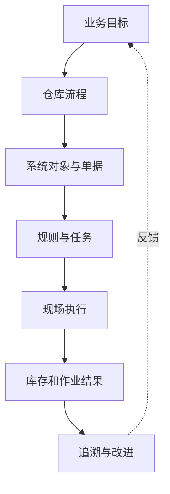

# 1. 概述：WMS 产品设计应该先看什么

参考：[原章节](../01-按章节拆分的md文件/01-概述.md)

## 0. 资料联动

| 资料层 | 入口 |
| --- | --- |
| 手册事实 | [01/01 概述](../01-按章节拆分的md文件/01-概述.md) |
| 流程图 | [02/01 概述](../02-按章节拆分的流程图/01-概述.md) |
| 原始数据字典 | [03/01 基础设置](../03-WMS的数据表按章节拆分/01-基础设置.md)、[03/02 业务规则](../03-WMS的数据表按章节拆分/02-业务规则.md) |
| 字段参考 | [05/01 基础设置](../05-WMS的字段设计参考借鉴/01-基础设置.md)、[05/02 业务规则](../05-WMS的字段设计参考借鉴/02-业务规则.md) |
| 共享语义 | [核心业务语义索引](../00-核心业务语义索引.md) |

> [手册事实] 本章主要提供手册导言、培训目标和使用背景，没有展开可直接核对的完整单据状态机。
>
> [归纳判断] WMS 设计的最小分析单位不是页面，而是“业务意图 → 执行动作 → 库存/单据结果”。
>
> [通用 WMS 建议] 任何新模块先写对象、动作、结果和逆向，再把字段和页面作为实现载体。
>
> [待确认] 本章没有给出具体业务单据、任务状态或库存事务定义，后续章节的具体结论不能反向填充为本章事实。

## 1. 参考事实

本章主要是手册导言和培训目标，没有展开具体单据、字段或操作流程。因此它对产品设计的价值不在于提供功能清单，而在于提醒设计者先建立问题意识。

### 使用场景与要解决的问题

| 使用场景 | 参与者 | 需要先回答的问题 | 对后续设计的影响 |
|---|---|---|---|
| 从零搭建 WMS | 产品经理、业务负责人 | 仓库要提升准确性、效率，还是透明度 | 决定首版指标和模块优先级 |
| 评估成熟 WMS | 产品经理、实施人员 | 哪些是通用能力，哪些是富勒的客户/行业特例 | 决定借鉴、改造或舍弃 |
| 设计单个模块 | 产品经理、研发、测试 | 操作后单据、任务和库存发生什么 | 决定数据模型、状态机和验收用例 |
| 处理异常和纠错 | 仓库主管、客服、审计人员 | 错误能否取消、反向、追责和重做 | 决定事务、日志和逆向流程 |

## 2. 设计目标

WMS 不是把仓库纸面单据搬到电脑里。它至少要同时改善：

- 业务执行的准确性；
- 库存信息的及时性和可信度；
- 仓库作业的透明度；
- 人员、设备、库位和时间的利用效率。

## 3. 产品经理的设计视角

如果只画页面而不画“操作后的库存和任务变化”，最终得到的往往是一个单据管理系统，而不是 WMS。

## 4. 数据模型与单据

本章不提供可确认的实体模型。建议把后续设计分为五类对象：

| 对象类别 | 典型对象 | 作用 |
|---|---|---|
| 主数据 | 货主、商品（SKU）、包装、批次规则 | 定义货物和管理口径 |
| 设施数据 | 仓库、库区、库位、设备 | 描述货物在哪里以及如何作业 |
| 业务单据 | ASN、SO、盘点单、调整单 | 记录业务意图和审批边界 |
| 执行对象 | 上架任务、拣货任务、补货任务 | 把业务意图变成现场动作 |
| 结果对象 | 库存余额、容器、库存事务 | 记录当前状态和历史变化 |

### 字段与逻辑边界

| 对象层级 | 本章处理方式 | 后续章节如何展开 |
|---|---|---|
| 业务单据表头 | 本章只定义必须回答的范围、责任和状态问题 | 在 PO、ASN、SO、盘点单等章节列具体字段 |
| 业务单据明细 | 本章只强调商品、数量、批次和位置等核心维度 | 在入库、出库和库存章节列计划数、执行数和差异数 |
| 系统对象字段 | 不预填具体数据库字段，避免把建议误当成事实 | 由各模块根据流程和状态确定字段 |

## 5. 库存影响与异常逆向流程

本章不适用直接库存影响分析，也不适用具体异常流程。后续章节必须补齐这一层。

## 6. 功能清单

| 功能域 | 使用场景 | 要解决的问题 | 本章作用 |
|---|---|---|---|
| 基础资料与仓库结构 | 定义货物、库位和货主 | 系统不知道管理什么、货物在哪里 | 后续设计的基础 |
| 规则与配置 | 表达仓库差异 | 同一流程无法适配不同现场 | 决定可配置边界 |
| 入库、库存、出库 | 完成核心仓储交易 | 计划、执行和库存结果脱节 | 构成 P0 主链 |
| 任务与设备 | 指导现场执行 | 单据无法转化为搬运动作 | 连接系统和现场 |
| 追溯、预警、报表、日志 | 管理和纠错 | 发生问题后无法解释 | 支撑运营闭环 |

## 7. 精华借鉴

| 借鉴点 | 解决的问题 | 通用化建议 | 首版判断 |
|---|---|---|---|
| 先定义业务结果 | 避免从菜单和页面倒推需求 | 用准确、透明、及时、可追溯和高效描述目标 | 必须借鉴 |
| 计划、执行、结果分层 | 避免单据状态代替现场结果 | 分开业务单据、作业任务、库存余额和事务 | 必须借鉴 |
| 设计异常和纠错 | 正常流程之外的问题无法收口 | 在主流程旁边同时设计取消、反向和审计 | 必须借鉴 |
| 从成熟产品抽象能力 | 既学习经验，又避免照搬 | 先判断业务目的，再决定对象和功能 | 必须借鉴 |
| 技术/行业特性后置 | 防止首版过度设计 | 将自动化、脚本和行业插件作为可插拔能力 | 谨慎后置 |

## 8. 待确认问题

- 首版产品更重视人工仓、自动化仓，还是两者兼容。
- 首版是面向单一货主仓库，还是从多货主仓储服务场景起步。
- 需要用哪些指标衡量准确性、效率和库存透明度。
