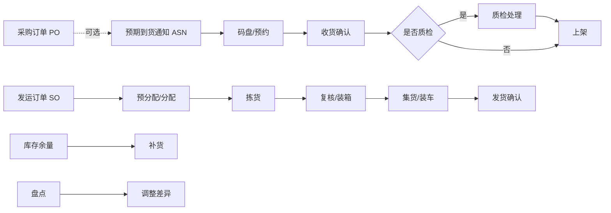
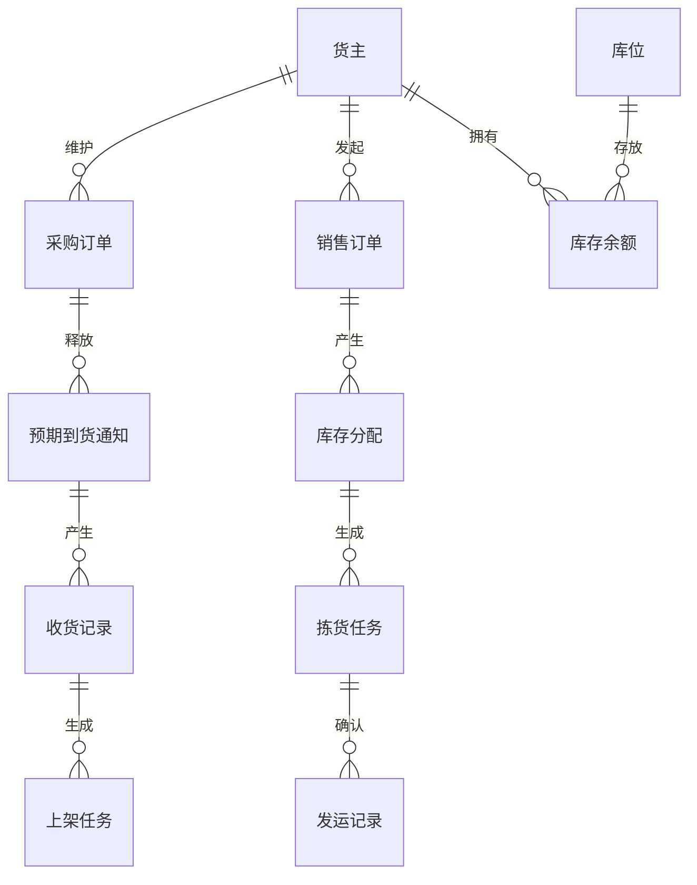

# 2. 仓库与配送中心：先设计完整业务链

参考：[原章节](../01-按章节拆分的md文件（1119页版本）/02-仓库、配送中心管理概述.md)

详细流程补充：[对应章节流程图](../02-按章节拆分的流程图/02-仓库、配送中心管理概述.md)

## 0. 资料联动

| 资料层 | 入口 |
| --- | --- |
| 手册事实 | [01/02 仓库、配送中心管理概述](../01-按章节拆分的md文件（1119页版本）/02-仓库、配送中心管理概述.md) |
| 流程图 | [02/02 仓库、配送中心管理概述](../02-按章节拆分的流程图/02-仓库、配送中心管理概述.md) |
| 原始数据字典 | [03/01 基础设置](../03-WMS的数据表按章节拆分/01-基础设置.md)、[03/03 入库](../03-WMS的数据表按章节拆分/03-入库操作.md)、[03/04 库存](../03-WMS的数据表按章节拆分/04-库存管理.md)、[03/05 出库](../03-WMS的数据表按章节拆分/05-出库操作.md)、[03/06 任务](../03-WMS的数据表按章节拆分/06-任务管理.md) |
| 字段参考 | [05/03 入库](../05-WMS的字段设计参考借鉴/03-入库操作.md)、[05/04 库存](../05-WMS的字段设计参考借鉴/04-库存管理.md)、[05/05 出库](../05-WMS的字段设计参考借鉴/05-出库操作.md)、[05/06 任务](../05-WMS的字段设计参考借鉴/06-任务管理.md) |
| 共享语义 | [核心业务语义索引](../00-核心业务语义索引.md) |

> [手册事实] 本章把 PO、ASN、收货、上架、SO、拣货、复核、发货、补货和盘点放在仓储主链中，并以 SAVE 概括目标。
>
> [归纳判断] 入库、库存和出库必须用同一套货主、SKU、库位、容器和任务语义衔接，不能按菜单孤立设计。
>
> [通用 WMS 建议] 用“计划量、执行量、结果量、异常量”分开表达数量，避免一个 `Qty` 同时承担订单、分配、拣货和库存含义。
>
> [待确认] 本章的端到端关系是设计抽象；具体状态回退、库存记账时点和可选节点仍以对应手册小节和业务配置为准。

## 1. 参考事实

富勒用 SAVE 概括现代仓储能力：Service、Accuracy、Visibility、Efficiency，即服务、准确、透明和效率。手册还区分公共仓库、自有仓库、合约仓库，并用 PO、ASN、码盘、收货、上架、SO、拣货、复核、发货、补货、盘点串起仓储运作。

### 使用场景与要解决的问题

| 使用场景 | 典型角色 | 没有 WMS 时的问题 | WMS 要形成的结果 |
|---|---|---|---|
| 供应商到货入库 | 收货员、库管员、质检员 | 到货与订单对不上，收了多少、放在哪里说不清 | 按单据收货、按库位上架，数量和批次可追溯 |
| 客户订单出库 | 订单员、拣货员、复核员、发运员 | 订单靠人工找货，容易错拣、漏拣、重复发货 | 订单分配到具体库存，并形成可执行任务 |
| 库内补货和移动 | 库管员、调度员 | 拣货位缺货，临时搬货没有记录 | 根据库存和需求生成补货/移动任务 |
| 周期盘点和差异处理 | 盘点员、仓库主管 | 账实差异只能靠手工表格，无法追责 | 盘点范围、实盘结果、复盘和调整形成闭环 |

## 2. 端到端业务流程

## 3. 关键业务判断

- PO 不是入库必经节点；ASN 可以直接创建，也可以从 PO 导入；没有 PO、ASN 也可以盲收。
- 收货是入库主链上的核心节点，上架、质检、码盘是按现场流程启用的节点。
- 出库主链通常是 SO → 分配 → 拣货 → 发货，复核、集货、装车属于可选增强环节。
- 补货和盘点不是出入库订单的附属按钮，而是独立的库存作业。

## 4. 数据模型

以上是通用抽象，不代表富勒后台表结构。

| 实体对象 | 中文定义 | 关键关系 |
|---|---|---|
| 货主 | 对库存和仓储服务结果负责的业务主体 | 一个货主可拥有多张采购订单、销售订单和多条库存余额 |
| 采购订单 | 约定采购数量和到货要求的计划单据 | 可拆分生成多张预期到货通知 |
| 预期到货通知 | 本次预计到货的执行依据 | 可按到货批次生成多次收货记录 |
| 收货记录 | 现场实际收货结果 | 可生成质检记录、上架任务和库存事务 |
| 销售订单/发运订单 | 出库需求与实际履约执行依据 | 一个销售订单可拆分多个发运订单 |
| 作业任务 | 给人员或设备执行的搬运指令 | 来源于收货、分配、补货或盘点结果 |
| 库存余额 | 某货主、商品、批次、库位等维度下的当前数量 | 被分配、冻结，并由库存事务持续变更 |

## 5. 单据与状态

入库和出库都需要把“计划数量、执行数量、差异数量”分开。建议状态至少能表达：创建、释放/审核、部分执行、完成、取消、关闭。具体状态数量应按业务复杂度控制，不要为了覆盖按钮而无限细分。

| 对象 | 核心状态 | 可执行动作 | 状态判断依据 |
|---|---|---|---|
| 采购订单/销售订单 | 草稿、已释放、部分执行、完成、冻结、取消、关闭 | 编辑、释放、冻结、取消、关闭 | 计划数量与累计执行数量、异常和下游对象 |
| ASN/发运订单 | 创建、部分执行、执行完成、取消、关闭 | 释放、生成任务、部分确认、完成、取消 | 明细累计收货/发运数和未完成任务 |
| 作业任务 | 待生成、待派发、执行中、部分完成、完成、异常、取消 | 派发、领取、确认、拆分、重派、取消 | 计划数、已完成数、剩余数和异常结果 |
| 库存余额 | 可用、预占、冻结、待上架、待移动 | 分配、冻结、释放、移动、调整 | 数量、库存状态和关联任务/事务 |

### 单据之间的生成关系

| 上游单据 | 下游单据/对象 | 关系 | 设计说明 |
|---|---|---|---|
| 采购订单 | 预期到货通知（ASN） | 1 对 0~多 | 一个 PO 可以按供应商、到货日期、车辆或仓库拆成多张 ASN；没有 PO 时也可以直接建 ASN |
| 预期到货通知 | 收货记录 | 1 对 1~多 | 分批到货、分车到货或部分收货时，一张 ASN 可以形成多次收货结果 |
| 收货明细 | 质检记录/上架任务 | 1 对 0~多 | 质检和上架是否生成独立对象，取决于仓库策略和作业复杂度 |
| 销售订单 | 发运订单 | 1 对 1~多 | 一个 SO 可按仓库、路线、承运人或发货批次拆分多个发运订单 |
| 发运明细 | 分配明细 | 1 对 0~多 | 一行需求可能从多个批次、库位或容器分配 |
| 分配明细 | 拣货任务 | 1 对 1~多 | 可按库区、工作区、人员或设备拆成多个任务 |
| 盘点单 | 盘点任务/调整单 | 1 对多、再对 0~多 | 盘点单生成现场任务，差异经复盘后再决定是否生成调整单 |

## 6. 字段与业务逻辑

字段设计的核心不是罗列所有可能字段，而是围绕“计划多少、实际多少、差多少、下一步做什么”组织表头、明细和执行对象。

| 对象 | 层级 | 核心字段 | 用途与校验 |
|---|---|---|---|
| 入库/出库单 | 表头 | 单号、仓库、货主、单据类型、来源单号、计划日期、优先级、状态 | 确定业务范围和处理顺序；仓库、货主和单据类型通常必填 |
| 入库/出库单 | 明细 | 商品、包装、计划数量、已执行数量、差异数量、批次/序列号要求 | 支撑数量平衡和库存候选过滤；已执行数量不能大于计划数量，超收/超发需有策略 |
| 作业任务 | 表头 | 任务号、任务类型、来源单据、工作区、优先级、执行人、任务状态 | 说明谁负责、做什么和当前进度 |
| 作业任务 | 明细 | 来源库位、目标库位、容器、批次、任务数量、已完成数量 | 支撑现场扫描和部分完成；源库位、目标库位和数量需在确认时再次校验 |
| 库存事务 | 明细 | 事务类型、关联单据/任务、操作前后库位、数量、操作人、时间、原因 | 解释库存变化；不得覆盖原事务 |

## 7. 库存影响

本章适用。设计时应明确库存变化发生在哪个节点：

| 节点 | 典型影响 |
|---|---|
| 收货确认 | 形成已收货数量；是否进入可用库存取决于上架/质检策略 |
| 上架确认 | 库存从过渡位置转入目标库位，形成可作业库存或待检库存 |
| 分配 | 占用可用库存，形成预占/分配数量，不应直接等同于发货 |
| 拣货确认 | 库存从储存位转入拣货/理货/集货位置 |
| 发货确认 | 扣减实际发运库存，写入库存事务 |
| 盘点调整 | 以实盘结果修正账面库存 |

## 8. 异常与逆向流程

典型异常包括短收、溢收、拒收、缺货、拣货差异、盘盈盘亏和取消。逆向处理要回到对应的库存节点：已分配未拣货可取消分配，已拣货需反拣或移回，已发货通常不能简单“撤销库存”，而应通过退货或反向业务处理。

## 9. 功能清单

| 功能 | 适用场景 | 解决问题 | 优先级 | 设计补充 |
|---|---|---|---|---|
| 收货与上架 | 供应商到货、退货入库 | 记录实收并把货物放到可定位库位 | P0 | 收货和上架可分开确认，避免把“收到”误当成“已上架” |
| 订单分配与拣货 | 客户订单履约 | 找到具体库存并指导现场取货 | P0 | 分配结果要能追溯到批次、库位、容器 |
| 发货确认 | 装车或交接承运人 | 明确实际发运数量，避免重复扣库存 | P0 | 以发货确认作为业务完成节点时，要与包裹/运单关联 |
| 库存查询与事务 | 库管、客服、财务查数 | 回答“现在有多少、为什么变化” | P0 | 余额用于当前状态，事务用于历史解释 |
| 质检、码盘、波次、复核 | 复杂仓库或高差错场景 | 控制作业质量和批量效率 | P1 | 作为可配置节点，不要强制所有仓库使用 |
| 补货、盘点、装车 | 库内运营和发运组织 | 处理拣货位缺货、账实差异和出库交接 | P1 | 需要独立任务和状态，不做成订单页面上的附属按钮 |
| Cross Dock、自动化设备、行业插件 | 特定业务或自动化仓 | 缩短中转时间或支持行业约束 | 后续 | 等核心库存事务稳定后再接入 |

功能不是越多越好。首版先保证“收货/上架—库存—分配/拣货—发货—事务追溯”能够跑通，再根据仓库的差错率、订单量和设备条件增加节点。

## 10. 精华借鉴

| 借鉴点 | 富勒给出的启发 | 通用化判断 |
|---|---|---|
| 主链完整 | 入库、库存、出库、任务、盘点彼此连接 | 借鉴；先画端到端链路，再拆菜单 |
| 单据解耦 | PO、ASN、收货、上架、SO、发运、拣货各有职责 | 借鉴；不同对象不要共用一个“状态” |
| 可选节点 | 质检、码盘、复核、装车按场景启用 | 借鉴；用策略控制，避免首版流程过重 |
| 结果可追溯 | 库存余额和事务承接作业结果 | 借鉴；所有改变数量或位置的动作都要落事务 |
| 功能密度 | 成熟产品覆盖大量行业和现场差异 | 谨慎；不把富勒全部菜单直接纳入通用首版 |

## 11. 待确认问题

- 收货确认后是否立即增加可用库存。
- 上架前的库存是否独立计入账面库存。
- 是否允许部分收货、部分发货和超收。
- 复核、装车是否属于首版必经节点。
