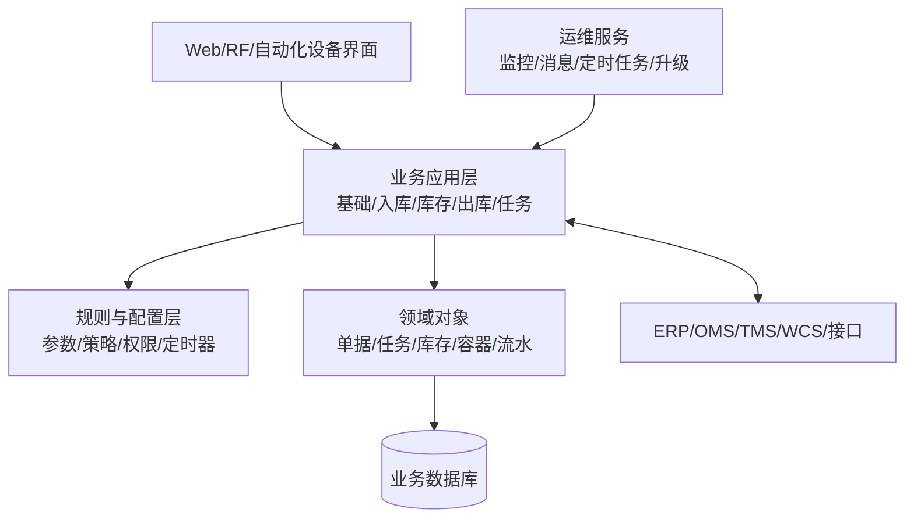

# 3. FLUX WMS 概述：系统应该如何分层

参考：[原章节](../01-按章节拆分的md文件（1119页版本）/03-FLUX-WMS-概述.md)

## 0. 资料联动

| 资料层 | 入口 |
| --- | --- |
| 手册事实 | [01/03 FLUX WMS 概述](../01-按章节拆分的md文件（1119页版本）/03-FLUX-WMS-概述.md) |
| 流程图 | [02/03 FLUX WMS 概述](../02-按章节拆分的流程图/03-FLUX-WMS-概述.md) |
| 原始数据字典 | [03/17 公共部分](../03-WMS的数据表按章节拆分/17-公共部分.md)、[03/18 后台表](../03-WMS的数据表按章节拆分/18-后台表.md)、[03/19 临时表](../03-WMS的数据表按章节拆分/19-临时表.md) |
| 字段参考 | [05/17 公共部分](../05-WMS的字段设计参考借鉴/17-公共部分.md)、[05/18 后台表](../05-WMS的字段设计参考借鉴/18-后台表.md)、[05/19 临时表](../05-WMS的字段设计参考借鉴/19-临时表.md) |
| 共享语义 | [核心业务语义索引](../00-核心业务语义索引.md) |

> [手册事实] 手册把 FLUX WMS 描述为实时 WMS，并列出业务系统、配置、基础设置、入库、库存、出库、任务、费收、日志、报表和扩展等模块；1119 页版还单列初始化配置、登录和用户界面等内容。
>
> [归纳判断] 菜单分层不等于领域边界；单据、任务、库存、容器、流水和外部接口才是跨页面复用的骨架。
>
> [通用 WMS 建议] Web、RF、设备和接口都复用同一套业务服务、权限校验和库存事务，避免终端各自实现规则。
>
> [待确认] 手册列出的模块和接口能力不等于每个客户环境都启用；部署方式、消息契约和服务边界需结合实际项目确认。

## 1. 参考事实

手册将 FLUX WMS 描述为实时 WMS，支持 B/S 架构、云部署、多种数据库和与 ERP、供应链计划、销售预测、订单及其他执行系统的通信。系统功能拆分为业务系统管理、业务系统配置、基础设置、仓库设置、业务规则、入库、库存、出库、任务、费收、日志、报表、二次开发、自动打印等模块，并可扩展 RF、标签、Cross Dock、归档等模块。1119 页版第 3 章还补充了系统初始化配置、登录界面、用户界面和系统模块的使用入口。

### 1.1. 初始化配置是系统启用前的准备层

初始化配置属于系统启用前的引导能力，不应与日常业务规则混在一起。产品设计上至少要区分：初始环境准备、用户登录与权限进入、系统模块入口，以及后续业务资料和规则配置。手册未完整说明初始化动作的默认值、幂等性和回滚方式，这些仍需确认。

### 使用场景与要解决的问题

| 使用场景 | 典型角色 | 用户问题 | 系统分层要解决的事 |
|---|---|---|---|
| Web 管理与 RF 作业并存 | 管理员、仓库作业员 | 不同终端重复实现规则，结果不一致 | 交互层适配终端，业务服务统一校验和落库 |
| ERP/OMS 下单、WMS 执行 | 计划员、仓库主管 | 上游订单和现场库存状态脱节 | 通过接口消息和业务单据边界衔接计划与执行 |
| 多仓、多货主、多订单类型 | 实施顾问、运营人员 | 同一功能被不同客户要求改成不同流程 | 用配置和规则表达差异，不把差异散落在代码里 |
| 高峰期批量作业 | 调度员、系统管理员 | 批处理、打印、消息失败后难以定位 | 将定时任务、日志、重试和监控独立出来 |

## 2. 系统分层建议

## 3. 模块与数据关系

菜单模块是用户看到的组织方式，领域对象才是系统真正的骨架。建议不要让“入库页面”直接负责所有库存逻辑，而是由入库单据产生收货结果，再由库存服务统一落库存事务。

| 层次 | 设计重点 |
|---|---|
| 交互层 | Web、RF、扫描、设备界面适配不同岗位 |
| 业务层 | 单据操作、状态校验、任务生成和回写 |
| 规则层 | 上架、分配、周转、补货、波次、单号等策略 |
| 数据层 | 组织、仓库、货主、SKU、库存、任务、流水 |
| 运维层 | 定时任务、监控、消息、日志、缓存和版本 |

## 4. 数据模型

核心对象可抽象为：组织、仓库、货主、用户、商品、包装、库位、业务单据、作业任务、库存余额、容器、库存事务、规则、接口消息。

| 实体对象 | 中文定义 | 所属层 | 关键关系 |
|---|---|---|---|
| 组织/仓库/货主 | 数据隔离和库存归属边界 | 基础域 | 单据、规则和库存都要带范围 |
| 商品/包装/批次 | 货物识别和数量管理口径 | 主数据域 | 被业务单据明细和库存余额引用 |
| 业务单据 | 计划、申请、执行依据或结果凭证 | 业务域 | 可生成任务、预占和库存事务 |
| 作业任务 | 人员、RF 或设备可执行的动作 | 执行域 | 来源于单据或库存规则，确认后回写结果 |
| 库存余额/事务 | 当前数量与变化历史 | 库存域 | 余额由事务驱动，不能由页面随意改写 |
| 规则/配置 | 决定候选、优先级和流程分支 | 规则域 | 按组织、仓库、货主、单据类型覆盖 |
| 接口消息/日志 | 外部通信和内部追溯证据 | 平台域 | 关联请求 ID、业务单号和重试记录 |

## 5. 单据与状态

系统分层意味着单据状态和任务状态不应混为一谈。例如 SO 可以是“分配完成”，但其中的拣货任务可能仍是“创建”；库存余额也可能已有预占，但尚未发生实际扣减。

### 对象之间的关系

| 上游对象 | 下游对象 | 关系 | 设计说明 |
|---|---|---|---|
| 配置/规则 | 业务单据 | 1 对多 | 单据创建或释放时读取适用配置，并记录命中版本 |
| 业务单据 | 作业任务 | 1 对多 | 一张单据可按库区、人员、设备拆成多条任务 |
| 业务单据 | 库存事务 | 1 对多 | 收货、拣货、发货、调整等动作会产生事务 |
| 作业任务 | 库存事务 | 1 对多 | 任务可以部分确认，每次确认都应可追溯 |
| 接口消息 | 业务单据 | 1 对 0~多 | 重复消息不能重复创建单据，需有幂等键 |

## 6. 字段与业务逻辑

| 对象 | 表头/主字段 | 明细/关联字段 | 核心逻辑 |
|---|---|---|---|
| 跨模块单据 | 单据号、组织、仓库、货主、类型、状态、来源系统单号 | 单据行号、商品、数量、批次、规则版本 | 单号稳定且可幂等；明细数量驱动部分完成状态 |
| 作业任务 | 任务号、类型、来源单据、工作区、优先级、状态 | 源位、目标位、容器、数量、执行人 | 任务确认回写来源单据和库存事务 |
| 库存事务 | 事务号、类型、状态、来源对象、请求 ID | 前后库位、数量、库存属性、原因 | 事务不可覆盖，失败要记录补偿或人工处理 |
| 接口消息 | 消息 ID、方向、接口类型、状态、幂等键 | 请求体、响应体、错误信息、重试次数 | 接收和业务处理状态分开，避免重复落单 |

业务服务负责状态校验和事务写入，交互端负责采集输入和展示结果，不应让不同端各自实现一套库存逻辑。

## 7. 库存影响与逆向流程

本章不适用直接库存变化。它适合建立跨模块约束：库存变化由业务领域服务统一记录，Web、RF 和设备端只是不同入口；逆向处理也应复用同一套库存事务和审计机制。

## 8. 功能清单

| 功能 | 适用场景 | 解决问题 | 优先级 | 设计补充 |
|---|---|---|---|---|
| 统一业务对象与权限 | 多模块协同、多角色操作 | 避免各模块各自定义边界 | P0 | 单据、任务、库存使用统一编号和数据范围 |
| 业务服务与规则服务 | 多仓、多货主、多订单类型 | 将校验、规则和流程复用 | P0 | 页面不直接改库存，规则命中结果可解释 |
| ERP/OMS 接口 | 上游下单、主数据同步 | 减少人工重复录入 | P0 | 要有幂等、重试、失败补偿和对账 |
| Web/RF 多端入口 | 管理与现场作业并存 | 同一业务适配不同工作方式 | P1 | 共用状态机和库存事务，不共用复杂页面 |
| 定时任务、消息、日志 | 批处理和系统运维 | 让异步结果可见、可重试 | P1 | 任务状态和业务单据状态分开 |
| 初始化配置与系统入口 | 新系统启用、环境交付 | 让系统从安装状态进入可配置状态 | P1 | 与日常业务配置分开，初始化结果要可追溯 |
| 微服务、WCS 深度集成、归档 | 规模化和自动化仓 | 支撑更大吞吐和设备协同 | 后续 | 先用清晰领域边界验证，再决定技术拆分 |

## 9. 精华借鉴

| 借鉴点 | 价值 | 通用化判断 |
|---|---|---|
| 模块与领域对象分离 | 菜单变化不会破坏核心业务对象 | 必须借鉴 |
| 规则、业务、执行分层 | 同一规则可服务 Web、RF 和设备 | 必须借鉴 |
| 多端共用业务服务 | 避免不同终端产生不同库存结果 | 必须借鉴 |
| 运维能力独立 | 异步、接口、打印和消息失败可追踪 | 建议首版保留基础能力 |
| 多数据库/分布式架构 | 适应不同客户和规模 | 不应直接当成首版需求，先验证业务规模 |

## 10. 待确认问题

- 首版是否需要 RF 和 Web 同时支持。
- 接口是同步调用、批量文件，还是消息队列。
- 规则是否允许业务人员配置，还是由产品/实施人员维护。
