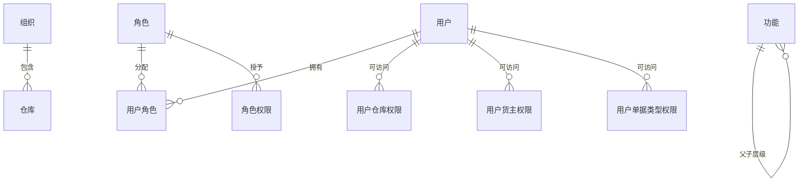

# 4. 业务系统管理：组织、权限与数据范围

参考：[原章节](../01-按章节拆分的md文件（1119页版本）/04-业务系统管理.md)

## 0. 资料联动

| 资料层 | 入口 |
| --- | --- |
| 手册事实 | [01/04 业务系统管理](../01-按章节拆分的md文件（1119页版本）/04-业务系统管理.md) |
| 流程图 | [02/04 业务系统管理](../02-按章节拆分的流程图/04-业务系统管理.md) |
| 原始数据字典 | [03/01 基础设置](../03-WMS的数据表按章节拆分/01-基础设置.md)、[03/15 资源管理](../03-WMS的数据表按章节拆分/15-资源管理.md)、[03/17 公共部分](../03-WMS的数据表按章节拆分/17-公共部分.md) |
| 字段参考 | [05/01 基础设置](../05-WMS的字段设计参考借鉴/01-基础设置.md)、[05/15 资源管理](../05-WMS的字段设计参考借鉴/15-资源管理.md)、[05/17 公共部分](../05-WMS的字段设计参考借鉴/17-公共部分.md) |
| 共享语义 | [核心业务语义索引](../00-核心业务语义索引.md) |

> [手册事实] 本章展示用户、角色、功能授权、仓库/货主/单证范围、供应商/收货人/分支机构授权、分级授权、导出和自定义操作授权等管理能力，也包含主机、插件、外部链接、密码规则和订单本地服务等系统管理入口。
>
> [归纳判断] WMS 的权限至少要同时约束功能动作和数据范围；扩展能力还要单独控制，避免导出或自定义操作绕开主链。
>
> [通用 WMS 建议] 对单据确认、库存调整、冻结释放和逆向操作设置更高的动作权限，并记录授权命中结果。
>
> [待确认] 具体角色继承、权限拒绝原因、用户停用后的会话处理和历史操作人保留方式需结合实施规则确认。

## 1. 参考事实

富勒在本章维护角色、用户、多角色、用户可登录仓库、可操作货主、可操作供应商、收货人和分支机构、可操作单证类型、分级授权、功能树、角色授权、数据导出授权、自定义操作授权、仓库、系统代码、数据字典、多语言、界面方案、附件和组织结构等；同时提供主机信息、系统配置数据导入导出、插件管理、外部链接设置、密码规则管理和订单信息本地服务配置。

### 使用场景与要解决的问题

| 使用场景 | 典型角色 | 用户问题 | 系统要交付的结果 |
|---|---|---|---|
| 多货主仓库 | 仓库管理员、客户人员 | 不同货主之间数据不能互相看到或操作 | 用户、角色、仓库、货主和单据类型形成数据权限边界 |
| 岗位分工 | 收货员、拣货员、主管 | 谁能看、谁能审核、谁能执行不清楚 | 功能权限与操作权限可分开授权 |
| 人员调岗/离职 | 系统管理员 | 删除用户后历史单据和日志失去操作人 | 用户停用而非删除，历史记录保留原身份 |
| 业务扩展 | 实施人员、超级管理员 | 导出、自定义操作可能绕开标准控制 | 扩展权限单独授权，并纳入审计 |

## 2. 产品设计重点

权限至少分成三层：

1. **功能权限**：能否进入某个功能、执行新增/编辑/审核/确认等操作；
2. **数据范围**：能看到哪些组织、仓库、货主和单证类型；
3. **扩展能力权限**：能否导出数据、执行自定义操作或查看自定义看板。

富勒还支持一个用户多角色，以及按仓库、货主、单证类型分别授权。这种设计适合多货主仓储服务场景。

### 权限配置与生效流程

## 3. 数据模型

| 实体对象 | 中文定义 | 关键关系 | 设计边界 |
|---|---|---|---|
| 组织 | 数据和人员管理的最高范围 | 包含多个仓库、用户和角色 | 组织切换必须影响可见数据 |
| 仓库 | 库存和作业的空间边界 | 被用户、货主、单据和库存引用 | 被引用后优先停用，不物理删除 |
| 用户/角色 | 登录主体与权限集合 | 用户可拥有多个角色 | 用户停用不删除历史操作人 |
| 功能/权限 | 菜单和新增、审核、确认等动作 | 角色关联多个权限 | 页面隐藏不能代替服务端校验 |
| 数据范围授权 | 用户/角色可操作的仓库、货主、单据类型 | 与用户或角色关联 | 未配置时的默认策略必须明确 |
| 系统代码/字典 | 下拉项、状态和值域定义 | 被单据字段和规则引用 | 停用代码不应让历史数据失去含义 |

### 3.1. 1119 页版授权与平台管理扩展

新版的授权对象不只包括仓库、货主和单据类型，还延伸到供应商、收货人、分支机构和分级数据范围。产品设计上应把这些对象作为授权范围维度，而不是继续在用户表中堆布尔字段。

主机信息、插件、外部链接、密码规则和订单本地服务属于平台管理能力，和业务单据权限分开建模；配置导入导出也需要保留版本、操作者和校验结果。

## 4. 状态与操作

权限对象本身通常不是业务交易单据，核心生命周期是：创建、启用、停用。系统预置记录不应随意删除；被用户、单据或日志引用的角色、仓库和代码，也应优先停用而不是物理删除。

| 对象 | 关键操作 | 约束 |
|---|---|---|
| 用户 | 创建、改密、停用、授权 | 用户编号稳定；停用不删除历史操作人 |
| 角色 | 创建、授权、停用 | 停用后不应影响历史数据 |
| 仓库 | 创建、启用、停用 | 被库存或单据引用后限制删除 |
| 系统代码 | 新增、排序、停用 | 业务逻辑代码不能只靠增加下拉项生效 |

## 5. 库存影响与逆向流程

直接库存影响：不适用。

间接影响：适用。权限会决定谁能查看库存、谁能审核冻结单、谁能执行调整和发货。因此权限校验必须在服务端操作前执行，不能只隐藏页面按钮。

## 6. 字段与逻辑

| 对象 | 核心字段 | 用途与校验 |
|---|---|---|
| 用户 | 用户编号、姓名、登录名、组织、状态、联系方式、最后登录时间 | 登录名稳定且唯一；停用后不能新建操作，但历史记录仍可查询 |
| 角色 | 角色编号、名称、类型、组织、状态、描述 | 角色停用不影响历史权限快照和历史业务 |
| 功能权限 | 功能编号、动作类型、授权状态 | 新增、编辑、审核、确认、取消等动作应分别控制 |
| 数据范围 | 授权主体、范围类型、组织/仓库/货主/单据类型 ID、有效期 | 组合范围生成查询条件和操作校验，不能只在前端过滤 |
| 系统代码/字典 | 分类、代码、名称、排序、语言、状态、是否系统预置 | 停用后不能用于新单据，但历史值仍可展示 |
| 审计关系 | 授权前值、后值、修改人、修改时间、原因 | 权限变更本身也需要可追溯 |

不要把“未配置授权”默认为“全部可见”，除非产品明确采用这种策略；默认放开容易造成多货主数据泄露。

## 7. 功能清单

| 功能 | 适用场景 | 解决问题 | 优先级 | 设计补充 |
|---|---|---|---|---|
| 用户与角色 | 组织和岗位管理 | 建立登录主体与岗位权限 | P0 | 支持停用、改密、批量导入，保留历史操作人 |
| 功能动作授权 | 新增、审核、确认、取消等关键操作 | 防止越权改变业务结果 | P0 | 动作粒度至少覆盖查询、编辑、审核、执行、逆向 |
| 仓库/货主数据权限 | 多仓、多货主 | 防止数据串看和跨范围操作 | P0 | 查询过滤和写操作校验必须共用同一授权逻辑 |
| 单据类型权限 | 不同岗位只能处理某些业务 | 限制高风险单据入口 | P1 | 与仓库、货主权限叠加计算 |
| 供应商/收货人/分支机构授权 | 预约、收货和多组织协同 | 控制可选业务主体和组织分支 | P1 | 与仓库、货主范围组合校验 |
| 导出/自定义操作授权 | 客户报表和特殊动作 | 控制扩展能力的风险 | P1 | 单独授权、记录操作日志、必要时脱敏 |
| 分级授权、配置导入导出和平台管理 | 集团化实施、系统运维 | 支持复杂授权和环境配置迁移 | P1/后续 | 需保留导入校验、版本和审计 |
| 组织树、临时授权、权限模拟 | 集团化或实施运维 | 处理复杂组织和排障 | 后续 | 临时授权必须有有效期和审批人 |

## 8. 精华借鉴

| 借鉴点 | 价值 | 通用化判断 |
|---|---|---|
| 功能权限与数据范围分离 | 既控制动作，也控制可见数据 | 必须借鉴 |
| 用户支持多角色 | 同一人员可能兼任仓库和管理岗位 | 借鉴，但要明确权限合并规则 |
| 仓库/货主/单据类型分层授权 | 适合多货主仓储服务 | 建议保留 |
| 停用而非删除 | 保留历史单据和审计链 | 必须借鉴 |
| 导出和自定义操作单独授权 | 扩展能力可能泄露或修改数据 | 借鉴并加强审计、脱敏和有效期 |

## 9. 待确认问题

- 权限主体是用户、角色，还是用户继承角色后允许个人覆写。
- 仓库管理员能否跨仓查看库存但不能跨仓执行作业。
- 货主授权不配置时，默认是全部可见还是全部不可见。
