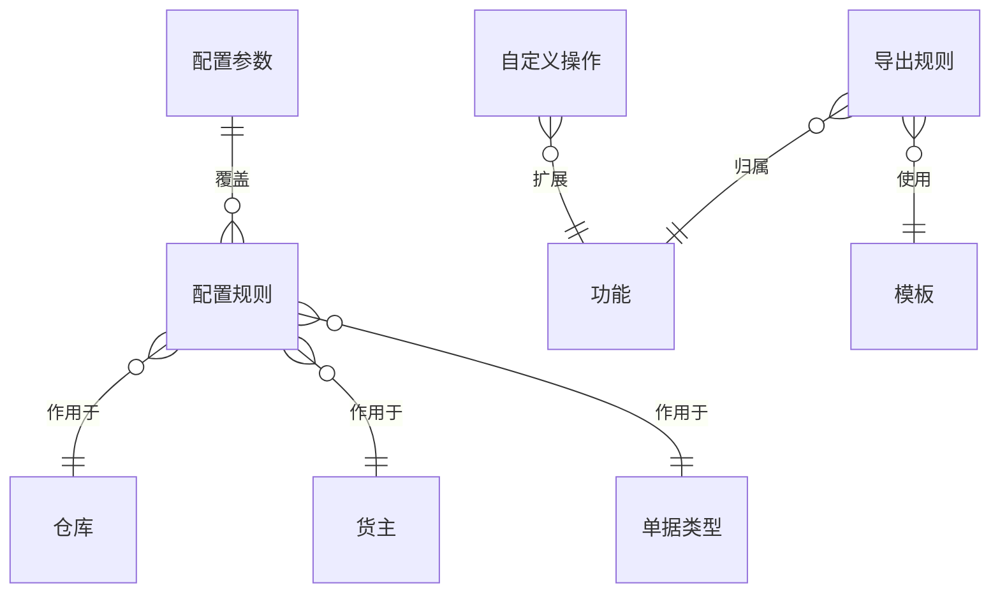

# 5. 业务系统配置：把差异放进配置边界

参考：[原章节](../01-按章节拆分的md文件/05-业务系统配置.md)

## 0. 资料联动

| 资料层 | 入口 |
| --- | --- |
| 手册事实 | [01/05 业务系统配置](../01-按章节拆分的md文件/05-业务系统配置.md) |
| 流程图 | [02/05 业务系统配置](../02-按章节拆分的流程图/05-业务系统配置.md) |
| 原始数据字典 | [03/02 业务规则](../03-WMS的数据表按章节拆分/02-业务规则.md)、[03/19 临时表](../03-WMS的数据表按章节拆分/19-临时表.md) |
| 字段参考 | [05/02 业务规则](../05-WMS的字段设计参考借鉴/02-业务规则.md)、[05/19 临时表](../05-WMS的字段设计参考借鉴/19-临时表.md) |
| 共享语义 | [核心业务语义索引](../00-核心业务语义索引.md) |

> [手册事实] 手册明确展示系统参数、WCO 范围、参数顺序、缓存重载、业务暂停、自定义操作、导出和自动打印配置。
>
> [归纳判断] 配置不是静态字典，而是业务动作执行时被读取的决策输入；其作用域和生效时点会改变流程结果。
>
> [通用 WMS 建议] 配置要有版本、测试、发布、生效和回滚边界，并在单据或任务结果中保留实际命中的配置版本。
>
> [待确认] 不同层级参数冲突时的全局优先级、缓存一致性以及对进行中单据的影响，不能仅凭字段名或页面顺序确定。

## 1. 参考事实

富勒支持系统参数、数据导出规则、自定义操作、模板文件、自动打印和标准业务扩展配置。系统参数可以按仓库、货主/客户、订单类型，即 WCO 维度细化；参数有默认值、参数类型、参数级别、活动标记和规则顺序。参数修改后可重载缓存，系统还可以通过特殊参数暂停业务操作。

### 使用场景与要解决的问题

| 使用场景 | 典型角色 | 用户问题 | 配置能力要交付的结果 |
|---|---|---|---|
| 多仓库差异 | 实施顾问、仓库主管 | 不同仓库的收货、质检和上架方式不同 | 同一功能按仓库配置差异，避免复制一套系统 |
| 多货主服务 | 客户管理员、运营人员 | 不同货主对部分发运、批次和打印要求不同 | 配置按货主隔离，并能看见当前命中的配置 |
| 订单类型差异 | 订单员、仓库主管 | B2B、B2C、调拨订单的执行链不同 | 按单据类型覆盖默认参数，并记录优先级 |
| 紧急停用业务 | 系统管理员 | 库存或接口异常时仍有新单进入 | 提供有权限、有原因、有恢复记录的业务暂停开关 |
| 配置变更 | 产品/实施人员 | 保存后影响范围不清，错误配置难以恢复 | 版本、测试、发布、生效时间和回滚可追踪 |

## 2. 产品设计重点

配置项需要同时定义三个问题：

- 谁可以配置；
- 配置对哪些范围生效；
- 修改后什么时候生效、是否影响进行中的单据。

WCO 设计的启发是：同一套 WMS 在不同仓库、货主和订单类型下可能需要不同流程，但不应把所有差异都写成代码分支。

## 3. 配置生效流程

| 实体对象 | 中文定义 | 关键关系 | 设计边界 |
|---|---|---|---|
| 配置参数 | 可被业务读取的参数定义 | 可拥有多个作用域覆盖值 | 参数类型和值域要稳定，不能随意改类型 |
| 配置规则 | 参数在某个范围内的具体值 | 关联组织、仓库、货主、单据类型 | 同一范围冲突时按明确优先级处理 |
| 配置版本 | 一组可发布的参数快照 | 关联配置规则和发布记录 | 已执行单据应保留使用过的版本 |
| 导出/打印规则 | 业务页面调用的输出配置 | 关联功能、模板和权限 | 输出失败不能触发原业务动作重跑 |
| 自定义操作 | 在标准功能上的扩展动作 | 关联功能、脚本/参数、授权 | 写操作必须复用标准服务和库存事务 |

## 4. 数据模型

## 5. 状态与操作

配置对象建议支持草稿、启用、停用、版本化；涉及数据库脚本、Java 类、存储过程和打印模板的配置，应增加测试、发布和失败记录，不要保存后立即无条件影响生产。

## 6. 库存影响与逆向流程

直接库存影响：不适用。

间接影响：适用。例如是否启用码盘、是否需要质检、是否允许部分分配，会改变后续库存和任务结果。配置设计必须记录生效范围和生效时间，并明确是否只对新建单据生效。

## 7. 字段与逻辑

| 对象 | 核心字段 | 用途与校验 |
|---|---|---|
| 参数定义 | 参数编码、名称、分类、数据类型、默认值、是否必填 | 定义参数含义和值域；编码一旦被业务使用不应随意复用 |
| 参数规则 | 参数编码、组织、仓库、货主、单据类型、覆盖值、优先级、状态 | 确定作用域和命中顺序；同范围同优先级不能有多个生效值 |
| 配置版本 | 版本号、变更说明、测试结果、生效时间、发布人、回滚版本 | 让配置变更可审计、可回退 |
| 导出/打印规则 | 功能编号、数据源、模板、格式、打印机、授权类型 | 输出配置与业务状态解耦，模板版本可回溯 |
| 自定义操作 | 操作编码、参数、脚本/服务、授权、状态、错误信息 | 禁止未经授权直接更新库存或核心单据表 |

配置值应有类型校验：Y/N、枚举、数值、文本不能混用。对于规则冲突，优先级必须可解释；同优先级的匹配结果不能依赖数据库返回顺序。

## 8. 功能清单

| 功能 | 适用场景 | 解决问题 | 优先级 | 设计补充 |
|---|---|---|---|---|
| 参数定义与默认值 | 所有可配置业务 | 统一参数名称、类型和默认行为 | P0 | 参数定义与具体作用域值分开 |
| WCO 作用域覆盖 | 多仓、多货主、多订单类型 | 用一套产品承载客户差异 | P0 | 明确组织→仓库→货主→单据类型的优先级 |
| 启停与缓存刷新 | 配置生效、紧急停用 | 控制什么时候影响新操作 | P0 | 记录生效时间、影响范围和发布人 |
| 配置测试与版本 | 实施上线、规则变更 | 防止错误配置直接影响生产 | P1 | 支持样例单试算、差异对比和回滚 |
| 导出、打印、自定义操作 | 客户个性化需求 | 降低重复开发 | P1 | 扩展能力单独授权并写审计日志 |
| 脚本沙箱、灰度发布 | 高级实施和复杂客户 | 降低自定义代码风险 | 后续 | 不作为普通业务人员的默认能力 |

## 9. 精华借鉴

| 借鉴点 | 解决的问题 | 通用化判断 |
|---|---|---|
| WCO 配置维度 | 一套系统承载不同仓库、货主和订单流程 | 借鉴，但首版先控制层级数量 |
| 默认值与覆盖值分离 | 不同范围既有共性又有差异 | 必须借鉴 |
| 参数重载缓存 | 配置修改后不必重启整个系统 | 借鉴，同时保留生效记录和失败提示 |
| 业务暂停参数 | 异常时保护库存和单据主链 | 借鉴，但必须有权限、原因和恢复动作 |
| SQL/脚本扩展 | 满足特殊客户快速交付 | 谨慎，先做只读扩展和沙箱 |

## 10. 待确认问题

- 参数是否按组织、仓库、货主、订单类型四级覆盖。
- 配置修改对已创建但未释放单据是否生效。
- 自定义 SQL、脚本和存储过程是否属于首版范围。
