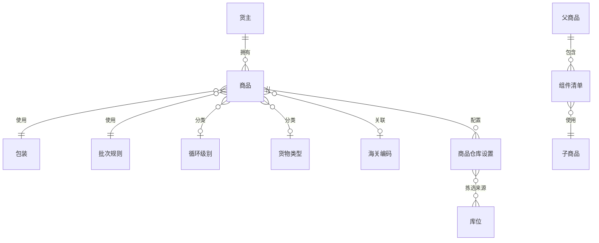

# 6. 基础设置：先把货物和货权定义清楚

参考：[原章节](../01-按章节拆分的md文件/06-基础设置.md)

## 0. 资料联动

| 资料层 | 入口 |
| --- | --- |
| 手册事实 | [01/06 基础设置](../01-按章节拆分的md文件/06-基础设置.md) |
| 流程图 | [02/06 基础设置](../02-按章节拆分的流程图/06-基础设置.md) |
| 原始数据字典 | [03/01 基础设置](../03-WMS的数据表按章节拆分/01-基础设置.md)、[03/02 业务规则](../03-WMS的数据表按章节拆分/02-业务规则.md) |
| 字段参考 | [05/01 基础设置](../05-WMS的字段设计参考借鉴/01-基础设置.md)、[05/02 业务规则](../05-WMS的字段设计参考借鉴/02-业务规则.md) |
| 共享语义 | [核心业务语义索引](../00-核心业务语义索引.md) |

> [手册事实] 本章覆盖包装、批次属性、循环级别、货物类型、客户、产品、库位相关基础资料和组件配置。
>
> [归纳判断] 基础资料不是页面录入的终点，而是后续收货、上架、分配、补货、复核和库存区分的输入。
>
> [通用 WMS 建议] 以“货主 + SKU + 仓库 + 包装/批次维度”明确库存识别口径，历史单据引用过的档案应支持停用或版本化。
>
> [待确认] 富勒实际库存单位、包装换算、批次属性冲突和组件执行时点需按手册对应页面与目标业务确认，不能由基础表名推导。

## 1. 参考事实

富勒将包装、批次属性、循环级别、货物类型、装箱、HS Code、客户档案、产品档案和组件放在基础设置中。手册强调基础设置有先后顺序，包装、批次属性和系统代码等基础内容未准备好，后续客户、产品、库位和单据就无法正确使用。

### 使用场景与要解决的问题

| 使用场景 | 典型角色 | 用户问题 | 基础资料要交付的结果 |
|---|---|---|---|
| 多包装单位管理 | 主数据管理员、收货员 | 箱、件、托盘换算不一致，库存和单据对不上 | 以主单位统一库存，保留作业包装层级 |
| 批次/效期管理 | 质量员、仓库主管 | 需要按批号、生产日期或效期收发货 | 将会影响库存区分和分配的属性配置化 |
| 多货主商品管理 | 客户管理员、运营人员 | 同一商品编码在不同货主下含义不同 | 以“货主 + 商品”作为库存和单据识别基础 |
| 套装、组装和拆分 | 加工员、订单员 | 父商品与子件的数量关系不清 | 用版本化 BOM 表达库存转化，而不是把配件写死在页面 |
| 档案变更 | 主数据管理员 | 修改包装或规则后，历史单据被错误重算 | 已引用资料停用/版本化，历史结果保持不变 |

## 2. 数据模型与基础对象关系

| 实体对象 | 中文定义 | 关键字段 | 关键关系 |
|---|---|---|---|
| 货主 | 商品和库存的归属主体 | 货主编码、名称、状态 | 拥有商品、订单和库存 |
| 商品 | 参与库存和业务单据的最小识别对象 | 货主、商品编码、名称、单位、状态 | 关联包装、批次规则、仓库设置和 BOM |
| 包装 | 商品不同作业单位之间的换算关系 | 包装层级、单位、换算率、尺寸、重量 | 被商品、单据明细和容器引用 |
| 批次规则 | 定义批次属性如何采集和参与决策 | 属性、格式、必填、选项、关键/验证标记 | 被商品和收发货流程引用 |
| 商品仓库设置 | 商品在特定仓库的作业默认值 | 拣货位、上架规则、周转规则、收发货单位 | 连接商品与仓库、库位和规则 |
| BOM/组件清单 | 父商品与子商品的版本化组成关系 | 版本、子件、用量、生效时间、状态 | 被加工单、拆分和组装流程引用 |

### 基础资料准备顺序

## 3. 核心设计精华

### 3.1 包装不是展示字段，而是数量换算基础

富勒以主单位作为库存余额的统一数量单位，箱、内包装、托盘等包装层级都换算到主单位。包装还可以控制收货标签、补货标签、出货标签、复核装箱和序列号采集在哪个层级发生。

通用设计建议：

- SKU 的库存数量统一落到主单位；
- 单据数量同时保留作业单位和主单位数量；
- 包装换算关系保存版本，历史单据不能因后来修改包装而改变；
- 包装层级的标签和序列号策略属于包装配置，不要散落在收货、出库页面。

### 3.2 批次属性要服务于决策

富勒允许为批次属性设置显示名、RF 显示、输入控制、格式、选项、关键属性和验证属性，并支持属性联动。批次属性并非越多越好：只有会影响库存区分、上架、分配、效期或出库核验的属性，才值得进入主流程。

建议将属性分成三类：

| 类别 | 作用 |
|---|---|
| 区分属性 | 参与形成库存批次，例如批号、生产日期、供应商批次 |
| 决策属性 | 影响上架、分配和周转，例如良品状态、效期 |
| 追溯属性 | 需要留存但不参与库存拆分或拣货判断的扩展信息 |

### 3.3 货主、客户和 SKU 要分层

手册把客户档案用于货主、供应商、承运人、收货人、结算人和下单方等角色。产品档案则以“货主 + 产品代码”为核心，保存包装、批次、仓库、拣货位、规则、序列号、配件和图片等信息。

通用 WMS 应避免把所有外部主体混成一个没有类型的“客户表”，也不能让 SKU 脱离货主直接进入库存。库存至少要能追溯货主、SKU、批次、包装、库位和容器。

### 3.4 产品档案是业务默认值，不是全部业务事实

产品档案可以提供默认包装、收货/出货单位、周转规则、预配规则、分配规则、拣货位和上架规则；订单或实际作业在必要时可以覆盖默认值。修改产品档案后，已创建单据是否同步更新，必须作为明确动作处理，不能自动改变历史单据。

### 3.5 BOM 与配件不是同一个概念

- 配件：产品的一部分，但通常不是独立 SKU，用于收货或退货时检查是否齐全。
- BOM/组件：由多个独立 SKU 组成父件，可用于拆分订单、组装或加工。

## 4. 字段与逻辑

| 对象 | 核心字段 | 关键逻辑 |
|---|---|---|
| 包装 | 包装代码、主单位、箱数、托盘数、尺寸、重量、标签标记 | 所有包装数量换算到主单位 |
| 批次规则 | 属性名、格式、必输/可选/只读、选项、关键/验证标记 | 收货采集，库存区分，出库校验 |
| 客户 | 客户编码、类型、隶属单位、地址、活动标记 | 货主与供应商/承运人等角色区分 |
| SKU | 货主、产品代码、包装、批次规则、规则默认值、拣货位 | SKU 是库存和单据明细的基础 |
| 组件 | 父件、版本、子件、数量、次序、活动标记 | 拆分、组装和库存转化依据 |

## 5. 库存影响与异常逆向

直接库存影响：通常不适用。

间接影响：适用。包装、批次属性和 SKU 规则会影响后续库存如何拆分、合并、分配和校验。已被库存或单据引用的配置，不建议物理删除；应停用、版本化或限制修改。

本章不需要编写收货或发货逆向流程，但需要明确：

- 修改批次规则不能破坏已有库存的属性解释；
- 修改包装换算不能改变历史单据数量；
- 修改 SKU 默认规则不应无提示覆盖进行中的单据；
- 停用 SKU 后是否允许已有库存出库，需要单独确认。

## 6. 功能清单

| 功能 | 适用场景 | 解决问题 | 优先级 | 设计补充 |
|---|---|---|---|---|
| 货主/客户档案 | 多货主仓储和供应链协同 | 明确库存归属及业务主体角色 | P0 | 货主、供应商、承运人、收货人等角色可分开表达 |
| 商品与仓库级设置 | 商品在不同仓库的规则不同 | 建立库存识别和仓库作业默认值 | P0 | 商品编码以货主为范围，仓库设置允许覆盖默认规则 |
| 包装与单位换算 | 箱、件、托盘等多单位 | 避免收发货数量不一致 | P0 | 换算版本不能影响历史单据 |
| 批次属性与效期 | 食品、医药、制造等受控商品 | 支持收发货校验和追溯 | P0/P1 | 只有参与决策的属性进入主链，其他作为追溯信息 |
| BOM、组件、配件 | 套装、组装、加工和退货检查 | 表达父子商品和完整性要求 | P1 | BOM 负责库存转化，配件负责检查，二者不要混用 |
| 货物类型、循环级别、HS Code | 运营分析、关务或盘点策略 | 增加分类和管理维度 | P1 | 不要为了字段完整把行业属性全部放进首版 |
| 替代品、图片、批量复制 | 大量主数据维护 | 降低录入和实施成本 | 后续 | 需要明确替代品是否允许自动分配 |

## 7. 富勒设计借鉴判断

| 参考设计 | 解决的问题 | 通用化建议 | 首版判断 |
|---|---|---|---|
| 主单位换算 | 多包装单位导致数量混乱 | 库存统一主单位，作业保留包装单位 | 必须借鉴 |
| 批次属性配置化 | 不同行业需要不同追溯和分配条件 | 配置属性的采集、校验和决策用途 | 建议借鉴 |
| 客户角色化 | 货主、供应商、承运人职责不同 | 主体对象与角色关系分离 | 建议借鉴 |
| 商品按仓库配置 | 同一商品在不同仓库作业策略不同 | 维护“商品 + 仓库”的默认设置 | 建议借鉴 |
| 默认规则与实际值分离 | 档案变更不应改写历史单据 | 单据保存命中值和来源版本 | 必须借鉴 |
| 配件与 BOM 分开 | “组成检查”和“库存转化”是两类需求 | 用不同对象和流程表达 | 建议借鉴 |
| 大量行业/自定义字段 | 覆盖客户差异但增加实施成本 | 以扩展属性和插件隔离，不直接塞进核心 | 谨慎纳入 |

## 8. 待确认问题

- 是否支持一品多包装，以及包装换算是否允许非整数。
- 批次是否作为库存余额的拆分维度，还是仅作为追溯信息。
- 首版是否支持序列号、替代品、配件和 BOM。
- SKU 停用后已有库存和历史单据的处理规则。
