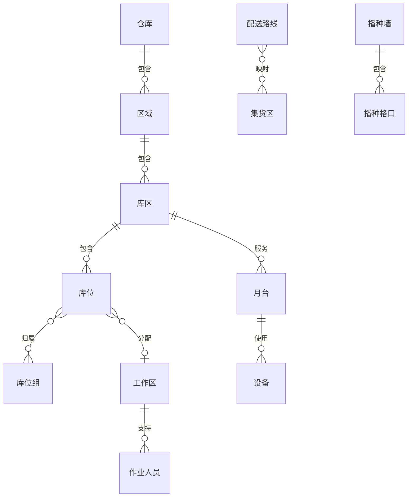

# 7. 仓库设置：把物理空间变成可计算的作业空间

参考：[原章节](../01-按章节拆分的md文件/07-仓库设置.md)

## 0. 资料联动

| 资料层 | 入口 |
| --- | --- |
| 手册事实 | [01/07 仓库设置](../01-按章节拆分的md文件/07-仓库设置.md) |
| 流程图 | [02/07 仓库设置](../02-按章节拆分的流程图/07-仓库设置.md) |
| 原始数据字典 | [03/01 基础设置](../03-WMS的数据表按章节拆分/01-基础设置.md)、[03/11 月台管理](../03-WMS的数据表按章节拆分/11-月台管理.md)、[03/15 资源管理](../03-WMS的数据表按章节拆分/15-资源管理.md) |
| 字段参考 | [05/01 基础设置](../05-WMS的字段设计参考借鉴/01-基础设置.md)、[05/11 月台管理](../05-WMS的字段设计参考借鉴/11-月台管理.md)、[05/15 资源管理](../05-WMS的字段设计参考借鉴/15-资源管理.md) |
| 共享语义 | [核心业务语义索引](../00-核心业务语义索引.md) |

> [手册事实] 本章把仓库、库区、库位、月台、设备、路线、分拣线和播种墙等物理/作业资源纳入设置。
>
> [归纳判断] 物理空间只有被编码成容量、属性、可用状态和作业关系后，才可能被上架、拣货和调度规则读取。
>
> [通用 WMS 建议] 库位状态、容量和货物相容性应在任务确认时再次校验，避免推荐结果与现场实际脱节。
>
> [待确认] 设备状态、月台预约状态、库位容量计算和路线分配的具体锁定时点需结合实际配置确认。

## 1. 参考事实

富勒将仓库划分为区域、库区、库位组、工作区，并进一步维护库位、路线、月台、设备、分拣口、堆垛机、播种墙和员工。区域/库区描述物理层级，库位是最小存储单位，库位组和工作区则分别服务于作业路线、任务调度和人员管理。

### 使用场景与要解决的问题

| 使用场景 | 典型角色 | 用户问题 | 仓库设置要交付的结果 |
|---|---|---|---|
| 新仓库建模 | 实施人员、仓库主管 | 系统只有一个仓库名称，无法指导现场作业 | 将物理仓库拆成可定位、可筛选的区域、库区和库位 |
| 收货、存储、拣货分区 | 收货员、上架员、拣货员 | 货物进入错误区域，作业动线混乱 | 为不同作业建立库位属性、工作区和过渡位 |
| 容量和混放控制 | 库管员、上架算法 | 系统推荐了现场放不下或不能混放的库位 | 让库位容量、属性和混放限制可计算 |
| 多班组/设备作业 | 调度员、设备管理员 | 不知道任务该交给哪个班组或设备 | 用工作区、库位组、设备能力和路线辅助派发 |
| 库位调整或封存 | 仓库主管 | 现场库位变化后，系统仍在向其分配任务 | 变更前检查库存和任务，并定义可入/可出边界 |

## 2. 数据模型与物理空间关系

### 实体对象清单

| 实体对象 | 中文定义 | 关键字段 | 关键关系 |
|---|---|---|---|
| 仓库 | 库存和作业的最高物理范围 | 编码、名称、类型、地址、状态 | 包含区域、库区、库位和作业资源 |
| 区域/库区 | 对仓库进行物理和作业分组 | 层级、用途、基点、补货来源标记 | 包含库位，参与规则筛选 |
| 库位 | 最小存储或过渡位置 | 编码、类型、属性、容量、顺序、坐标 | 被库存余额、任务和规则引用 |
| 库位组/工作区 | 逻辑作业范围和人员调度范围 | 库位集合、任务类型、作业模式 | 参与分配、路径和任务派发 |
| 路线/集货区 | 出库后的物流组织空间 | 路线、站点、集货区、承运人 | 关联发运订单、包裹和装车单 |
| 月台/设备/端口 | 仓库作业资源和自动化节点 | 能力、状态、位置、端口 | 参与收发货和设备任务路由 |

## 3. 库位设计要点

库位不仅是一个编码，还要同时描述：

- 能放什么：库位使用、库位类型、包装类型、环境和属性；
- 能放多少：体积、重量、箱数、托盘数、SKU 种类和数量限制；
- 能否混放：是否允许混产品、混批次；
- 如何排序：上架顺序、拣货顺序、XYZ 坐标和层数；
- 谁来操作：库位组、工作区、设备端口和巷道；
- 当前状态：正常、封存、管控、禁入。

值得借鉴的是将“上架顺序”和“拣货顺序”分开。物理库位不变，也可以通过调整逻辑顺序优化动线。

## 4. 库位属性与库存控制

富勒对库位属性有较清晰的作业含义：

| 属性 | 典型控制 |
|---|---|
| 正常 | 可参与正常入库、出库、补货和移动 |
| 封存 | 不参与移动、上架和补货 |
| 管控 | 可入库或移动，但正常分配时不使用 |
| 禁入 | 不允许库存进入，但允许从中取出 |

“禁入”与“封存”不能混为一个不可用状态：前者仍可能有可出库存，后者是整个库位被屏蔽。

## 5. 业务流程

### 空间对象的层级关系

区域和库区是组织空间，库位才是库存的直接位置；库位组和工作区是逻辑集合，不应在库存余额里重复存储一份“逻辑库位”。一个库位可以属于多个逻辑组，但同一时刻的可入、可出和可盘点状态必须能够被系统计算。

## 6. 字段与逻辑

| 对象 | 核心字段 | 设计逻辑 |
|---|---|---|
| 仓库 | 编码、名称、类型、地址、状态 | 库存、单据、规则的基础隔离边界 |
| 区域/库区 | 编码、层级、基点、补货来源标记 | 上架、补货和作业范围筛选 |
| 库位 | 编码、使用、属性、类型、容量、顺序、坐标 | 候选库位过滤、容量校验和作业导航 |
| 工作区 | 编码、上/下架过渡位、拣货/补货模式 | 任务分配和现场作业入口 |
| 路线/集货区 | 路线、集货区映射 | 集货、波次和装车分组 |
| 设备/端口 | 设备、能力、状态、端口 | 自动化任务路由和能力校验 |

库位编码应稳定、可扫描、可人工识别。库位编号改变不应成为调整作业顺序的唯一办法。

## 7. 库存影响与异常逆向

直接库存影响：配置本身不改变库存。

间接影响：适用。库位属性和容量决定库存是否能进入、是否可分配；工作区和设备状态决定任务能否执行。

异常与逆向：不展开业务单据逆向，但必须定义配置变更约束：

- 有库存或未完成任务的库位不能随意删除；
- 库位封存后，已有库存是允许出库、移动还是全部冻结，需要确认；
- 库区从补货来源中移除，不应自动取消已经生成的补货任务；
- 设备故障应阻止新任务下发，但不能抹掉已生成任务。

## 8. 功能清单

| 功能 | 适用场景 | 解决问题 | 优先级 | 设计补充 |
|---|---|---|---|---|
| 仓库、区域、库区、库位 | 所有仓库 | 建立库存位置和作业范围 | P0 | 编码稳定、可扫描，引用后限制删除 |
| 库位属性和容量 | 上架、分配、盘点 | 避免放错、放不下和混放 | P0 | 可入、可出、可盘点最好分开表达 |
| 库位组、工作区 | 多班组、多作业区 | 组织任务和人员 | P1 | 逻辑集合与物理位置分离 |
| 路线、集货区、月台 | 多路线、多车辆发运 | 防止集错货、装错车 | P1 | 与发运订单、包裹、装车单关联 |
| 员工、设备、端口 | 自动化或精细调度 | 将任务交给有能力的执行主体 | P1 | 设备离线时要阻止新任务并保留已有任务 |
| 分拣口、堆垛机、播种墙、WCS | 自动化仓和复杂电商 | 支持更复杂的出库组织 | 后续 | 建议建立在稳定的任务协议之上 |

## 9. 精华借鉴

| 借鉴点 | 解决的问题 | 通用化判断 |
|---|---|---|
| 物理层级与逻辑集合并存 | 既还原仓库，又能按作业组织 | 必须借鉴 |
| 库位属性和容量可计算 | 防止推荐结果不可执行 | 必须借鉴 |
| 库位状态有作业含义 | 封存、禁入和管控并不相同 | 必须借鉴 |
| 工作区承接任务调度 | 让人员、设备和空间关联起来 | 建议借鉴 |
| 自动化资源建模 | 支持设备仓，但实施成本高 | 按业务规模后置 |

## 10. 待确认问题

- 库位是否支持多层级、库位容量和 XYZ 坐标。
- 是否需要同时管理箱拣货位、件拣货位和存储位。
- 库位状态是单一状态，还是允许“可入、可出、可盘点”分别控制。
- 首版是否接入设备、输送线和播种墙。
