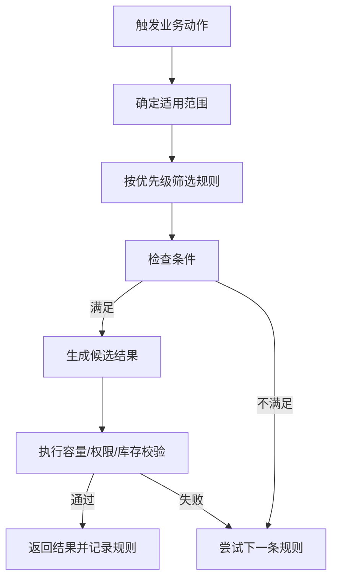

# 8. 业务规则：把仓库经验变成可执行策略

参考：[原章节](../01-按章节拆分的md文件/08-业务规则.md)

## 0. 资料联动

| 资料层 | 入口 |
| --- | --- |
| 手册事实 | [01/08 业务规则](../01-按章节拆分的md文件/08-业务规则.md) |
| 流程图 | [02/08 业务规则](../02-按章节拆分的流程图/08-业务规则.md) |
| 原始数据字典 | [03/02 业务规则](../03-WMS的数据表按章节拆分/02-业务规则.md)、[03/01 基础设置](../03-WMS的数据表按章节拆分/01-基础设置.md) |
| 字段参考 | [05/02 业务规则](../05-WMS的字段设计参考借鉴/02-业务规则.md)、[05/01 基础设置](../05-WMS的字段设计参考借鉴/01-基础设置.md) |
| 共享语义 | [核心业务语义索引](../00-核心业务语义索引.md) |

> [手册事实] 本章覆盖上架、周转、预配、分配、补货、质检、序列号、波次、配送、归档和订单分配计划等规则入口。
>
> [归纳判断] 规则真正的产品价值在于把“候选范围、排序、约束、失败后动作”结构化，而不只是保存一个规则名称。
>
> [通用 WMS 建议] 记录规则作用域、版本、优先级、命中结果和失败原因；同一批作业不要因配置修改而无法解释历史结果。
>
> [待确认] 规则冲突优先级、同级规则是否叠加、执行时读取还是生成时快照，以及 SQL/扩展规则的安全边界，需实际确认。

## 1. 参考事实

富勒的业务规则覆盖上架、库存周转、预分配、分配、补货、质检、流水号、定时器、波次计划、自动发运、路线、配送、单证控制、序列号和波次调度。规则可以按仓库、货主、产品、订单类型等范围配置，并通过顺序、条件和优先级决定最终结果。

### 使用场景与要解决的问题

| 使用场景 | 典型角色 | 用户问题 | 规则能力要交付的结果 |
|---|---|---|---|
| 上架库位推荐 | 上架员、仓库主管 | 靠经验找位，容易混放或浪费容量 | 根据商品、批次、包装、库位属性和容量返回候选 |
| 批次/效期分配 | 订单员、拣货员 | 有库存但取错批次，造成过期或客户拒收 | 将 FIFO、效期、货主和状态变成可解释的候选排序 |
| 拣货位补货 | 库管员、调度员 | 拣货位缺货，订单临时停住 | 按上下限、需求和已占用量生成补货任务 |
| 波次和自动发运 | 调度员、发运员 | 订单量大、路线复杂，逐单处理效率低 | 按时间、路线、承运人和作业条件组织订单 |
| 规则变更和排障 | 产品/实施人员 | 配置改错后不知道影响了什么 | 记录版本、命中规则、候选失败原因和重算范围 |

## 2. 规则执行通用模型



建议把规则拆成三段：筛选条件、候选结果、校验约束。这样产品经理和实施人员都能解释“为什么选了这个库位/批次/任务”。

## 3. 主要规则的设计精华

### 3.1 上架规则

富勒的上架规则按行顺序执行，先依据订单类型、包装级别、循环级别和批次属性判断是否适用，再选择目标库位范围，最后检查混放、空间、容量、库位属性等限制。规则还支持成功/失败跳转和兜底库位。

通用建议：候选库位计算要返回“候选过程和失败原因”，否则规则只能配置，无法调试。

### 3.2 库存周转与分配规则

库存周转规则使用批次属性排序，支持 FIFO 等升降序逻辑，以及精确匹配、模糊匹配和优先匹配。分配规则则决定从哪些区域、库区、库位和库存状态取货，以及是否允许部分分配。

周转排序解决“先取哪批”，分配规则解决“从哪里取、能取多少、怎样形成任务”，两者不能合并成一个模糊的“分配策略”。

### 3.3 补货规则

补货既可以按库存低于上下限定时生成，也可以由订单需求驱动。产品拣货位、补货来源库区、补货上下限、是否考虑已分配数量和上架规则共同决定补货结果。

### 3.4 波次与自动发运规则

波次规则可以按订单时间、货主、承运人、路线、区域、体积、重量、订单数量和等待时间组合订单，还可以指定是否播种、是否自动下发任务和是否更新分配规则。自动发运规则则把拣货、称重、复核、装箱和运输交接等完成节点组合成发运资格。

## 4. 数据模型

```mermaid
erDiagram
    规则 ||--o{ 规则明细 : 包含
    规则明细 }o--o{ 条件 : 过滤
    规则明细 }o--o{ 约束 : 校验
    商品 }o--o{ 规则 : 默认使用
    业务单据 }o--o{ 规则 : 覆盖
    规则 --> 规则执行记录 : 产生
    规则执行记录 }o--|| 业务单据 : 应用于
```

### 规则对象清单

| 实体对象 | 中文定义 | 关键字段 | 关键关系 |
|---|---|---|---|
| 规则 | 针对某类业务动作的一组策略 | 编码、类型、适用范围、版本、状态 | 包含规则明细 |
| 规则明细 | 一条可执行的条件、结果和失败处理 | 顺序、条件、候选范围、动作、失败跳转 | 被规则执行记录引用 |
| 条件/约束 | 判断是否适用以及结果是否合法 | 字段、运算符、值、校验类型 | 过滤候选并阻断非法结果 |
| 规则执行记录 | 记录一次规则计算的输入和结果 | 单据/任务、命中规则、候选、失败原因、时间 | 关联业务单据或任务 |
| 配置覆盖 | 同一规则在不同范围的值 | 仓库、货主、商品、订单类型、优先级 | 参与作用域和覆盖计算 |

## 5. 字段与逻辑

| 对象 | 层级 | 核心字段 | 用途与校验 |
|---|---|---|---|
| 规则 | 表头 | 规则编码、名称、类型、适用仓库、货主、订单类型、优先级、版本、生效时间、状态 | 定义规则范围；同范围同优先级要有唯一结果 |
| 规则明细 | 明细 | 顺序、条件字段、运算符、条件值、候选范围、成功动作、失败动作 | 描述筛选、候选和失败跳转；顺序必须稳定 |
| 规则约束 | 明细 | 库位属性、容量、混放、库存状态、权限、数量限制 | 在返回结果前做最终校验，失败原因可解释 |
| 规则执行记录 | 事实 | 单据/任务、输入快照、命中明细、候选结果、失败原因、执行时间 | 支持试算、排障和结果追溯 |

配置顺序必须稳定。规则覆盖关系应可解释，例如：订单指定值 > 商品默认值 > 货主默认值 > 系统默认值；如果产品选择另一种覆盖策略，也要固化为全局约定。

### 规则与业务单据的关系

规则不是业务单据的替代品。规则决定“怎么做”，单据记录“要做什么”，执行记录说明“这次为什么得到这个结果”。一张单据可以命中多条规则，但最终使用的规则版本、顺序和失败原因必须可追溯。

## 6. 库存影响与异常逆向

直接库存影响：规则本身不直接改库存。

间接影响：强适用。规则决定库存何时被预占、哪些库存可分配、上架到哪里、补货是否生成以及订单何时发运。

异常与逆向：规则配置错误时，不应直接“回滚库存”。应支持停用/改版规则、记录规则版本、重新计算未执行任务；已执行的库存操作必须按原业务单据的反向流程处理。

## 7. 功能清单

| 功能 | 适用场景 | 解决问题 | 优先级 | 设计补充 |
|---|---|---|---|---|
| 规则定义、启停、版本 | 所有策略变化 | 让仓库经验可维护、可回溯 | P0 | 生效时间、版本和操作人必不可少 |
| 上架规则 | 收货后放置 | 推荐满足属性和容量的库位 | P0 | 候选、失败原因和兜底结果要可见 |
| 周转/分配规则 | 批次、效期、货主受控出库 | 决定从哪批、哪位取货 | P0 | 排序和过滤分开设计 |
| 补货规则 | 拣货位缺货或低于下限 | 提前补足作业库存 | P1 | 订单需求与库存上下限都可成为触发源 |
| 质检、序列号、单证控制 | 受控商品和高风险操作 | 增加流程校验和追溯 | P1 | 与入库/出库策略绑定，不做孤立配置 |
| 波次、自动发运、路线配送 | 大订单量、多路线 | 提高批量履约效率 | P1 | 先定义波次聚合边界，再联动任务 |
| 复杂调度、自定义 SQL | 高级客户和特殊算法 | 满足差异化策略 | 后续 | 需要权限、沙箱、版本和性能边界 |

## 8. 精华借鉴

| 借鉴点 | 解决的问题 | 通用化判断 |
|---|---|---|
| 条件、候选、约束三段式 | 避免把规则写成不可解释的黑盒 | 必须借鉴 |
| 顺序和优先级明确 | 多条规则同时命中时结果稳定 | 必须借鉴 |
| 规则试算和命中日志 | 配置错误可定位、可验收 | 建议首版保留 |
| 默认值与单据覆盖 | 同一商品/客户存在临时需求 | 借鉴，但覆盖必须留痕 |
| 复杂脚本和自定义 SQL | 支持高级客户 | 谨慎后置，不能绕过标准服务 |

## 9. 待确认问题

- 规则是按仓库、货主、SKU、订单类型，还是按组织分层覆盖。
- 首版是否支持业务人员自主配置，还是只支持产品/实施配置。
- 是否需要规则模拟、试算和命中日志。
- 库存不足时，部分分配、替代品和跨库分配如何取舍。
