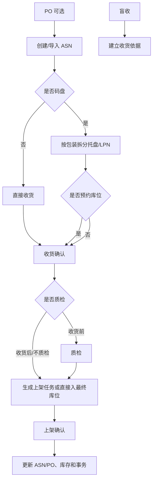
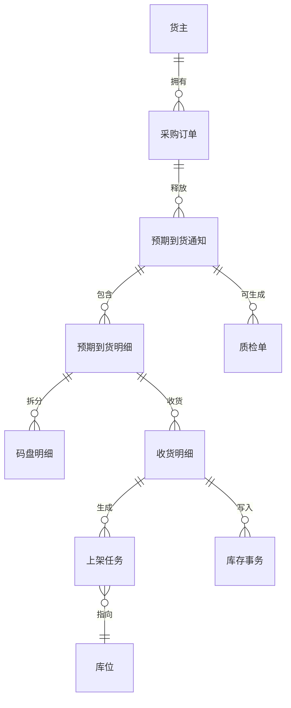

# 9. 入库操作：把“到货”变成可追踪库存

参考：[原章节](../01-按章节拆分的md文件/09-入库操作.md)

详细流程补充：[对应章节流程图](../02-按章节拆分的流程图/09-入库操作.md)

## 0. 资料联动

| 资料层 | 入口 |
| --- | --- |
| 手册事实 | [01/09 入库操作](../01-按章节拆分的md文件/09-入库操作.md) |
| 流程图 | [02/09 入库操作](../02-按章节拆分的流程图/09-入库操作.md) |
| 原始数据字典 | [03/03 入库操作](../03-WMS的数据表按章节拆分/03-入库操作.md)、[03/04 库存管理](../03-WMS的数据表按章节拆分/04-库存管理.md)、[03/06 任务管理](../03-WMS的数据表按章节拆分/06-任务管理.md)、[03/11 月台管理](../03-WMS的数据表按章节拆分/11-月台管理.md)、[03/19 临时表](../03-WMS的数据表按章节拆分/19-临时表.md) |
| 字段参考 | [05/03 入库操作](../05-WMS的字段设计参考借鉴/03-入库操作.md)、[05/04 库存管理](../05-WMS的字段设计参考借鉴/04-库存管理.md)、[05/06 任务管理](../05-WMS的字段设计参考借鉴/06-任务管理.md)、[05/11 月台管理](../05-WMS的字段设计参考借鉴/11-月台管理.md)、[05/19 临时表](../05-WMS的字段设计参考借鉴/19-临时表.md) |
| 共享语义 | [核心业务语义索引](../00-核心业务语义索引.md#入库与上架) |

> [手册事实] 本章明确展示 PO、ASN、盲收、收货、码盘、质检、上架和入库异常等入口及其组合方式。
>
> [归纳判断] PO/ASN 是计划或来源对象，收货是实际到货结果，上架是位置落位动作；三者的数量不能共用一个“已完成”概念。
>
> [通用 WMS 建议] 将计划量、通知量、实收量、质检合格量、待上架量和已上架量分开，并在每个确认动作中记录来源单据和库存事务。
>
> [待确认] 收货确认后库存是否立即可用、质检与上架的先后、超收/短收的允许范围和取消后的库存回滚，必须按配置或实际系统确认。

## 1. 参考事实

富勒支持三种常见入库入口：PO → ASN → 收货、直接创建 ASN 后收货，以及没有 PO/ASN 的盲收。码盘、库位预约、质检和上架根据现场流程选择启用；收货是入库主链中的核心作业节点。

### 使用场景与要解决的问题

| 使用场景 | 典型角色 | 用户问题 | 入库功能要交付的结果 |
|---|---|---|---|
| 采购到货 | 收货员、采购员 | 供应商送来的货与采购计划、到货通知不一致 | 把预计数量与实际数量分开，支持部分收货、超收和拒收 |
| 多批次/多车辆到货 | 收货员、库管员 | 同一批货不是一次到齐，无法持续跟踪剩余数量 | 一张 ASN 可对应多次收货，明细保留累计收货数和未收数 |
| 盲收或无采购单到货 | 收货员、仓库主管 | 临时到货没有上游单据，现场无法录入 | 允许建立最小收货依据，但保留来源缺失和后续补单入口 |
| 需要质检的入库 | 质检员、库管员 | 收到的货不一定能立即销售或发运 | 把待检、合格、不合格和冻结状态区分开 |
| 收货后上架 | 上架员、调度员 | 货收到了，但其他人不知道放在哪里 | 生成上架任务，确认后形成可定位、可作业库存 |

## 2. 业务流程

## 3. 数据模型

建议把 PO、ASN、收货记录、质检单和上架任务分成不同对象。PO 表示采购计划，ASN 表示本次预计到货，收货记录表示现场实收，上架任务表示库存位置变化。

| 实体对象 | 中文定义 | 关键字段 | 关键关系 |
|---|---|---|---|
| 采购订单 | 采购方计划采购的数量和要求 | 订单号、供应商、计划到货日、商品、计划数量 | 可释放为多张 ASN |
| 预期到货通知 | 一次或一批预计到货的执行依据 | ASN 号、来源订单、到货时间、预计数量、状态 | 可产生多次收货 |
| 收货记录 | 现场实际收到的货物结果 | 收货号、实收数、拒收数、破损数、批次、库位 | 可生成质检单、上架任务和库存事务 |
| 质检单 | 对收货结果进行检验和判定 | 检验项目、结果、合格数、不合格数、原因 | 可回写收货明细并触发冻结/属性变化 |
| 码盘/容器 | 货物在托盘、箱或 LPN 中的包装承载关系 | 容器号、包装层级、数量、父容器 | 可被上架、拣货和盘点任务引用 |
| 上架任务 | 将收货库存放入目标库位的现场指令 | 来源库位、目标库位、数量、执行人、状态 | 确认后写入库存位置事务 |
| 库存事务 | 记录收货增加或库位转移的事实 | 事务类型、关联对象、前后位置、数量、时间 | 由收货/上架等操作生成 |

## 4. 单据与状态

| 对象 | 建议核心状态 | 典型操作 |
|---|---|---|
| PO | 创建、部分释放、完全释放、部分收货、完全收货、冻结、取消、关闭 | 释放、未释放、冻结、生成 ASN、取消行 |
| ASN | 创建、已码盘、部分收货、完全收货、取消、完成、关闭 | 释放、码盘、预约、生成质检单、收货、标记完成 |
| 质检单 | 创建、部分质检、全部质检、取消、关闭 | 录入结果、确认、生成属性转移 |
| 上架任务 | 创建、执行中、完成、取消 | 打印、改目标库位、确认上架 |

状态应由系统根据明细数量和作业结果更新。不要让用户直接编辑“已收货数量”或手工选择最终状态。

### 单据之间的生成关系

这里把原文中的“一个 PO 可以生成几个 SN”按“一个 PO 可以生成几张 ASN（预期到货通知）”理解；`SN` 原文疑义仍需回查，本文后续统一使用 `ASN`：

| 上游 | 下游 | 关系 | 什么时候拆分 |
|---|---|---|---|
| 采购订单 | ASN | 1 对 0~多 | 按供应商、到货日期、车辆、仓库或到货批次拆分；PO 也可能暂不释放 ASN |
| ASN | 收货记录 | 1 对 1~多 | 分批到货、部分收货、不同收货班次时拆分 |
| ASN 明细 | 码盘明细 | 1 对 0~多 | 一行商品按托盘、箱或 LPN 分装时拆分 |
| 收货明细 | 质检单 | 1 对 0~多 | 按质检批次、检验项目或不合格处理拆分 |
| 收货明细 | 上架任务 | 1 对 0~多 | 按目标库位、容器、库区或作业人员拆分 |
| 上架任务 | 库存事务 | 1 对多 | 一次任务可能分多次确认，每次确认都要有独立事务 |

## 5. 字段与业务逻辑

| 对象 | 层级 | 核心字段 | 填写/生成时机 | 关键校验与逻辑 |
|---|---|---|---|---|
| ASN | 表头 | ASN 号、仓库、货主、供应商、来源 PO、订单类型、预计到货时间、预约时间、状态 | 创建/导入时 | 仓库、货主、到货方式和来源必须明确；同一来源订单不能无依据重复释放 |
| ASN | 表头 | 质检策略、码盘策略、收货库位、费用/集装箱信息、参考单号 | 按仓库或单据类型带出，可覆盖 | 记录命中的配置，避免操作员不知道为什么生成质检或上架任务 |
| ASN | 明细 | 商品、包装、收货单位、主单位、预计数量、已收数量、未收数量 | 创建和每次收货确认 | 主单位数量由包装换算；未收数=预计数-累计实收数，超收需单独标记 |
| 收货明细 | 明细 | 实收数量、拒收数量、破损数量、批次属性、序列号、收货库位、容器号 | 现场扫描/录入时 | 计划数、实收、拒收、破损等数量应可核对，不能用一个“差异数”掩盖原因 |
| 质检单 | 表头/明细 | 检验批次、项目、合格数、不合格数、结果、原因、处理方式 | 收货前或收货后 | 不合格货物进入冻结、不良品或退回流程，不能默认进入可用库存 |
| 上架任务 | 表头/明细 | 任务号、来源收货、来源库位、目标库位、容器、任务数、已完成数、执行人 | 收货或质检后 | 目标库位需通过属性、容量和混放校验；部分确认要保留剩余任务 |

关键逻辑：订单单位数量和主单位数量同时保留；收货确认和上架确认分别控制“收到”和“放到哪里”；拒收、破损、待检和冻结必须有独立数量或状态，不能都归入“异常”。

## 6. 库存影响

本章强适用。

| 操作 | 库存影响 |
|---|---|
| 码盘 | 通常只拆分预期明细并生成容器/跟踪号，不应增加实际库存 |
| 库位预约 | 预留目标位置，不应把预约当成已入库库存 |
| 收货确认 | 增加收货库存，记录批次、包装、库位和库存事务 |
| 收货到过渡位 | 库存进入过渡位置，通常不可直接参与出库 |
| 上架确认 | 库存从过渡位转入目标库位，改变位置和可作业条件 |
| 质检不合格 | 可能冻结或改变批次属性，具体以质检规则确认 |
| 取消收货 | 只能冲销尚未进入不可逆后续作业的收货结果；已上架库存应走反向库存事务 |

## 7. 异常与逆向流程

重点覆盖：

- 部分收货、多次收货；
- 超量收货；
- 短收、溢收、拒收和破损；
- 质检不合格、受控收货和待检库存；
- 码盘后拆托、重新生成跟踪号；
- 预约库位取消后重新计算；
- 已收货但未上架、已上架后需要撤回。

逆向动作必须区分层级：取消 ASN 不等于取消收货，取消收货也不等于删除库存。每个逆向操作要校验下游是否已经生成任务、发生分配或产生库存移动。

## 8. 功能清单

| 功能 | 适用场景 | 解决问题 | 优先级 | 设计补充 |
|---|---|---|---|---|
| ASN 创建/导入 | 有采购计划或供应商提前报货 | 让仓库提前知道将到什么货 | P0 | 支持从 PO 生成，也支持无 PO 直接创建 |
| 收货确认 | 车辆到仓、现场清点 | 形成真实收货结果 | P0 | 计划数、实收数、拒收数、破损数分开记录 |
| 部分/多次收货 | 分批、分车到货 | 防止未到货数量被误结案 | P0 | ASN 保留未收数量，不能一次确认成完成 |
| 过渡库位与上架任务 | 收货区与存储区分离 | 让“已收货但未上架”可见 | P0 | 上架确认才改变目标库位；支持部分上架 |
| 质检 | 食品、医药、制造等受控入库 | 避免不合格货物进入可用库存 | P1 | 支持收货前/后质检，结果联动冻结或放行 |
| 码盘、容器、预约 | 托盘化、多车辆或库位紧张 | 管理包装层级和到货资源 | P1 | 容器是执行对象，不要只当打印标签 |
| 盲收与收货异常 | 无单到货、短收、溢收、拒收 | 在不完整信息下保留现场事实 | P1 | 异常结果要能后续补单、审核和统计 |
| Cross Dock、自动收货 | 高周转或自动化仓 | 缩短入库到出库的等待 | 后续 | 先验证主链和接口可靠性，再增加自动化节点 |

## 9. 富勒设计借鉴判断

| 参考设计 | 解决的问题 | 通用 WMS 建议 | 首版取舍 |
|---|---|---|---|
| PO 与 ASN 解耦 | 计划与实际到货节奏不同 | PO 表示需求，ASN 表示一次到货，允许 1 对多 | 建议保留 |
| 盲收和部分收货 | 现场经常出现无单到货或分批到货 | 允许先记录事实，但必须留下来源缺失和后续补单状态 | 部分收货 P0，盲收 P1 |
| 过渡库位 | 收货与存储不是同一动作 | 把收货区、待检区和存储区建成可配置库位 | 建议 P0 |
| 码盘生成跟踪号 | 托盘/箱成为作业单位 | 容器号贯穿上架、盘点、拣货和追溯 | 简单容器 P1 |
| 质检前后可配置 | 不同仓库放行节点不同 | 通过入库策略控制收货前检、收货后检或免检 | 基础质检 P1 |
| 拒收与破损分开 | 供应商责任和库存处理不同 | 分别记录数量、原因和处理去向 | 建议保留 |
| 右键菜单较多 | 熟练用户效率高，但不易学习 | 按单据状态和岗位展示动作，并在服务端再次校验 | 需要改造 |

## 10. 待确认问题

- 收货确认是否立即计入账面库存和可用库存。
- 质检不合格是进入不良品库存、冻结库存，还是拒收退回。
- 是否允许超收，超收审批由 WMS 还是上游 ERP 控制。
- 已上架库存取消收货时采用反向单、退货单还是库存调整单。
