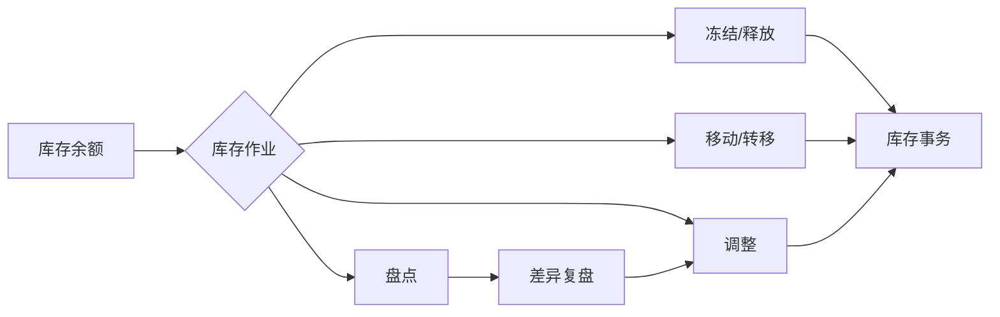
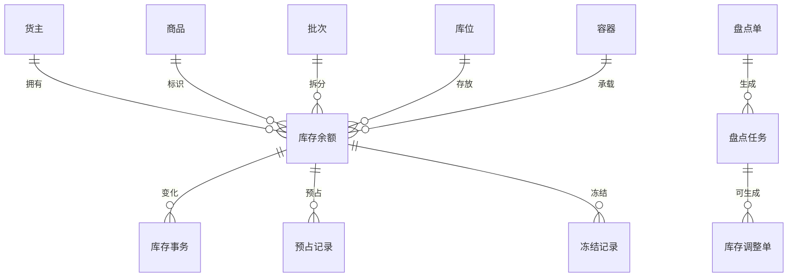

# 10. 库存管理：把余额、变化和控制分开

参考：[原章节](../01-按章节拆分的md文件（1119页版本）/10-库存管理.md)

详细流程补充：[对应章节流程图](../02-按章节拆分的流程图/10-库存管理.md)

## 0. 资料联动

| 资料层 | 入口 |
| --- | --- |
| 手册事实 | [01/10 库存管理](../01-按章节拆分的md文件（1119页版本）/10-库存管理.md) |
| 流程图 | [02/10 库存管理](../02-按章节拆分的流程图/10-库存管理.md) |
| 原始数据字典 | [03/04 库存管理](../03-WMS的数据表按章节拆分/04-库存管理.md)、[03/06 任务管理](../03-WMS的数据表按章节拆分/06-任务管理.md)、[03/18 后台表](../03-WMS的数据表按章节拆分/18-后台表.md)、[03/19 临时表](../03-WMS的数据表按章节拆分/19-临时表.md) |
| 字段参考 | [05/04 库存管理](../05-WMS的字段设计参考借鉴/04-库存管理.md)、[05/06 任务管理](../05-WMS的字段设计参考借鉴/06-任务管理.md)、[05/18 后台表](../05-WMS的字段设计参考借鉴/18-后台表.md)、[05/19 临时表](../05-WMS的字段设计参考借鉴/19-临时表.md) |
| 共享语义 | [核心业务语义索引](../00-核心业务语义索引.md#数量与库存事务) |

> [手册事实] 本章围绕库存查询、冻结、移动、盘点、调整和库存结果展开，并区分库存当前值与操作结果。
>
> [归纳判断] 库存余额回答“现在有多少、在哪里”，库存事务回答“为什么变成这样”；冻结、分配和待上架是可执行性口径，不应直接混成余额。
>
> [通用 WMS 建议] 为每次库存变化生成可追溯事务，并用幂等键防止收货、上架、拣货、调整或反向动作重复记账。
>
> [待确认] 可用、冻结、已分配、待上架之间是否存在重复占用，以及各类动作的实际记账时点，不能仅凭页面显示或字段名确定。

## 1. 参考事实

富勒的库存管理包括库存余量、库存事务、库存冻结单、库存转移单、库存调整单、库存移动单、库存盘点单、库存扫描、库存对账、图形化库存 2D/3D，以及对应的快捷冻结、转移、调整、移动和 ABC 动态分析。库存余量区分库存数量、分配数量、冻结数量、可用数量和各类待执行任务数量。

### 使用场景与要解决的问题

| 使用场景 | 典型角色 | 用户问题 | 库存功能要交付的结果 |
|---|---|---|---|
| 查询当前库存 | 库管员、客服、订单员 | 只知道总数，不知道可用数、冻结数和具体位置 | 按货主、商品、批次、库位、容器展示库存分层数量 |
| 库存冻结/释放 | 质量异常、货损、合规拦截 | 问题货物仍被订单分配或发出 | 在不减少总量的情况下改变可用性，并可追溯释放原因 |
| 库内移动/转移 | 整理库位、货主变更、属性纠正 | 搬货或改属性后系统仍显示旧位置/旧归属 | 记录来源和目标，更新库存余额并产生库存事务 |
| 盘点和差异处理 | 周期盘点、月末盘点、动态盘点 | 账实不符但无法判断是现场差错还是系统问题 | 盘点、复盘、调整分步完成，保留差异依据 |
| 库存调整 | 盘盈盘亏、损耗、系统纠错 | 直接改余额会失去责任和原因 | 通过调整单或反向事务修正，不覆盖历史记录 |

## 2. 业务流程图



| 实体对象 | 中文定义 | 关键字段 | 关键关系 |
|---|---|---|---|
| 库存余额 | 当前某个库存维度组合下的数量快照 | 货主、商品、批次、库位、容器、库存数、可用数、冻结数 | 被预占、冻结、移动和调整 |
| 预占记录 | 订单或任务对可用库存的占用 | 来源订单/行、库存 ID、预占数、释放数、状态 | 关联分配明细，取消时释放 |
| 冻结记录 | 对库存可用性进行限制的记录 | 冻结原因、数量、范围、创建人、释放时间 | 关联库存余额和冻结单 |
| 库存事务 | 每次数量、位置或属性变化的不可变事实 | 事务类型、前后值、数量、来源对象、时间、操作人 | 由收货、拣货、移动、调整等操作产生 |
| 盘点单 | 定义盘点范围和差异处理责任 | 盘点类型、范围、截止时间、状态、负责人 | 生成多个盘点任务 |
| 盘点任务 | 分配给人员或设备的现场盘点动作 | 库位、商品、账面数、实盘数、复盘数、差异原因 | 差异可生成库存调整单 |
| 库存调整单 | 经授权的数量修正依据 | 调整前数、目标数、差异数、原因、审核信息 | 执行后生成调整事务 |

## 3. 数据模型与库存对象



## 4. 库存数量口径

富勒把库存数量、分配数量、冻结数量和可用数量区分开，并把待上架、待补货、待移出、待移入和待调整数量作为作业占用信息展示。通用 WMS 应明确公式，而不能只在页面上堆几个数字。

一种可供验证的初始口径是：

```text
可用库存 = 账面库存 - 冻结库存 - 已分配库存 - 其他未完成任务占用
```

其中“待上架库存是否进入账面库存”“任务占用是否与分配重复扣减”必须结合事务模型确认，不能直接套用公式。

库存余额建议至少按“货主 + 商品 + 批次/序列号 + 库位 + 容器 + 库存状态”形成可解释的库存维度。任何一个维度在业务上会影响能否出库，就不能只作为页面展示字段。

## 5. 库存操作与影响

| 操作 | 是否改变总量 | 主要结果 |
|---|---:|---|
| 冻结/释放 | 否 | 改变可用性，生成冻结记录 |
| 转移 | 通常否 | 可改货主、SKU、批次属性、库位或跟踪号 |
| 移动 | 否 | 改变库存库位/跟踪号，写入前后信息 |
| 调整 | 是 | 将账面数量改为目标数量，记录原因和损益 |
| 盘点 | 通常否 | 形成实盘结果，差异再生成调整或出入库单 |
| ABC 调整 | 否 | 改变产品循环级别，不自动改变库存库位 |

## 6. 单据与状态

| 单据 | 建议状态 | 核心操作 |
|---|---|---|
| 冻结单 | 创建、审核、冻结、部分释放、关闭、取消 | 审核、冻结、释放 |
| 转移单 | 创建、审核、部分完成、完成、关闭、取消 | 审核、执行转移、计算目标库位 |
| 调整单 | 创建、审核、部分执行、完成、关闭、取消 | 审核、执行调整 |
| 移动单 | 创建、部分执行、完成、关闭、取消 | 计算目标库位、执行移动 |
| 盘点单 | 创建、任务生成、盘点中、复盘、待调整、关闭 | 生成任务、录入结果、生成差异任务/调整单 |

审核、执行和关闭要分开。审核只是允许执行，不能直接等同于库存已经改变。

### 单据、任务与事务关系

| 对象 | 生成/关联对象 | 关系 | 设计说明 |
|---|---|---|---|
| 冻结单 | 冻结记录 | 1 对多 | 一张冻结单可覆盖多个商品、批次、库位或容器；释放可以部分执行 |
| 转移单 | 转移任务/库存事务 | 1 对多 | 目标货主、商品、批次或库位发生变化时，必须保留转移前后关系 |
| 移动单 | 移动任务/库存事务 | 1 对多 | 主要改变位置或容器，不应与货权/商品属性转移混同 |
| 盘点单 | 盘点任务 | 1 对多 | 按库位、商品、人员或盘点策略拆分现场任务 |
| 盘点任务 | 调整单 | 1 对 0~多 | 差异可以复盘后合并调整，也可以按责任范围拆分 |
| 任一库存操作 | 库存事务 | 1 对多 | 部分确认、批次拆分或前后位置变化时产生多条事务 |

## 7. 库存事务

库存事务是所有库存变化的事实记录，至少要记录：事务号、事务类型、状态、单证号/行号、仓库、货主、SKU、批次、库位、跟踪号、操作前信息、操作后信息、数量、操作人、时间、原因和关联任务。

“原始信息”和“目标信息”是很有价值的设计：它能让库存转移、移动和调整不只留下最终余额，还能回答库存从哪里变到哪里。

| 对象 | 层级 | 核心字段 | 用途与校验 |
|---|---|---|---|
| 库存余额 | 主记录 | 货主、商品、批次、序列号、库位、容器、库存状态、账面数、可用数、冻结数、预占数 | 定义库存维度和当前数量；同一维度组合要能唯一定位 |
| 预占/冻结记录 | 关联记录 | 来源单据/行、库存 ID、数量、原因、状态、创建/释放时间、操作人 | 可用性变化要可释放、可追溯，不能只改余额字段 |
| 库存事务 | 事实记录 | 事务号、事务类型、来源对象、前值、目标值、数量、原因、请求 ID、操作人、时间 | 每次确认产生不可变记录；失败要有补偿或人工处理状态 |
| 盘点单 | 表头 | 盘点号、类型、范围、截止时间、作业限制、负责人、状态 | 定义盘点边界，不等同于实盘结果 |
| 盘点任务 | 明细/任务 | 库位、商品、批次、账面数、实盘数、复盘数、差异原因、状态 | 支持盲盘、复盘和部分完成，差异再决定调整方式 |
| 库存调整单 | 表头/明细 | 调整号、调整类型、调整前数、目标数、差异数、原因、审核人、状态 | 授权后才能改变总量，执行后写入调整事务 |

## 8. 库存影响与异常逆向

本章强适用。逆向处理必须遵循“原事务可追溯、反向事务不覆盖原记录”的原则：

- 冻结可以释放，但保留原冻结记录；再次冻结应产生新记录；
- 未执行的任务可以取消并释放占用；
- 已执行移动应生成反向移动，而不是直接改回原库位；
- 调整完成后发现错误，应通过新的调整或冲销事务修正；
- 盘点差异先复盘，再生成调整单或盘盈入库/盘亏出库单。

## 9. 盘点设计

富勒支持普通盘点、循环盘点、物理盘点、动态/动碰盘点、呆滞库存盘点和随机盘点，也支持盲盘、复盘和盘点预检。

建议将盘点拆成：盘点范围 → 盘点任务 → 实盘结果 → 差异复盘 → 调整依据 → 关闭。盘点结果本身不应直接覆盖库存余额。

### 9.1. 1119 页版补充能力

#### 9.1.1. 库存扫描

库存扫描面向已经在库的库存，支持扫描商品、包装、容器或跟踪号，按配置进行混箱和序列号校验，并可在扫描完成后生成移库单或转移单。扫描是库存整理的作业入口，不代表已经完成移动或转移。

#### 9.1.2. 库存对账

库存对账可以从 ERP 提取库存，再按货主配置的产品/批次属性汇总 WMS 库存并计算差异。对账结果用于双方管理员处理，不能把差异计算直接画成自动调整库存。

#### 9.1.3. 图形化库存 2D/3D

图形化库存是库存查询的可视化层：2D 可以按设施、工作区、货架排和库位逐级查看；3D 需要配置物理坐标和尺寸后建模查询。它们不产生库存事务，且原文说明同一库位不支持同时使用 2D 和 3D 模式。

## 10. 功能清单

| 功能 | 适用场景 | 解决问题 | 优先级 | 设计补充 |
|---|---|---|---|---|
| 库存余额查询 | 日常查货、客服答疑、订单分配 | 看清总量、可用量、冻结量和位置 | P0 | 查询口径要固定，支持按库存维度下钻 |
| 库存事务查询 | 差异追责、库存审计 | 解释库存为什么增加、减少或移动 | P0 | 支持从余额、单据、任务互相跳转 |
| 冻结/释放 | 质量、破损、合规或客户锁定 | 防止问题库存继续被使用 | P0 | 冻结是可用性变化，不是总量减少 |
| 库存移动 | 库内整理、换容器、位置纠正 | 保持系统位置与现场一致 | P0 | 记录源库位、目标库位和执行人 |
| 库存调整 | 盘盈盘亏、损耗、纠错 | 在授权下修正账实差异 | P0 | 必须有原因、审核和调整事务 |
| 转移、盘点 | 货主/属性变更、周期或动态盘点 | 管理更复杂的库存控制 | P1 | 盘点结果不直接覆盖余额，转移要保留前后属性 |
| 库存扫描与对账 | 现场整理、ERP/WMS 差异核对 | 将扫描结果和跨系统差异纳入库存控制 | P1 | 扫描、对账与库存调整分开，差异不自动修正 |
| 图形化库存 2D/3D | 设施可视化和库位查询 | 让库存位置与物理空间对应 | P1/后续 | 只作为查询层，坐标和建模规则需单独维护 |
| ABC、复杂属性转移 | 精细化库存策略 | 用周转级别或属性优化作业 | 后续 | 先统一库存维度和事务口径 |

## 11. 富勒设计借鉴判断

| 参考设计 | 解决的问题 | 通用化建议 | 首版判断 |
|---|---|---|---|
| 余额与事务分开 | 当前状态和历史原因不是一类数据 | 余额服务查询，事务服务解释变化 | 必须借鉴 |
| 可用、分配、冻结分开 | 总量不等于可发数量 | 定义数量公式和重复扣减边界 | 必须借鉴 |
| 快捷操作与正式单据并存 | 高频动作需要效率，复杂动作需要审批 | 两者共用同一库存事务服务 | 借鉴并统一底层逻辑 |
| 转移与移动分开 | 货权/属性变化与单纯搬位不同 | 按变化维度拆分对象和权限 | 建议保留 |
| 盘点差异先复盘 | 避免把现场误差直接记成盘盈盘亏 | 盘点结果、复盘和调整分层 | 建议保留 |
| 跨货主转移和损益调整 | 满足复杂运营，但有财务/货权风险 | 首版必须先明确授权、会计和审计边界 | 谨慎纳入 |

## 12. 待确认问题

- 账面库存、可用库存、预占、冻结、任务占用的计算口径。
- 库存转移是否允许同时改变货主、SKU、批次和库位。
- 调整是否必须审核，是否允许直接快捷调整。
- 盘点期间是否冻结作业，还是允许动态盘点并提示关联任务。
