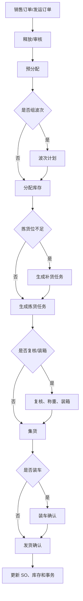
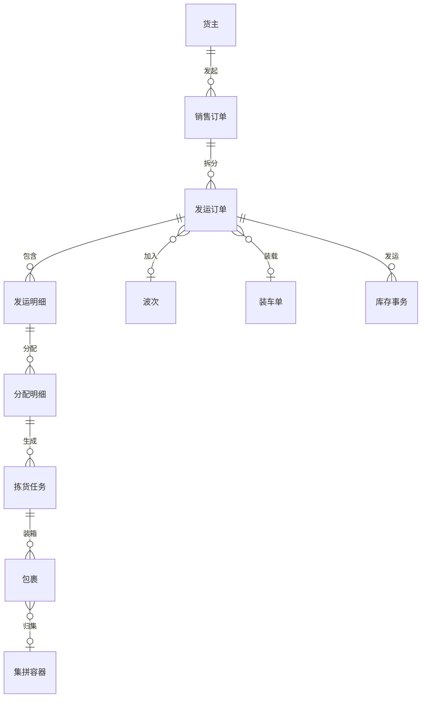

# 11. 出库操作：把订单履约拆成可控制的作业链

参考：[原章节](../01-按章节拆分的md文件/11-出库操作.md)

详细流程补充：[对应章节流程图](../02-按章节拆分的流程图/11-出库操作.md)

## 0. 资料联动

| 资料层 | 入口 |
| --- | --- |
| 手册事实 | [01/11 出库操作](../01-按章节拆分的md文件/11-出库操作.md) |
| 流程图 | [02/11 出库操作](../02-按章节拆分的流程图/11-出库操作.md) |
| 原始数据字典 | [03/05 出库操作](../03-WMS的数据表按章节拆分/05-出库操作.md)、[03/06 任务管理](../03-WMS的数据表按章节拆分/06-任务管理.md)、[03/10 报表](../03-WMS的数据表按章节拆分/10-报表.md)、[03/17 公共部分](../03-WMS的数据表按章节拆分/17-公共部分.md)、[03/19 临时表](../03-WMS的数据表按章节拆分/19-临时表.md) |
| 字段参考 | [05/05 出库操作](../05-WMS的字段设计参考借鉴/05-出库操作.md)、[05/06 任务管理](../05-WMS的字段设计参考借鉴/06-任务管理.md)、[05/17 公共部分](../05-WMS的字段设计参考借鉴/17-公共部分.md)、[05/19 临时表](../05-WMS的字段设计参考借鉴/19-临时表.md) |
| 共享语义 | [核心业务语义索引](../00-核心业务语义索引.md#出库与履约) |

> [手册事实] 本章展示 SO/发运订单、波次、分配、拣货、复核、发货、取消发货、播种、配送、集拼、集货和装车等作业入口。
>
> [归纳判断] 出库主链由订单意图、分配决策、现场任务和发运结果组成；复核、集拼、集货和装车不是所有仓库都必然启用的同一节点。
>
> [通用 WMS 建议] 把“已分配、已拣货、已复核、已装箱、已发货”作为不同结果，并明确每个结果对库存可用量和逆向处理的影响。
>
> [待确认] 分配是否扣减可用库存、拣货确认和发货确认的记账时点、取消发货的回退范围，以及多个订单候选的排序算法，仍需验证。

## 1. 参考事实

富勒的出库主链是 SO → 预分配/分配 → 拣货 → 发货；根据现场需要增加波次、复核、单品复核、N+X 复核、播种、配送单、集拼箱、集货位、装车、异常处理、发票和包裹管理。销售订单可作为原始指令，发运订单是实际执行依据。

### 使用场景与要解决的问题

| 使用场景 | 典型角色 | 用户问题 | 出库功能要交付的结果 |
|---|---|---|---|
| 客户订单履约 | 订单员、仓库主管 | 订单多、库存分散，人工找货容易错发 | 将订单需求拆成可执行的库存分配和拣货任务 |
| 多订单集中作业 | 调度员、拣货员 | 逐单拣货造成重复走动，效率低 | 按仓库、路线、承运人或时间窗组波次 |
| 批次/效期出库 | 库管员、拣货员 | 货物满足数量但不满足批次、效期或货主要求 | 将库存属性作为分配和拣货校验条件 |
| 复核、装箱和装车 | 复核员、发运员 | 拣对了但装错包裹、路线或车辆 | 通过复核、包裹、集货和装车建立交接证据 |
| 缺货和拣货差异 | 仓库主管、客服 | 现场实际数量与分配结果不一致 | 支持补货、重新分配、部分发运、反拣和异常关闭 |

## 2. 业务流程

| 实体对象 | 中文定义 | 关键字段 | 关键关系 |
|---|---|---|---|
| 销售订单 | 上游系统或业务人员提出的出库需求 | 订单号、货主、收货人、要求交期、商品和数量 | 可拆分生成多个发运订单 |
| 发运订单 | WMS 实际执行和发货确认的单据 | 发运号、仓库、路线、承运人、状态、允许部分发运 | 包含发运明细，可加入波次 |
| 分配明细 | 订单需求与具体库存的关联结果 | 来源库位、批次、容器、分配数、取消数 | 可生成多个拣货任务 |
| 拣货任务 | 给人员或设备的取货指令 | 来源库位、目标容器、任务数、执行人、状态 | 完成后形成待复核/待发运货物 |
| 包裹/集拼容器 | 承载商品并参与交接的容器 | 包裹号、重量、体积、件数、路线 | 可被集货区和装车单引用 |
| 库存事务 | 记录拣货移动、发货扣减等库存事实 | 事务类型、前后库位、数量、关联单据/任务 | 与发运订单和任务双向追溯 |

## 3. 数据模型

## 4. 单据与状态

发运订单可使用创建、部分预分配、预分配完成、部分分配、分配完成、部分拣货、拣货完成、部分发运、完全发运、取消和完成等状态。状态多并不是目标，关键是状态要对应明确数量字段和下一步动作。

| 阶段 | 主要状态判断 | 典型操作 |
|---|---|---|
| 订单 | 创建/释放/冻结/未释放 | 释放、冻结、拆分、取消、关闭 |
| 分配 | 部分/完成 | 预配、分配、取消分配、触发补货 |
| 拣货 | 创建/部分/完成 | 生成任务、拣货确认、反拣 |
| 复核包装 | 未复核/部分/完成 | 复核、装箱、称重、打印面单 |
| 装车发运 | 待装车/已装车/已发运 | 装载确认、重置、确认发货 |

“允许部分分配”和“允许部分发运”应分开。允许部分分配不代表可以直接部分发运。

### 单据之间的生成与聚合关系

| 上游 | 下游/关联对象 | 关系 | 设计说明 |
|---|---|---|---|
| 销售订单 | 发运订单 | 1 对 1~多 | 按仓库、路线、承运人、发货批次或订单行拆分 |
| 发运订单 | 波次 | 多对 0~1 | 一个波次可聚合多个发运订单；不是每个订单都必须组波次 |
| 发运明细 | 分配明细 | 1 对 0~多 | 同一商品可能从多个库位、批次或容器取货 |
| 分配明细 | 拣货任务 | 1 对 1~多 | 按库区、路径、工作区或设备拆分 |
| 拣货任务 | 包裹 | 多对 0~多 | 一次拣货可分装多个包裹，也可先进入集货容器 |
| 发运订单 | 装车单 | 多对 0~多 | 允许拆车、换车或分批装车；装车不是发货确认本身 |

## 5. 字段与核心逻辑

| 对象 | 层级 | 核心字段 | 用途与校验 |
|---|---|---|---|
| 销售/发运订单 | 表头 | 单号、货主、仓库、订单类型、优先级、要求发货时间、路线、站点、承运人、状态 | 决定履约范围和作业顺序；仓库、货主、收货信息必填 |
| 销售/发运订单 | 表头 | 允许部分分配、允许部分发运、批次/序列号策略、复核策略、来源系统单号 | 明确差异处理边界；这些开关必须能追溯来源和版本 |
| 发运订单 | 明细 | 商品、包装、需求单位、主单位、订货数、已分配数、已拣货数、已发货数、差异数 | 形成数量平衡；各执行数量不能超过需求数，例外需审核 |
| 发运明细 | 明细 | 批次、效期、序列号、指定库位/库区、周转规则、分配规则、替代商品 | 缩小库存候选范围；规则覆盖要记录原因和操作人 |
| 分配明细 | 明细 | 来源库存、来源库位、容器、批次、分配数量、取消数量、分配状态 | 说明“具体从哪里取”；取消分配要释放预占 |
| 包裹/装车 | 表头/明细 | 包裹号、件数、重量、体积、运单号、集货区、车辆、装车数量 | 支撑交接和物流跟踪；装箱数量与复核数量要能核对 |

核心逻辑是：订单字段表达“要什么”，分配明细表达“从哪里取”，拣货任务表达“谁去取”，发货确认表达“最终发了什么”。

## 6. 库存影响

本章强适用。

| 操作 | 库存/任务影响 |
|---|---|
| 预分配 | 预留订单需求，是否占用可用库存由策略决定 |
| 分配 | 将具体库存与订单行建立关联，形成分配数量和拣货依据 |
| 拣货确认 | 库存从来源库位转移到拣货/理货/集货位置，或进入待发运状态 |
| 复核装箱 | 通常改变容器、包装和重量，不应重复扣库存 |
| 集货/装车 | 改变容器和作业位置，保留订单与包裹关联 |
| 发货确认 | 扣减实际发运库存，生成出库事务并更新订单发货数 |

同一件货物不能因为“拣货确认”和“复核确认”被重复扣减。库存变化节点必须由统一事务模型定义。

## 7. 异常与逆向流程

富勒支持出库异常记录，并提供重新下发拣货任务、取消分配、取消拣货任务、生成反拣任务、生成盘点任务和关闭异常等处理方式。

建议至少覆盖：

- 库存不足：补货、部分分配、取消分配或人工替代；
- 拣货短少：重新拣货、反拣、盘点或取消订单行；
- 货物损坏：冻结、替换库存或取消分配；
- 复核差异：拆包、补拣、重打包、调整数量；
- 装车后发现问题：拆分装车明细、重置装车状态；
- 已发货后纠错：不直接回写原库存，进入退货/逆向入库流程。

取消订单的前提是释放下游占用；订单已经分配、拣货或装车时，不能只把订单改成取消。

## 8. 波次、复核和集货的设计判断

- 波次解决“哪些订单一起做”；
- 分配解决“从哪些库存取”；
- 拣货解决“作业员如何取”；
- 复核解决“是否取对、如何装”；
- 集货和装车解决“如何按路线/承运人发运”。

这几个对象职责不同，不能把波次当成订单状态，也不能把拣货明细直接当成最终发货明细。

## 9. 功能清单

| 功能 | 适用场景 | 解决问题 | 优先级 | 设计补充 |
|---|---|---|---|---|
| 发运订单与释放 | 接收 OMS/ERP 订单 | 明确哪些需求进入仓库执行 | P0 | 释放前后要有权限和数据校验 |
| 预占/分配 | 库存分散、批次受控 | 把订单与具体库存建立关系 | P0 | 区分预分配、实际分配和取消分配 |
| 拣货任务 | 人工、RF 或设备作业 | 把分配结果变成现场动作 | P0 | 支持部分拣货、缺货和反拣 |
| 发货确认 | 交接承运人或客户 | 确认实际发运量并扣减库存 | P0 | 只能按已复核/已装车条件确认，视业务而定 |
| 波次与补货 | 多订单集中作业、拣货位缺货 | 减少行走并保障拣货库存 | P1 | 波次负责聚合，补货负责补足来源库存，职责要分开 |
| 复核、装箱、集货、装车 | 高差错或多路线发运 | 防止拣对装错、装错车 | P1 | 每个节点要有数量和容器交接记录 |
| 异常处理与逆向 | 短拣、破损、取消、退货 | 不让异常直接改写原始结果 | P1 | 通过反拣、退货入库或调整单闭环 |
| 播种、发票、复杂承运商接口 | 电商、多包裹或物流协同 | 支持更复杂的履约方式 | 后续 | 等基本出库和库存事务稳定后再引入 |

## 10. 富勒设计借鉴判断

| 参考设计 | 解决的问题 | 通用化建议 | 首版判断 |
|---|---|---|---|
| 销售订单与发运订单分层 | 一个业务需求可能拆成多批实际发运 | 让销售需求和仓库执行各自有状态、数量和权限 | 多仓/多批发运时保留，单仓简单场景可合并 |
| 分配与拣货任务分离 | 系统决策和现场动作节奏不同 | 分配锁定库存，任务安排人员/设备，不能混成一个确认 | 建议保留 |
| 波次多条件组合 | 降低重复行走和分拣成本 | 波次只负责聚合订单，不直接改变库存 | 订单量较大时 P1 |
| 路线/承运人/集货关联 | 避免货物装错车或错发 | 包裹、集货区、装车单和发运订单互相可追溯 | 基础路线 P1 |
| 异常可跳过并集中处理 | 现场不应被单个异常完全阻塞 | 允许部分完成，但必须保留差异和后续动作 | 建议保留 |
| 右键动作较多 | 熟练用户效率高，但不易理解 | 按状态、岗位和前置条件展示动作 | 需要改造 |
| N+X、图形化播种 | 服务复杂电商订单 | 作为履约增强，不作为通用 WMS 的主链前提 | 后续 |

## 11. 待确认问题

- 是否保留销售订单与发运订单两层，还是首版只做发运订单。
- 库存是在分配时预占、拣货时移动，还是发货时才扣减。
- 是否支持部分分配、部分拣货和部分发运。
- 复核、称重、装车是否为必经节点。
- 缺货时是否允许替代 SKU、跨库分配或自动补货。
