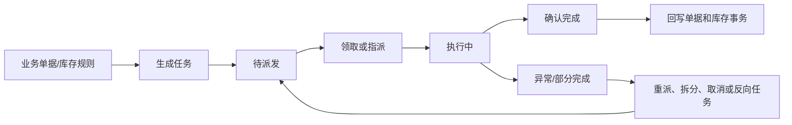
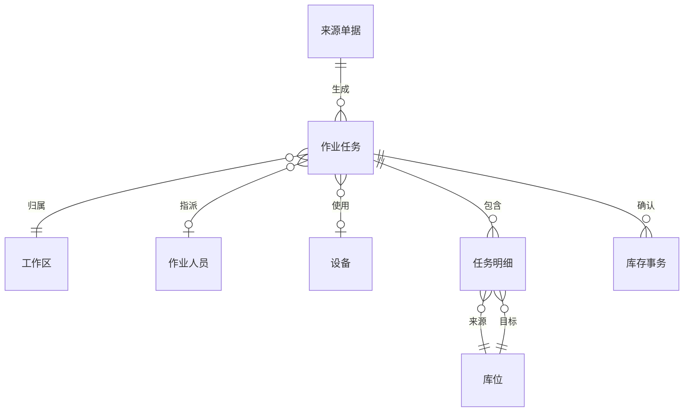

# 12. 任务管理：把系统决策变成现场动作

参考：[原章节](../01-按章节拆分的md文件/12-任务管理.md)

详细流程补充：[对应章节流程图](../02-按章节拆分的流程图/12-任务管理.md)

## 0. 资料联动

| 资料层 | 入口 |
| --- | --- |
| 手册事实 | [01/12 任务管理](../01-按章节拆分的md文件/12-任务管理.md) |
| 流程图 | [02/12 任务管理](../02-按章节拆分的流程图/12-任务管理.md) |
| 原始数据字典 | [03/06 任务管理](../03-WMS的数据表按章节拆分/06-任务管理.md)、[03/15 资源管理](../03-WMS的数据表按章节拆分/15-资源管理.md)、[03/16 RF 功能表](../03-WMS的数据表按章节拆分/16-RF功能表.md)、[03/19 临时表](../03-WMS的数据表按章节拆分/19-临时表.md) |
| 字段参考 | [05/06 任务管理](../05-WMS的字段设计参考借鉴/06-任务管理.md)、[05/15 资源管理](../05-WMS的字段设计参考借鉴/15-资源管理.md)、[05/16 RF 功能表](../05-WMS的字段设计参考借鉴/16-RF功能表.md)、[05/19 临时表](../05-WMS的字段设计参考借鉴/19-临时表.md) |
| 共享语义 | [核心业务语义索引](../00-核心业务语义索引.md#任务与库存) |

> [手册事实] 本章围绕任务生成、派发、人员/设备执行、任务查询和 RF 作业入口展开。
>
> [归纳判断] 任务是业务单据和现场动作之间的边界对象；任务状态、来源单据、源/目标库位和执行结果必须能互相追溯。
>
> [通用 WMS 建议] 任务确认采用幂等处理，部分完成、短拣、取消和反向任务分别记录，不用一个“完成”状态吞掉异常。
>
> [待确认] 不同任务类型的状态集合、任务拆分/合并、派发策略以及任务确认与库存事务的先后关系，不能统一假定。

## 1. 参考事实

富勒把上架、拣货、补货等任务统一纳入任务管理，并提供专项任务页、任务查询、优先执行、人员指派、任务派发和员工工作区设置。任务可以通过纸面清单、RF 或自动化设备执行。

### 使用场景与要解决的问题

| 使用场景 | 典型角色 | 用户问题 | 任务管理要交付的结果 |
|---|---|---|---|
| 收货后上架 | 调度员、上架员 | 收到的货堆在收货区，不知道先放什么、放哪里 | 根据收货结果生成带源位、目标位和数量的上架任务 |
| 订单拣货 | 调度员、拣货员 | 订单需求不能直接指导现场搬运 | 把库存分配拆成可领取、可扫描、可确认的任务 |
| 拣货位补货 | 库管员、补货员 | 拣货位缺货导致订单停滞 | 根据库存下限或订单需求生成补货任务 |
| 盘点和复盘 | 盘点员、主管 | 盘点范围和责任人不清，差异无法追溯 | 将盘点范围拆成任务，记录实盘、复盘和差异原因 |
| 人员/设备调度 | 仓库主管、设备管理员 | 任务堆积但无法判断谁能做、何时做 | 按工作区、能力、优先级和设备状态派发 |

## 2. 业务流程图：任务生命周期

## 3. 数据模型与任务对象

任务必须保留来源单据、来源行、来源库存、源库位、目标库位、数量、容器、优先级、工作区、执行人和完成时间。

| 实体对象 | 中文定义 | 关键字段 | 关键关系 |
|---|---|---|---|
| 来源单据 | 触发任务的业务依据 | 单据号、单据行、业务类型、需求数量 | 可生成一个或多个作业任务 |
| 作业任务 | 面向现场的一次可执行动作集合 | 任务号、类型、状态、优先级、工作区、执行人 | 包含多个任务明细 |
| 任务明细 | 具体从哪里搬多少到哪里 | 源库位、目标库位、商品、批次、容器、计划数、完成数 | 确认时产生库存事务 |
| 工作区 | 任务执行的空间或岗位范围 | 工作区编码、库位组、允许任务类型、负责人 | 参与任务筛选和派发 |
| 作业人员/设备 | 实际执行任务的主体 | 编号、能力、状态、当前任务 | 领取或被指派任务 |
| 库存事务 | 任务确认后的库存事实 | 事务类型、关联任务、前后位置、数量、时间 | 由已确认任务生成 |

## 4. 任务分类和字段

| 任务对象 | 层级 | 来源 | 核心字段 | 主要结果 |
|---|---|---|---|---|
| 上架任务 | 表头/明细 | 收货/质检结果 | 任务号、来源库位、目标库位、商品、批次、容器、计划数、完成数 | 库存从过渡位进入目标位 |
| 拣货任务 | 表头/明细 | 发运订单分配 | 任务号、来源库位、商品、批次、容器、目标包裹、计划数、完成数 | 形成待复核/待发运货物 |
| 补货任务 | 表头/明细 | 库存或订单需求 | 任务号、来源存储位、目标拣货位、商品、批次、数量、优先级 | 补充拣货库存 |
| 盘点任务 | 表头/明细 | 盘点单 | 任务号、库位、商品、账面数、实盘数、复盘数、差异原因 | 形成盘点差异结果 |

## 5. 派发逻辑

任务派发可以按工作区、库位组、设备、员工和容器范围筛选，并通过员工 ID 领取任务。系统也支持手工指派和提升优先级。

建议首版把“任务生成”和“任务派发”分开：前者是业务系统决定需要做什么，后者是现场调度决定谁在何时做。

### 来源单据与任务关系

| 来源 | 任务 | 关系 | 设计说明 |
|---|---|---|---|
| 收货明细 | 上架任务 | 1 对 0~多 | 按目标库位、容器或工作区拆分；收货后不一定立即生成 |
| 分配明细 | 拣货任务 | 1 对 1~多 | 按源库位、批次、路径、设备或人员拆分 |
| 补货需求 | 补货任务 | 1 对 1~多 | 一条需求可能从多个存储位补到多个拣货位 |
| 盘点单 | 盘点任务 | 1 对多 | 按库位、商品或作业人员切分 |
| 作业任务 | 反向任务 | 1 对 0~多 | 取消、短拣、错放等异常需要新任务，不直接覆盖原任务 |

## 6. 库存影响与异常逆向

库存影响：适用，但取决于任务类型。上架、拣货和补货会改变库存位置或占用；盘点任务本身不直接改库存，差异处理才产生调整。

异常逆向：适用。未开始任务可以取消并释放占用；部分完成任务需要拆分剩余数量或生成反向任务；已完成任务不能简单改回完成前状态，应通过库存移动/反拣等反向事务处理。

## 7. 功能清单

| 功能 | 适用场景 | 解决问题 | 优先级 | 设计补充 |
|---|---|---|---|---|
| 任务生成 | 收货、分配、补货、盘点结果产生后 | 把业务需求变成现场动作 | P0 | 记录生成原因和来源对象，支持幂等避免重复生成 |
| 任务查询与领取/指派 | 人工作业、班组调度 | 明确谁负责哪项动作 | P0 | 领取、转派、抢单和权限边界要定义清楚 |
| 任务执行确认 | RF、Web 或设备执行 | 把现场完成结果回写系统 | P0 | 支持扫码校验、部分完成和数量平衡 |
| 异常、拆分和反向任务 | 短拣、错放、设备故障 | 不让异常直接改写原任务 | P0 | 原任务保留，剩余量或纠错量进入新任务 |
| 工作区、库位组、优先级 | 多区域、多班组仓库 | 提升派发效率 | P1 | 任务筛选条件要可解释，不能只依赖人工经验 |
| 设备匹配和 WCS 回传 | 自动化仓 | 将任务交给可执行设备 | 后续 | 先统一任务状态和幂等回传协议 |

## 8. 精华借鉴

| 借鉴点 | 解决的问题 | 通用化建议 | 首版判断 |
|---|---|---|---|
| 任务独立建模 | 单据无法直接指导现场搬运 | 任务保存来源、位置、数量、容器和执行人 | 必须借鉴 |
| 生成与派发分离 | 系统知道要做什么，不等于已经分给谁 | 调度、领取、转派和执行分别建模 | 必须借鉴 |
| 任务部分完成 | 现场经常只能完成一部分 | 已完成、剩余和异常数量分开记录 | 必须借鉴 |
| 任务驱动库存事务 | 现场结果需要回写库存 | 确认任务时调用统一库存事务服务 | 必须借鉴 |
| 自动派发和路径优化 | 提升复杂仓库效率 | 先稳定任务状态和设备协议，再优化算法 | 后续 |

## 9. 待确认问题

- 任务是否支持部分完成和拆分。
- 任务领取后是否锁定执行人，是否允许转派。
- RF 与 Web 确认是否使用同一任务状态和库存事务。
