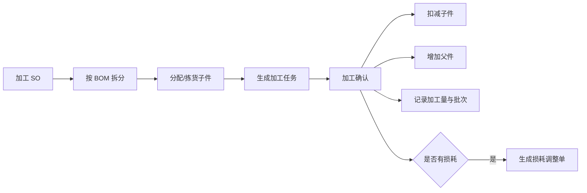
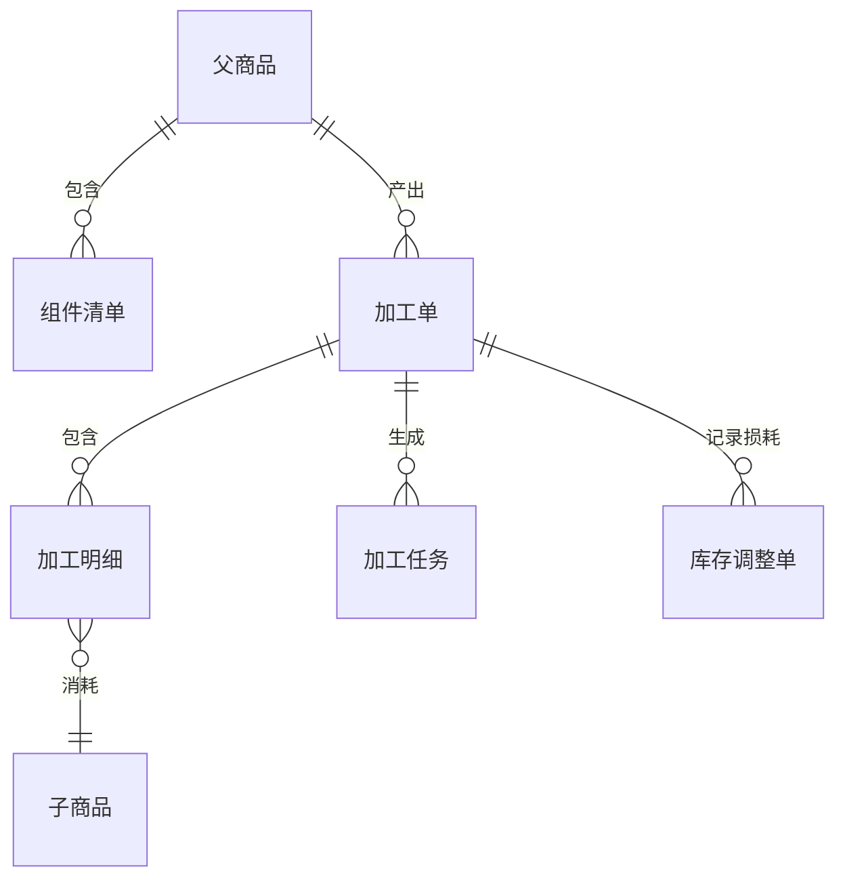

# 13. 增值服务：用业务单据管理加工结果

参考：[原章节](../01-按章节拆分的md文件/13-增值服务.md)

## 0. 资料联动

| 资料层 | 入口 |
| --- | --- |
| 手册事实 | [01/13 增值服务](../01-按章节拆分的md文件/13-增值服务.md) |
| 流程图 | [02/13 增值服务](../02-按章节拆分的流程图/13-增值服务.md) |
| 原始数据字典 | [03/12 增值服务](../03-WMS的数据表按章节拆分/12-增值服务.md)、[03/03 入库操作](../03-WMS的数据表按章节拆分/03-入库操作.md)、[03/05 出库操作](../03-WMS的数据表按章节拆分/05-出库操作.md)、[03/07 费收](../03-WMS的数据表按章节拆分/07-费收.md) |
| 字段参考 | [05/12 增值服务](../05-WMS的字段设计参考借鉴/12-增值服务.md)、[05/03 入库操作](../05-WMS的字段设计参考借鉴/03-入库操作.md)、[05/05 出库操作](../05-WMS的字段设计参考借鉴/05-出库操作.md)、[05/07 费收](../05-WMS的字段设计参考借鉴/07-费收.md) |
| 共享语义 | [核心业务语义索引](../00-核心业务语义索引.md) |

> [手册事实] 本章覆盖增值服务申请、执行、完成和计费相关配置/记录的页面能力。
>
> [归纳判断] 增值服务不是库存之外的“备注”，它可能改变包装、数量、容器、质量结果和可计费作业结果。
>
> [通用 WMS 建议] 以服务订单/工序/执行结果承接库存前后快照，并把服务完成和计费事件分开，避免重复扣库存或重复计费。
>
> [待确认] 每种行业服务是否直接改变库存、是否需要质检或审批、以及计费事件的产生时点需按目标业务确认。

## 1. 参考事实

富勒把增值服务分为加工单、拆分单和增值服务单。加工有两类：原产品加工后 SKU 和数量不变，例如换包装、贴标签；以及多个子件组合成父件，导致 SKU 和数量发生变化。

### 使用场景与要解决的问题

| 使用场景 | 典型角色 | 用户问题 | 增值服务要交付的结果 |
|---|---|---|---|
| 换包装、贴标签 | 加工员、仓库主管 | 仓储服务发生了，但普通出入库单无法表达 | 留存服务过程、加工数量、操作人和费用依据 |
| 子件组装成套 | 加工员、库存管理员 | 多个独立 SKU 需要转化为一个可销售父件 | 按 BOM 消耗子件、生成父件，并保证数量平衡 |
| 拆分/重新组合 | 仓库主管、订单员 | 一个包装或组合需要变成多个库存对象 | 记录拆分前后对象、数量和批次继承关系 |
| 加工损耗 | 加工主管、财务 | 损耗被口头处理，库存和费用无法解释 | 单独记录损耗原因、数量、审核和库存调整 |

## 2. 业务流程

| 实体对象 | 中文定义 | 关键字段 | 关键关系 |
|---|---|---|---|
| 父商品 | 加工后产出的商品 | 商品、版本、包装、批次策略 | 关联 BOM 和加工单 |
| 子商品 | 加工消耗的独立库存商品 | 商品、批次、消耗单位、数量 | 由加工明细引用并扣减库存 |
| 组件清单（BOM） | 定义父子商品及用量的版本化规则 | BOM 版本、子件、单位用量、生效时间 | 一套 BOM 可被多张加工单引用 |
| 加工单 | 记录计划加工和实际加工结果 | 加工号、父件、计划数、完成数、损耗数、状态 | 可生成加工任务和库存事务 |
| 加工任务 | 给现场人员执行的加工动作 | 工作区、来源库位、目标库位、数量、执行人 | 确认后回写加工单 |
| 库存调整单 | 记录损耗或异常修正依据 | 调整类型、数量、原因、审核、关联加工单 | 形成独立调整事务 |

### 加工对象之间的关系

| 对象 | 关系 | 说明 |
|---|---|---|
| BOM | 1 对多加工单 | 同一 BOM 版本可被多张加工单引用，但加工单要保存当时的版本 |
| 加工单 | 1 对多加工任务 | 可按加工库位、班组或批次拆分任务 |
| 加工单 | 1 对多加工明细 | 一张加工单可消耗多种子商品，并分别记录计划和实际消耗 |
| 加工单 | 1 对 0~多损耗/调整单 | 只有发生损耗或异常修正时才生成，不应默认一单一调 |

## 3. 数据模型

## 4. 字段与逻辑

| 对象 | 层级 | 核心字段 | 用途与校验 |
|---|---|---|---|
| 加工单 | 表头 | 加工号、货主、仓库、加工类型、BOM 版本、加工库位、状态、计划日期 | 确定加工范围和规则版本；已执行后不能随意换 BOM |
| 加工单 | 明细 | 父商品、计划数、完成数、待加工数、损耗数、父件批次 | 形成产出数量平衡；完成数+待加工数+取消数应可解释 |
| 加工明细 | 明细 | 子商品、来源库位/容器、批次、单位用量、计划消耗、实际消耗 | 说明具体扣减来源；不能超出可用库存，超耗需审批 |
| 加工任务 | 表头/明细 | 任务号、来源加工单、工作区、人员、源位、目标位、任务数、完成数 | 指导现场执行，支持部分完成和异常拆分 |
| 损耗记录 | 明细 | 损耗类型、数量、原因、责任人、审核状态、关联调整单 | 不让损耗数量从加工结果中无痕消失 |

确认加工时，子件扣减、父件增加和加工流水必须在同一业务事务内完成；如果跨系统或异步处理，要有处理中、成功、失败和补偿状态。

## 5. 库存影响

本章强适用。加工确认可能同时产生：子件库存减少、父件库存增加、库存批次生成或继承、加工库位变化和加工事务。损耗不应直接从加工数量中消失，应生成可审核、可追溯的损耗调整依据。

## 6. 异常与逆向流程

需要覆盖子件不足、加工部分完成、加工损耗、BOM 版本不一致、加工失败和父件质量异常。已确认加工不能简单删除，应通过反向加工或库存调整处理；尚未执行的加工任务可以取消并释放子件占用。

## 7. 功能清单

| 功能 | 适用场景 | 解决问题 | 优先级 | 设计补充 |
|---|---|---|---|---|
| BOM 维护 | 套装、组装、拆分 | 明确父子商品和标准用量 | P0 | BOM 必须版本化，历史加工使用历史版本 |
| 加工单与任务 | 需要在仓内完成加工 | 将加工计划交给现场执行 | P0 | 加工单与加工任务分开，支持部分完成 |
| 加工确认 | 子件转父件、包装变更 | 同步完成库存转化和结果记录 | P0 | 子件减少、父件增加、流水写入要保持一致 |
| 损耗和异常 | 破损、损耗、加工失败 | 解释数量差异并形成责任依据 | P1 | 损耗独立审核，必要时生成调整单 |
| 加工费用 | 对客户收取增值服务费 | 将加工结果传给计费模块 | P1 | 计费读取加工事件，不直接修改库存 |
| 复杂工序、设备接口 | 生产化加工或自动化 | 支持多工序和设备执行 | 后续 | 先确认通用 WMS 是否需要生产能力 |

## 8. 精华借鉴

| 借鉴点 | 解决的问题 | 通用化建议 | 首版判断 |
|---|---|---|---|
| 增值服务单独建模 | 换包装、贴标等服务无法用普通出入库表达 | 用加工单/服务单记录过程和结果 | P1 |
| BOM 版本化 | 同一父件的组成会变化 | 加工单保存实际使用的 BOM 版本 | 必须借鉴 |
| 父子件库存转化 | 加工前后商品和数量发生变化 | 子件减少、父件增加、事务同批完成 | 必须借鉴 |
| 损耗单独处理 | 损耗数量容易无痕消失 | 记录原因、责任、审核和调整事务 | P1 |
| 复杂工序和设备 | 加工流程可能接近生产制造 | 先确认 WMS 边界，再决定是否扩展 | 后续 |

## 9. 待确认问题

- 加工后的父件批次属性如何生成或继承。
- 损耗由加工单直接产生，还是必须生成调整单。
- 首版是否支持 SKU 不变的服务记录。
