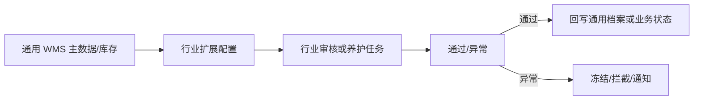

# 14. 行业插件：把行业差异隔离在通用主链之外

参考：[原章节](../01-按章节拆分的md文件（1119页版本）/14-行业插件.md)

## 0. 资料联动

| 资料层 | 入口 |
| --- | --- |
| 手册事实 | [01/14 行业插件](../01-按章节拆分的md文件（1119页版本）/14-行业插件.md) |
| 流程图 | [02/14 行业插件](../02-按章节拆分的流程图/14-行业插件.md) |
| 原始数据字典 | [03/14 行业插件](../03-WMS的数据表按章节拆分/14-行业插件.md)、[03/04 库存管理](../03-WMS的数据表按章节拆分/04-库存管理.md)、[03/12 增值服务](../03-WMS的数据表按章节拆分/12-增值服务.md)、[03/17 公共部分](../03-WMS的数据表按章节拆分/17-公共部分.md) |
| 字段参考 | [05/14 行业插件](../05-WMS的字段设计参考借鉴/14-行业插件.md)、[05/04 库存管理](../05-WMS的字段设计参考借鉴/04-库存管理.md)、[05/12 增值服务](../05-WMS的字段设计参考借鉴/12-增值服务.md)、[05/17 公共部分](../05-WMS的字段设计参考借鉴/17-公共部分.md) |
| 共享语义 | [核心业务语义索引](../00-核心业务语义索引.md) |

> [手册事实] 本章展示医药等行业场景的资料审核、退货、越库、对账、称重和数量抽检等插件能力；1119 页版还增加两票制、业务申请单、序列号盘点差异、B2C 退货、产品组、订单快递转投、耗材拉动、称重收货和注册证审核等主题。
>
> [归纳判断] 行业插件应挂接标准单据、冻结、库存事务和审计能力，而不是另起一套不可追溯的库存主链。
>
> [通用 WMS 建议] 将行业校验、证照、质量和特殊动作作为扩展策略接入标准服务，核心对象仍使用货主、SKU、批次、库存和任务。
>
> [待确认] 插件是否启用冻结、质检不合格如何隔离、退货如何形成逆向入库，以及插件表与标准表的主键关系，需结合行业实施确认。

## 1. 参考事实

富勒提供医药行业相关能力，包括按批号管理药品检验报告、生成和确认药品养护任务、对客商资料审核、对药品资料审核。资料审核通过后，才成为正式客户档案或产品档案；养护异常的库存可以生成冻结单。新版同时扩展到合规、退货、称重、快递、耗材和申请协同等插件主题。

### 1.1. 1119 页版插件能力索引

| 能力组 | 1119 页版主题 | 04 的设计处理 |
|---|---|---|
| 医药合规 | 药品检验报告、药品养护、客商审核、药品审核、两票制、注册证审核 | 作为行业资料、审核、养护和冻结能力的扩展索引 |
| 业务申请与主数据 | 业务申请单、产品组维护 | 作为申请对象或主数据扩展，具体状态待确认 |
| 库存与退货 | 序列号盘点差异、B2C 退货、越库、对账 | 复用盘点、逆向入库、库存对账和越库主链 |
| 现场作业与物流 | 称重、称重收货、订单快递转投、耗材拉动 | 作为收货、运输或物料补给的插件入口 |

这张表只解决新版范围可见性，不代表每个插件已有完整通用流程。没有被 02 详细展开的插件，不在本章自行补充状态、字段和接口契约。

### 使用场景与要解决的问题

| 使用场景 | 典型角色 | 用户问题 | 插件要交付的结果 |
|---|---|---|---|
| 医药客商/商品准入 | 质量员、主数据管理员 | 未审核的客商或药品资料进入正式业务 | 审核通过后才转为可用档案，保留审核过程 |
| 批次检验与文件管理 | 质量员、仓库主管 | 批次货物的检验报告和有效期分散在附件中 | 将报告与货主、商品、批次、库存关联 |
| 库存养护 | 养护员、仓库主管 | 库存需要定期检查，异常货物仍可能被出库 | 生成养护任务，异常时冻结或拦截库存 |
| 行业规则扩展 | 行业客户、实施人员 | 通用核心被行业字段和流程污染 | 将额外约束封装为插件，通过标准接口接入 |

## 2. 业务流程图与设计边界

行业插件不应把行业字段直接塞进所有 SKU 和单据。通用核心负责库存、单据、任务、冻结和审计；行业插件负责额外资料、审核、合规任务和行业输出。

## 3. 数据模型

建议增加扩展对象：行业资料、证照、审核记录、养护计划、养护任务、批次文件。它们通过 SKU、货主、批次和库存 ID 关联，不复制通用库存余额。

| 实体对象 | 中文定义 | 关键字段 | 关键关系 |
|---|---|---|---|
| 行业资料 | 行业所需的主体或商品扩展信息 | 资料类型、对象、内容、状态、有效期 | 关联货主、商品或批次 |
| 证照/报告 | 证明主体或批次符合要求的文件 | 文件类型、编号、有效期、版本、附件 | 被审核记录引用 |
| 审核记录 | 资料从提交到通过/驳回的过程 | 审核人、时间、结果、意见、版本 | 决定档案是否转正 |
| 养护计划/任务 | 定期检查库存的计划和执行动作 | 周期、范围、任务状态、结果、异常 | 异常可触发冻结单和预警 |
| 行业扩展字段 | 不进入通用核心的可选属性 | 字段编码、值、对象、版本 | 通过扩展关系关联，不复制库存 |

## 4. 库存影响与异常逆向

库存影响：部分适用。检验报告和资料审核不直接改库存；养护异常可能触发冻结，使库存不可出库。

异常逆向：审核不通过应保留审核记录并阻止转正；养护结果异常应冻结或进入人工处理；已关联文件替换时保留文件版本和操作记录。

## 5. 功能清单

| 功能 | 适用场景 | 解决问题 | 优先级 | 设计补充 |
|---|---|---|---|---|
| 扩展字段、附件和版本 | 行业资料和报告 | 保存行业信息且不污染通用表 | P0 | 文件替换要保留版本和有效期 |
| 审核状态与准入 | 客商、药品资料 | 防止未审核资料进入业务 | P0 | 审核结果需能阻断建档、收货或出库 |
| 通用冻结接口 | 养护异常、质量异常 | 让行业结果影响库存可用性 | P0 | 插件只发起标准冻结，不直接改库存余额 |
| 证照、检验报告、养护任务 | 医药等受控行业 | 形成合规检查闭环 | P1 | 任务结果与批次/库存关联 |
| 两票制、注册证、业务申请、产品组 | 医药合规和主数据协同 | 承接新版新增行业主题 | P1/后续 | 先定义插件对象与标准主链的接口 |
| 序列号盘点差异、B2C 退货 | 高价值商品和电商退货 | 补齐盘点与逆向入库场景 | P1/后续 | 复用标准盘点、退货和库存事务 |
| 称重、称重收货、快递转投、耗材拉动 | 现场作业和物流协同 | 支持特殊作业输入和物流分支 | 后续 | 没有完整证据时只保留能力边界 |
| 行业接口和规则包 | 行业监管或大型客户 | 减少重复实施 | 后续 | 先验证插件边界和接口稳定性 |

## 6. 精华借鉴

| 借鉴点 | 解决的问题 | 通用化判断 |
|---|---|---|
| 行业资料独立建模 | 行业字段不污染通用商品和库存 | 必须借鉴 |
| 审核后转正 | 把准入控制放在业务发生前 | 借鉴，审核状态要能被主链读取 |
| 插件通过冻结接入库存 | 行业异常能阻断出库但不破坏库存模型 | 必须借鉴 |
| 行业规则包 | 降低同类客户重复实施 | 后置能力，先定义标准扩展接口 |

## 7. 待确认问题

- 是否把行业插件纳入通用 WMS 首版。
- 行业审核通过后是创建正式档案，还是改变档案状态。
- 行业附件是否需要版本、有效期和失效提醒。
