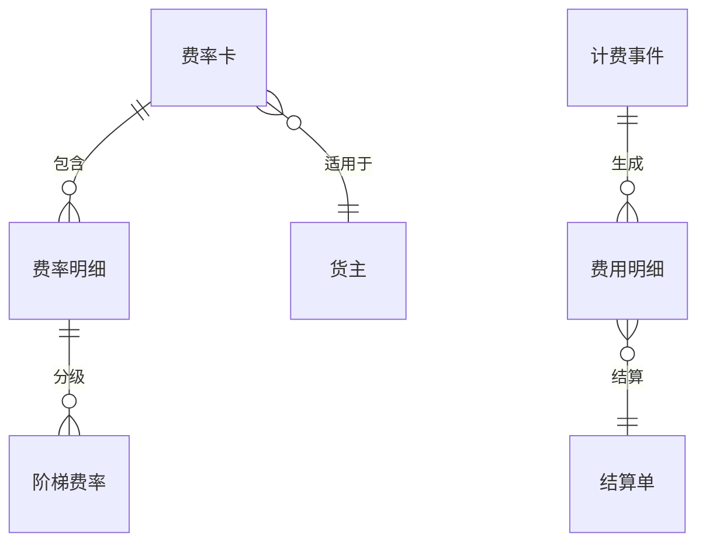

# 15. 费收：让仓储服务结果可以计算和结算

参考：[原章节](../01-按章节拆分的md文件/15-费收.md)

## 0. 资料联动

| 资料层 | 入口 |
| --- | --- |
| 手册事实 | [01/15 费收](../01-按章节拆分的md文件/15-费收.md) |
| 流程图 | [02/15 费收](../02-按章节拆分的流程图/15-费收.md) |
| 原始数据字典 | [03/07 费收](../03-WMS的数据表按章节拆分/07-费收.md)、[03/10 报表](../03-WMS的数据表按章节拆分/10-报表.md)、[03/12 增值服务](../03-WMS的数据表按章节拆分/12-增值服务.md) |
| 字段参考 | [05/07 费收](../05-WMS的字段设计参考借鉴/07-费收.md)、[05/10 报表](../05-WMS的字段设计参考借鉴/10-报表.md)、[05/12 增值服务](../05-WMS的字段设计参考借鉴/12-增值服务.md) |
| 共享语义 | [核心业务语义索引](../00-核心业务语义索引.md) |

> [手册事实] 本章以仓租、操作费、计费规则、费用项目和结算结果等费收能力为主要内容。
>
> [归纳判断] 费收依赖入库、出库、库存、增值服务等已确认的业务事件；收费记录不能代替原业务结果。
>
> [通用 WMS 建议] 把计费事件、计费规则、费率版本、计费明细和结算单分开，保留来源单据、数量/重量/时间快照及重算依据。
>
> [待确认] 具体费收事件、按什么数量或时间计费、税价口径、冲销和重算权限不能从菜单名称直接确定。

## 1. 参考事实

富勒支持仓储费率、费用清单、收入/支出结算和运输费率。费率可以按入库、库存、出库、增值服务和特殊费用分类，并支持计费基准、起止范围、级差、最低/最高计费、免费金额、替代费用、收费对象、支付对象和税率。

### 使用场景与要解决的问题

| 使用场景 | 典型角色 | 用户问题 | 计费功能要交付的结果 |
|---|---|---|---|
| 多货主仓储服务 | 仓储运营、财务、客户 | 不同客户使用资源不同，无法公平收费 | 按货主、仓库和服务类型形成计费事件 |
| 入库/出库作业收费 | 财务、运营 | 只按月固定收费，无法反映实际操作量 | 从收货、上架、拣货、发货等结果取数 |
| 库存保管费 | 财务、客户 | 库存天数、体积或托盘占用无法核算 | 以库存快照或计费周期计算保管量 |
| 增值服务/运输收费 | 加工主管、财务 | 加工、包装和运输结果没有费用依据 | 关联服务记录、包裹、重量、体积和费率 |
| 费用纠错与结算 | 财务、客户 | 费率改动或业务取消后账单无法修正 | 费用独立重算、作废、红冲和补计 |

## 2. 计费流程

## 3. 数据模型

### 计费对象清单

| 实体对象 | 中文定义 | 关键字段 | 关键关系 |
|---|---|---|---|
| 费率卡 | 某类客户/仓库适用的一组收费规则 | 版本、生效期、货主、仓库、状态 | 包含多条费率明细 |
| 费率明细/阶梯费率 | 某项服务的计费条件和单价 | 费用类型、计费基准、范围、单价、最低/最高 | 被计费事件匹配 |
| 计费事件 | 已发生且可收费的业务事实 | 来源单据/任务、事件时间、数量、单位 | 生成费用明细 |
| 费用明细 | 某项服务在某次周期中的计算结果 | 来源、计费量、单价、金额、税额、费率版本 | 汇总到费用清单 |
| 结算单 | 经审核后对外结算的账单 | 周期、收费方、支付方、金额、状态 | 包含费用明细 |

## 4. 字段与逻辑

| 对象 | 层级 | 核心字段 | 用途与校验 |
|---|---|---|---|
| 费率卡 | 表头 | 费率 ID、货主、仓库、费用方向、生效/失效时间、状态 | 确定适用范围和版本；同范围同时间不能有冲突生效版本 |
| 费率明细 | 明细 | 费用类型、费用代码、计费基准、计费单位、最低/最高、免费额、税率 | 定义怎么收费；计费基准必须能从业务数据中取得 |
| 阶梯费率 | 明细 | 起止范围、级差、单价、替代费用 | 处理不同用量的单价；边界值要有明确归属 |
| 计费事件 | 事实 | 来源单据/行、事件时间、计费数量、单位、货主、仓库 | 来源业务结果，不因重算而重复生成 |
| 费用清单/结算单 | 表头/明细 | 计费周期、收费方、支付方、金额、税额、费率版本、状态 | 费率变化不能重算已结算历史，纠错走作废/红冲 |

## 5. 库存影响与异常逆向

直接库存影响：不适用。费用计算读取业务结果，不应反向修改库存。

异常与逆向：费用可能需要重算、作废、红冲或补计，但不应通过修改原始入库/出库数量来纠正费用。费用清单和结算单应有独立状态。

## 6. 功能清单

| 功能 | 适用场景 | 解决问题 | 优先级 | 设计补充 |
|---|---|---|---|---|
| 费率卡和费用类型 | 多货主、多服务类型 | 统一收费规则 | P0 | 费率版本、生效期和适用范围清晰可查 |
| 计费事件采集 | 收货、库存、出库、加工等 | 把业务结果转成收费依据 | P0 | 事件不可变、可去重、能回溯来源 |
| 费用清单 | 周期账单和内部核算 | 汇总每个客户的费用 | P0 | 展示计费量、单价、金额和来源 |
| 阶梯、最低/最高、免费额 | 合同差异 | 表达复杂计费口径 | P1 | 规则计算要能试算和解释 |
| 审核、结算、红冲 | 对外账单和费用纠错 | 处理确认和逆向费用 | P1 | 不修改原始库存/业务数量 |
| 自动开票、财务接口 | 财务一体化 | 减少重复录入 | 后续 | 先统一费用和结算状态 |

## 7. 精华借鉴

| 借鉴点 | 解决的问题 | 通用化建议 | 首版判断 |
|---|---|---|---|
| 按业务事件计费 | 只按固定月费无法反映实际服务量 | 从收货、上架、库存、出库和加工结果提取事件 | 必须借鉴 |
| 费率与费用结果分离 | 费率变更会影响历史账单 | 费用明细保存命中的费率版本 | 必须借鉴 |
| 计费口径可解释 | 客户无法核对账单金额 | 同时展示计费量、单位、单价、来源和公式 | 必须借鉴 |
| 费用独立逆向 | 用改库存/改单据纠正费用会破坏业务事实 | 费用作废、红冲、补计单独处理 | 必须借鉴 |
| 复杂合同和自动开票 | 满足财务一体化需求 | 等基础事件和结算状态稳定后再接入 | 后续 |

## 8. 待确认问题

- 费用按收货、上架、库存天数、出库、加工还是运输计费。
- 计费事件在单据完成时产生，还是在结算周期结束时汇总。
- 是否首版支持成本、税率和收入/支出双向结算。
