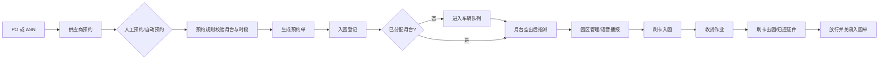

# 15. 预约：把到货资源从“临时等待”变成可调度计划

参考：[原章节](../01-按章节拆分的md文件（1119页版本）/15-预约.md)

详细流程补充：[对应章节流程图](../02-按章节拆分的流程图/15-预约.md)

## 0. 资料联动

| 资料层 | 入口 |
|---|---|
| 手册事实 | [01/15 预约](../01-按章节拆分的md文件（1119页版本）/15-预约.md) |
| 流程图 | [02/15 预约](../02-按章节拆分的流程图/15-预约.md) |
| 相关设计 | [07/仓库设置](07-仓库设置.md)、[08/业务规则](08-业务规则.md)、[09/入库操作](09-入库操作.md) |
| 共享语义 | [核心业务语义索引](../00-核心业务语义索引.md#入库与上架) |

> [手册事实] 新版手册提供按 PO 或 ASN 的供应商预约、预约单、入园登记和园区管理，并支持月台安排、车辆排队、证件发放/归还和出园放行。
>
> [归纳判断] 预约不是收货结果，而是到货资源计划；它把供应商、订单、车辆、时间段、月台和后续收货连接起来。
>
> [通用 WMS 建议] 把“预约成功”“车辆已到场”“已分配月台”“已入园”“已完成收货”分成不同对象和状态，避免用一个到货状态覆盖现场事实。
>
> [待确认] 预约是否强制、月台容量如何锁定、预约迟到/爽约如何处理，以及预约取消对 ASN 和收货的影响，需要结合现场规则确认。

## 1. 参考事实

大型仓库存在多个建筑和操作月台时，手工安排容易造成集中等待。富勒支持供应商按 PO 或 ASN 发起预约；可选择一条或多条 PO 共同送货，也可通过 Excel 导入 ASN 后预约。

预约支持人工选择月台和时段，也支持按预约规则自动分配。系统会根据总箱数、卸货效率和时间刻度估算占用时长，并通过图形化方式展示月台占用情况。预约规则可以限制供应商可选的月台和时间段。

预约成功后生成预约单。预约单可以调整优先级、关闭、取消、跳转入园登记；按 PO 预约时，还可以从预约单选择部分明细生成 ASN，一个 PO 可以生成多个 ASN。

入园登记可以提取预约单，也可以新增非预约入园。园区管理负责可入园提示、语音播报、刷卡入园、车辆排队、月台指派和出园确认。通行卡全部归还或记录异常原因后，入园单才可以放行并关闭。

## 2. 业务流程



两条原文主链为：

```text
PO → 供应商预约 → 生成 ASN → 入园登记 → 园区管理 → 收货
ASN → 供应商预约 → 入园登记 → 园区管理 → 收货
```

## 3. 数据模型与对象关系

| 实体对象 | 中文定义 | 关键字段 | 关键关系 |
|---|---|---|---|
| 预约申请 | 供应商对一次送货/提货资源的计划 | 供应商、PO/ASN、预期日期、体积、重量、箱数 | 可生成预约单 |
| 预约规则 | 限制可预约时间、月台和范围的规则 | 仓库、供应商、月台、时段、提前天数、优先级 | 参与预约校验和自动分配 |
| 预约单 | 预约成功后的执行凭证 | 预约号、来源类型、预约日期、时段、月台、状态 | 关联 PO/ASN 和入园登记 |
| 月台时段 | 可被占用的作业资源 | 月台、工作时间、时间刻度、占用开始/结束 | 被预约单占用 |
| 入园登记 | 车辆/司机/访客到场记录 | 车牌、司机、卡号、抵达时间、队列、状态 | 提取预约单，进入园区管理 |
| 园区作业记录 | 入园、月台、出园的现场事实 | 入园时间、月台、播报标记、归还时间、异常原因 | 关联入园登记和证件 |

## 4. 单据与状态

| 对象 | 建议状态 | 可执行动作 |
|---|---|---|
| 预约申请 | 草稿、已预约、已关闭、已取消 | 新增、调整、保存、关闭、取消、生成 ASN |
| 预约单 | 已预约、已生成 ASN、已入园、已完成、已取消 | 调整优先级、生成/重置 ASN、入园登记、取消 |
| 入园登记 | 待入园、排队中、可入园、已入园、作业中、已离园、已关闭 | 提取预约、分派月台、发放/归还证件、放行 |

状态之间不能互相替代：预约成功不代表车辆已到场，已入园不代表收货完成，收货完成也不代表证件已经归还。

## 5. 字段与业务逻辑

| 设计对象 | 关键逻辑 |
|---|---|
| 供应商授权 | 预约用户只能查询授权供应商对应的到货单据；授权范围不是前端隐藏按钮即可替代的权限校验 |
| 预约提前天数 | `APP_ADV_DAY` 从次日开始控制可预约周期；超过周期的预期到货日期不能预约 |
| 作业时长 | 可按箱数和卸货效率估算，并按半小时进位；原文说明最短半小时、最长 4 小时 |
| 月台选择 | 人工拖动调整或由系统自动预约；预约规则限制供应商可用月台和时段 |
| ASN 生成 | 按 PO 预约时可选择部分记录/数量生成 ASN；超量规则受 `RECEIVE_OVERQTY` 控制 |
| 队列排序 | 同时存在预约时间队列和车辆抵达时间队列；排序可通过标准业务规则扩展调整 |
| 证件放行 | 证件全部归还或记录遗失等异常原因后，才允许放行关闭入园单 |

## 6. 库存影响与异常逆向

预约、入园登记和园区排队本身不改变库存，也不等于收货。库存变化仍发生在收货、质检、上架等正式交易节点。

需要单独处理的异常包括：预约取消、ASN 重置、车辆没有月台而排队、临时非预约入园、通行卡遗失、车辆迟到/爽约和收货数量与预约数量不一致。异常处理应保留预约和现场记录，不能通过删除预约记录来“修正”历史。

## 7. 功能清单

| 功能 | 解决问题 | 优先级 | 设计判断 |
|---|---|---|---|
| PO/ASN 预约 | 提前安排到货资源 | P0 | 两种入口共用预约对象，来源类型保留 |
| 月台与时段可视化 | 减少人工冲突 | P0 | 先支持可解释的占用和冲突提示 |
| 预约规则与自动分配 | 限制资源并减少人工排班 | P1 | 规则需保存命中原因和版本 |
| 入园登记与车辆排队 | 管理到场车辆 | P0 | 入园事实与预约计划分开记录 |
| 证件、刷卡和放行 | 形成园区安全闭环 | P1 | 归还校验和遗失原因可追溯 |
| 周期预约与供应商自助 | 降低重复登记成本 | 后续 | 先确认预约强制性和外部用户权限 |

## 8. 精华借鉴

| 借鉴点 | 解决的问题 | 通用化判断 |
|---|---|---|
| 预约独立于收货 | 到货资源计划与实收结果不是一件事 | 必须借鉴 |
| 时间段/月台成为可计算资源 | 多月台场景无法靠备注管理 | 必须借鉴 |
| 预约单衔接入园登记 | 供应商计划和现场车辆可以关联 | 必须借鉴 |
| 队列与月台动态调度分开 | 已到场但资源暂不可用 | 建议借鉴 |
| 证件归还作为放行条件 | 园区安全和作业关闭需要闭环 | 行业/大型园区按需纳入 |

## 9. 待确认问题

- 预约是否是所有供应商到货的强制前置条件。
- 月台占用是在保存预约时锁定，还是在入园/分派时再次确认。
- 迟到、爽约、超时占用和预约取消是否产生预警或费用。
- 预约数量与实际收货数量不一致时，是否需要审批或重新预约。
