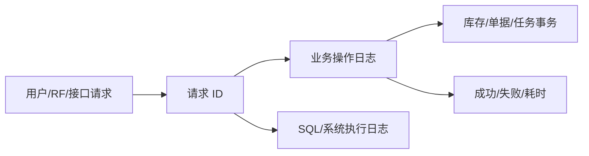

# 17. 业务系统日志：让每次操作都能追溯

参考：[原章节](../01-按章节拆分的md文件/17-业务系统日志.md)

## 0. 资料联动

| 资料层 | 入口 |
| --- | --- |
| 手册事实 | [01/17 业务系统日志](../01-按章节拆分的md文件/17-业务系统日志.md) |
| 流程图 | [02/17 业务系统日志](../02-按章节拆分的流程图/17-业务系统日志.md) |
| 原始数据字典 | [03/17 公共部分](../03-WMS的数据表按章节拆分/17-公共部分.md)、[03/18 后台表](../03-WMS的数据表按章节拆分/18-后台表.md)、[03/19 临时表](../03-WMS的数据表按章节拆分/19-临时表.md) |
| 字段参考 | [05/17 公共部分](../05-WMS的字段设计参考借鉴/17-公共部分.md)、[05/18 后台表](../05-WMS的字段设计参考借鉴/18-后台表.md)、[05/19 临时表](../05-WMS的字段设计参考借鉴/19-临时表.md) |
| 共享语义 | [核心业务语义索引](../00-核心业务语义索引.md) |

> [手册事实] 本章涉及系统日志、删除日志、错误日志、打印日志及其查询/追溯用途。
>
> [归纳判断] 审计记录要连接业务对象、操作人、时间、前后结果和原因；单独保存一条错误文字不能解释库存为何变化。
>
> [通用 WMS 建议] 将业务审计、技术错误、接口消息和库存事务分层，但使用统一关联键互相跳转，便于从异常回到原单据和任务。
>
> [待确认] 日志保留周期、删除权限、错误日志状态和技术日志与业务事务的关联粒度，手册和原始字典未完整说明。

## 1. 参考事实

富勒记录业务操作信息、系统 SQL 日志、用户登录信息、登录失败信息和打印汇总信息。业务操作日志包含用户、功能、组织、仓库、IP、日志批次号、请求 ID、输入输出 JSON、结果代码和耗时；业务日志可通过日志批次号或请求 ID 与 SQL 日志关联。

### 使用场景与要解决的问题

| 使用场景 | 典型角色 | 用户问题 | 日志功能要交付的结果 |
|---|---|---|---|
| 库存差异追查 | 仓库主管、审计人员 | 只看到余额变化，不知道谁做了什么 | 从库存事务回溯到操作人、单据、任务和请求 |
| 接口失败排查 | 系统管理员、实施人员 | 上游说已发送，WMS 却没有结果 | 关联消息、请求、业务处理和错误信息 |
| 权限与敏感操作审计 | 管理员、审计人员 | 审核、调整、发货等高风险操作无法追责 | 记录动作、前后值、操作者、时间和数据范围 |
| 登录和系统安全 | 系统管理员 | 异常登录和密码问题不可见 | 记录成功、失败、来源地址和会话结果 |
| 打印与批处理追踪 | 仓库主管、运维人员 | 任务失败后不知道是否重复执行 | 记录打印/批处理状态、次数、耗时和错误 |

## 2. 单据与状态

本章没有业务交易单据。日志记录建议区分生成中、成功、失败和已归档等生命周期状态；这些状态只表示日志处理情况，不表示库存或业务单据状态。

## 3. 日志链路

## 4. 数据模型

日志记录、请求、业务事务、SQL 执行、登录会话和打印任务可以分开建模，但要通过 requestId、batchId、业务单据号和事务号关联。

| 实体对象 | 中文定义 | 关键字段 | 关键关系 |
|---|---|---|---|
| 请求记录 | 一次 Web、RF 或接口调用的上下文 | 请求 ID、来源、用户、开始/结束时间、结果 | 关联业务操作和 SQL 执行 |
| 业务操作日志 | 用户实际执行的功能和动作 | 功能、动作、单据、仓库、前后值、结果、耗时 | 可关联库存事务和任务 |
| 库存/业务事务 | 业务结果的事实记录 | 事务号、类型、数量、状态、关联对象 | 说明库存或单据如何变化 |
| SQL/系统执行日志 | 技术层执行过程 | 语句标识、耗时、错误、批次号 | 只作排障证据，不替代业务日志 |
| 登录/打印日志 | 安全登录和输出结果 | 用户、IP、设备、结果、打印任务、次数 | 支撑安全和现场问题追查 |

## 5. 库存影响与逆向流程

日志不直接影响库存，也不应通过删除日志来逆向业务。库存纠错应通过正式反向事务完成，日志只记录谁在何时执行了什么。

## 6. 字段与业务逻辑

| 日志层级 | 核心字段 | 关键逻辑 |
|---|---|---|
| 请求层 | 请求 ID、来源端、用户、IP、开始/结束时间、响应结果 | 同一请求 ID 贯穿业务处理，支持幂等和链路定位 |
| 业务操作层 | 用户、功能、动作、组织、仓库、单据、前后值、结果代码、耗时 | 业务成功与 SQL 成功分开记录；高风险动作保存前后值 |
| 库存/单据层 | 事务号、任务号、单据号、事务类型、数量、状态 | 业务结果由正式事务解释，日志不直接改结果 |
| 技术执行层 | 批次号、语句标识、耗时、错误、影响行数 | 用于排障；密码、令牌和敏感数据必须脱敏 |
| 管理层 | 查询条件、保留期、归档状态、访问权限 | 支持按用户、功能、仓库、单据、请求 ID 和时间查询 |

## 7. 功能清单

| 功能 | 适用场景 | 解决问题 | 优先级 | 设计补充 |
|---|---|---|---|---|
| 业务操作日志 | 所有业务操作 | 说明谁在什么时候执行了什么 | P0 | 与单据、任务、库存事务可互相跳转 |
| 登录和失败日志 | 系统安全和账号排查 | 发现异常登录和权限问题 | P0 | 记录来源端、IP、结果和会话 |
| 请求 ID 与业务关联 | 接口、RF、异步调用 | 快速定位一次操作的全链路 | P1 | 贯穿业务日志、事务和技术日志 |
| 错误、耗时、打印日志 | 批处理和现场故障 | 判断失败影响和是否重复执行 | P1 | 业务失败与技术失败分开展示 |
| 归档、告警、脱敏 | 长期审计和合规 | 控制日志成本与敏感信息风险 | 后续 | 保留策略、查询权限和脱敏规则可配置 |

## 8. 精华借鉴

| 借鉴点 | 解决的问题 | 通用化建议 | 首版判断 |
|---|---|---|---|
| 业务日志与库存事务分开 | 结果和操作过程关注点不同 | 事务解释库存怎么变，日志解释谁做了什么 | 必须借鉴 |
| 请求 ID/批次号贯穿 | 接口和异步问题难定位 | 将请求、业务操作、事务和技术执行关联 | P1 |
| 失败也记录 | 出错后无法判断影响范围 | 保存错误、输入摘要、影响对象和补偿状态 | 必须借鉴 |
| 敏感字段脱敏 | 日志可能泄露账号或业务数据 | 按字段类型配置脱敏和访问权限 | 必须借鉴 |
| SQL 级追踪 | 有助于技术排障但成本高 | 先保证业务审计，再按规模增加技术日志 | 后续 |

## 9. 待确认问题

- 首版是否记录 SQL 级日志，还是只记录业务审计日志。
- 业务日志中允许保留哪些请求参数和返回数据。
- 日志是否需要满足特定行业的审计要求。
