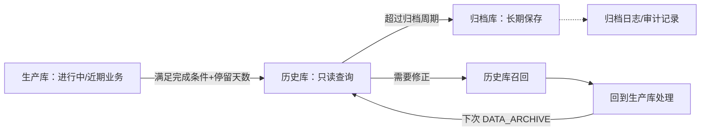

# 22. 迁移&归档：让业务数据拥有可管理的生命周期

参考：[原章节](../01-按章节拆分的md文件（1119页版本）/22-迁移&归档.md)

详细流程补充：[对应章节流程图](../02-按章节拆分的流程图/22-迁移&归档.md)

## 0. 资料联动

| 资料层 | 入口 |
|---|---|
| 手册事实 | [01/22 迁移&归档](../01-按章节拆分的md文件（1119页版本）/22-迁移&归档.md) |
| 流程图 | [02/22 迁移&归档](../02-按章节拆分的流程图/22-迁移&归档.md) |
| 相关设计 | [05-业务系统配置](05-业务系统配置.md)、[19-业务系统日志](19-业务系统日志.md)、[20-二次开发管理](20-二次开发管理.md) |
| 共享语义 | [核心业务语义索引](../00-核心业务语义索引.md) |

> [手册事实] 新版手册提供生产库、历史库、归档库三级存储，以及迁移归档规则、归档数据表配置、迁移归档作业日志和历史库召回。
>
> [归纳判断] 迁移&归档不是简单删除旧数据，而是把“在线业务性能、历史只读查询、长期保存和必要纠错”分成不同数据层。
>
> [通用 WMS 建议] 业务关闭、接口回传、迁移、归档和召回都要形成可追溯事件；召回后重新处理，不能直接修改归档库中的历史快照。
>
> [待确认] 生产库与历史库的查询路由、跨库事务一致性、归档失败重试和不同业务单据的可召回范围，需要结合部署和数据治理要求确认。

## 1. 参考事实

系统周期性将生产库中已完结的业务数据迁移到历史库，用于只读查询；超过归档周期的数据再从历史库写入归档库，以减少生产库数据量，降低查询和备份对现场作业的影响。历史库和归档库可以部署在不同服务器，也可以部署在同一服务器。

迁移归档规则包括规则代码、日归档/定期归档、启用标记、仓库、货主、目标数据库、标准迁移条件、附件条件、停留天数、批次处理记录数、数据类型和 Java 类/存储过程等配置。`DATA_ARCHIVE` 定时器按照规则执行。

归档数据表配置支持主表、从表、执行顺序、归档条件、关键字、归档时间字段和归档后是否删除原数据。系统标准表可以预置，现场个性化表也可以按“其他业务数据”配置归档。

系统日志还可以使用 MongoDB 主库分片和归档库分片，并由 `LOG_RETENTION_DAYS`、`LOG_ARCHIVE_RETENTION_DAYS` 和 `DEL_LOGS` 控制日志查询范围与删除。

特殊情况下，已迁移到历史库的单据可以通过历史库召回回到生产库，完成取消、修正或重新计算；后续定时器再次执行时，处理后的单据可以重新迁移。

## 2. 数据生命周期

## 3. 数据模型与配置对象

| 实体对象 | 中文定义 | 关键字段 | 关键关系 |
|---|---|---|---|
| 迁移归档规则 | 定义何时、按什么范围迁移/归档 | 仓库、货主、目标库、完成条件、停留天数、批次、数据类型 | 驱动定时任务 |
| 归档表配置 | 定义哪些主表/从表参与处理 | 分类、主表、从表、执行顺序、归档条件、时间字段、关键字 | 决定数据依赖和顺序 |
| 迁移归档任务 | 一次定时迁移/归档执行 | 任务编号、规则、开始/结束时间、处理量、结果、错误 | 产生作业日志 |
| 业务数据快照 | 迁移/归档后的可查询数据 | 来源单据、业务状态、迁移时间、数据层 | 位于生产/历史/归档库 |
| 历史库召回记录 | 一次从历史库回生产库的操作 | 单据类型、单证号、操作人、时间、原因、结果 | 关联原单据和后续重迁移 |
| 日志分片 | 日志在线与长期保存的存储层 | 保留天数、分片、日志日期、删除时间 | 受日志保留参数和删除定时器控制 |

## 4. 迁移条件与表关系

| 控制项 | 设计含义 |
|---|---|
| 标准迁移条件 | 可以按订单完成或接口回传完成判断；有接口要求时不能只看业务单据关闭 |
| 停留天数 | 完成后的数据在生产库保留一段时间，避免影响上游单证唯一性或近期纠错 |
| 批次处理记录数 | 限制单次处理规模，避免迁移任务长时间占用数据库资源 |
| 数据类型 | 入库、出库、库存、其他业务、波次等分类，可多选 |
| 主从表顺序 | 先按主表确认可归档数据，再按关键字段筛选从表，避免留下无法解释的孤儿数据 |
| 归档后删除 | 只有完成归档且满足保留策略时，才考虑删除运行库原数据；删除动作必须可审计 |
| 公共规则 `*` | 仓库/货主没有独立规则时使用公共规则，独立规则优先 |

## 5. 状态与操作

| 对象 | 建议状态 | 可执行动作 |
|---|---|---|
| 迁移归档规则 | 草稿、启用、停用 | 新增、修改、启停、测试/执行 |
| 归档任务 | 待执行、执行中、成功、部分成功、失败 | 查看日志、重试、定位错误 |
| 历史数据 | 已迁移、已召回、已重新迁移 | 只读查询、召回、回生产处理 |

归档状态不能替代业务状态：订单关闭是业务结果，已迁移是数据位置，已归档是保存层级，三者必须分开记录。

## 6. 库存影响与异常逆向

迁移和归档不改变库存数量、库位或库存状态；它改变的是数据所在存储层和查询路径。库存业务纠错应先通过历史库召回回到生产库，再执行正式取消、反向或调整操作。

主要异常包括：主表已迁移但从表未完成、目标库不可用、归档条件错误、个性化表未配置、批次过大导致超时、召回单据与当前接口状态冲突。系统应保留任务日志和失败原因，不能通过直接删除数据绕过业务状态。

## 7. 功能清单

| 功能 | 解决问题 | 优先级 | 设计判断 |
|---|---|---|---|
| 迁移归档规则 | 控制不同仓库/货主的数据生命周期 | P1 | 规则有范围、版本、启停和审计 |
| 主从表归档配置 | 保证相关业务数据成组迁移 | P1 | 主表、从表、关键字和执行顺序必须可检查 |
| 定时执行与作业日志 | 让后台处理可观察、可排错 | P1 | 记录处理量、耗时、失败原因和重试 |
| 历史库只读查询 | 降低生产库负载又保留追溯 | P1 | 查询入口要明确当前数据所在层 |
| 历史库召回 | 支持特殊纠错和重新处理 | P1 | 召回必须授权、留痕，处理后重新迁移 |
| 日志分片与保留 | 控制日志长期增长 | 后续 | 与业务数据归档分开治理 |

## 8. 精华借鉴

| 借鉴点 | 解决的问题 | 通用化判断 |
|---|---|---|
| 生产/历史/归档分层 | 在线性能和长期保存互相冲突 | 必须借鉴 |
| 规则驱动迁移 | 不同仓库和货主的保留周期不同 | 必须借鉴 |
| 主从表配置 | 复杂业务数据不能只迁移一张表 | 必须借鉴 |
| 召回后回到标准主链 | 历史数据仍可能需要纠错 | 必须借鉴 |
| 作业日志独立 | 后台任务失败不能没有证据 | 必须借鉴 |

## 9. 待确认问题

- 历史库是否允许跨库查询，还是由应用层按日期路由。
- 哪些业务状态才算可迁移，接口回传完成由哪个系统确认。
- 归档后删除是否必须审批，是否需要保留可恢复备份。
- 历史库召回是否支持批量、部分明细和已归档数据召回。
