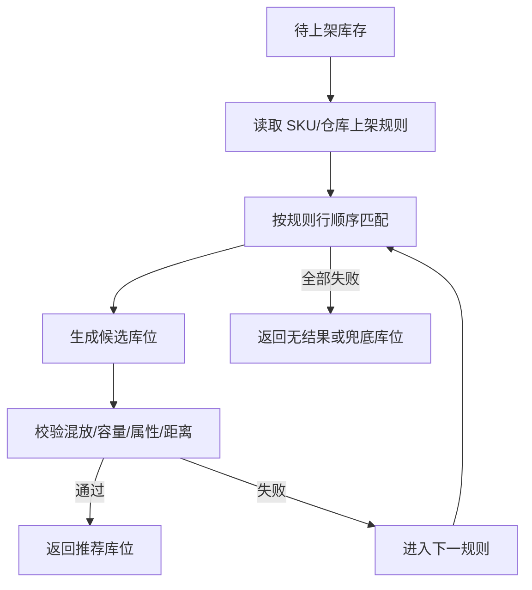

# 补充：上架库位计算实例

参考：[01/09 入库操作](../01-按章节拆分的md文件（1119页版本）/09-入库操作.md)中的 `9.11 上架计算实例`。

## 0. 资料联动

| 资料层 | 入口 |
| --- | --- |
| 手册事实 | [01/09 入库操作](../01-按章节拆分的md文件（1119页版本）/09-入库操作.md)（`9.11 上架计算实例`） |
| 流程图 | [02/09 入库操作](../02-按章节拆分的流程图/09-入库操作.md)（对应上架计算流程） |
| 原始数据字典 | [03/02 业务规则](../03-WMS的数据表按章节拆分/02-业务规则.md)、[03/01 基础设置](../03-WMS的数据表按章节拆分/01-基础设置.md)、[03/04 库存管理](../03-WMS的数据表按章节拆分/04-库存管理.md)、[03/06 任务管理](../03-WMS的数据表按章节拆分/06-任务管理.md)、[03/19 临时表](../03-WMS的数据表按章节拆分/19-临时表.md) |
| 字段参考 | [05/02 业务规则](../05-WMS的字段设计参考借鉴/02-业务规则.md)、[05/01 基础设置](../05-WMS的字段设计参考借鉴/01-基础设置.md)、[05/04 库存管理](../05-WMS的字段设计参考借鉴/04-库存管理.md)、[05/06 任务管理](../05-WMS的字段设计参考借鉴/06-任务管理.md)、[05/19 临时表](../05-WMS的字段设计参考借鉴/19-临时表.md) |
| 共享语义 | [核心业务语义索引](../00-核心业务语义索引.md#入库与上架) |

> [手册事实] 本章实例展示通过上架规则、产品多仓设置和库存移动测试库位推荐的思路，并记录候选失败原因与推荐结果。
>
> [归纳判断] 库位计算是“规则输入 → 候选 → 约束校验 → 可解释结果”，计算结果本身不等于库存位置已经改变。
>
> [通用 WMS 建议] 保存命中规则、候选库位、失败原因和人工确认结果；实际位置变更只在上架/移动任务确认时记账。
>
> [待确认] 规则优先级、容量算法、混放判断、库位锁定和推荐失效时机不能仅凭实例中的示例推导为全局算法。

## 1. 参考事实

实例通过上架规则、产品档案多仓设置和库存移动单测试库位推荐。规则示例按顺序尝试：先找同类产品相邻库位，再在指定库区查找相同产品组的库存，最后使用目标库位作为兜底；当前面规则找不到合适库位时，使用后续规则。

### 使用场景与要解决的问题

| 使用场景 | 典型角色 | 用户问题 | 库位计算要交付的结果 |
|---|---|---|---|
| 收货后上架 | 上架员、调度员 | 收到的货没有明确存放位置 | 根据库存属性和空间约束推荐目标库位 |
| 同品集中存放 | 库管员 | 同一商品分散在很多库位，拣货和盘点效率低 | 优先寻找已有同品或同组库存的库位 |
| 多包装/容量差异 | 上架员、仓库主管 | 推荐库位放不下或包装不匹配 | 在候选阶段校验包装、体积、重量和容量 |
| 规则失败和人工接管 | 仓库主管 | 所有规则都失败时，现场只能凭经验处理 | 返回失败原因，支持人工指定或兜底库位 |

## 2. 计算流程

## 3. 数据模型

上架计算至少读取 SKU、仓库 SKU 设置、包装、批次、来源库位、上架规则、规则明细、候选库位、库位库存和容量。计算结果应保存命中的规则、候选失败原因和推荐目标库位。

| 实体对象 | 中文定义 | 关键字段 | 关键关系 |
|---|---|---|---|
| 待上架库存 | 等待确定目标位置的收货库存 | 商品、批次、包装、数量、来源库位、容器 | 作为计算输入 |
| 商品仓库设置 | 商品在仓库中的默认上架约束 | 上架规则、商品组、拣货位、包装要求 | 参与规则匹配 |
| 上架规则/明细 | 按顺序定义候选范围和失败跳转 | 顺序、条件、目标库区、排序、兜底动作 | 产生规则执行记录 |
| 候选库位 | 经过筛选的可能目标位置 | 库位、容量、属性、距离、失败原因 | 被排序和校验 |
| 库位库存/容量 | 判断能否混放、能放多少 | 当前商品、批次、占用量、剩余容量 | 影响候选是否通过 |
| 推荐结果 | 本次计算的可解释输出 | 命中规则、候选列表、目标库位、状态 | 被上架任务或人工确认引用 |

## 4. 库存影响与异常逆向

计算本身不改变库存，只产生推荐结果。真正的库存位置变化发生在上架/移动确认时。

计算失败不是库存异常，应提示无匹配规则、容量不足、混放限制、库位禁用或缺少基础资料。已确认上架后的库位纠正应走库存移动或反向移动，不应重新计算后直接覆盖历史结果。

## 5. 单据与状态

库位计算结果可以区分待计算、已推荐、无匹配、已人工确认和已执行。推荐状态不等于上架完成，只有上架/移动任务确认后才改变库存位置。

## 6. 功能清单

| 功能 | 适用场景 | 解决问题 | 优先级 | 设计补充 |
|---|---|---|---|---|
| 规则读取和候选计算 | 收货后上架 | 将经验规则转成计算结果 | P0 | 规则顺序、适用范围和版本必须固定 |
| 容量、属性、混放校验 | 多包装、批次和库位限制 | 防止推荐不可执行位置 | P0 | 每个候选失败原因要可见 |
| 推荐结果与上架任务 | 人工或 RF 上架 | 将计算结果交给现场确认 | P0 | 推荐不等于库存已移动，确认才产生事务 |
| 规则试算和失败诊断 | 实施、配置排障 | 验证规则是否命中 | P1 | 输入快照、命中规则和候选过程可回放 |
| 人工覆盖和兜底库位 | 规则无结果或现场特殊 | 保证异常情况下仍能作业 | P1 | 人工覆盖需权限和原因 |
| 动态库位、路径优化、仿真 | 自动化或高密度仓 | 提升空间和动线效率 | 后续 | 先统一容量、位置和任务模型 |

## 7. 精华借鉴

| 借鉴点 | 解决的问题 | 通用化建议 | 首版判断 |
|---|---|---|---|
| 规则与具体输入连接 | 配置正确不代表计算结果正确 | 用真实商品、库存、容量和库位数据试算 | 必须借鉴 |
| 候选失败原因可见 | 无推荐时只能人工猜原因 | 返回规则、候选、约束和失败原因 | 必须借鉴 |
| 推荐结果与执行结果分离 | 推荐后现场可能人工调整 | 推荐形成结果，确认上架后才改库存 | 必须借鉴 |
| 人工覆盖可追溯 | 特殊现场需要临时指定 | 记录操作人、原因、目标库位和权限 | P1 |
| 动态优化和仿真 | 提升空间和路径利用率 | 先稳定基础规则和验收样例 | 后续 |

## 8. 待确认问题

- 无匹配库位时是阻断、人工指定，还是进入异常库位。
- 人工覆盖推荐库位是否必须填写原因。
- 上架计算结果是否需要冻结候选库位容量。
